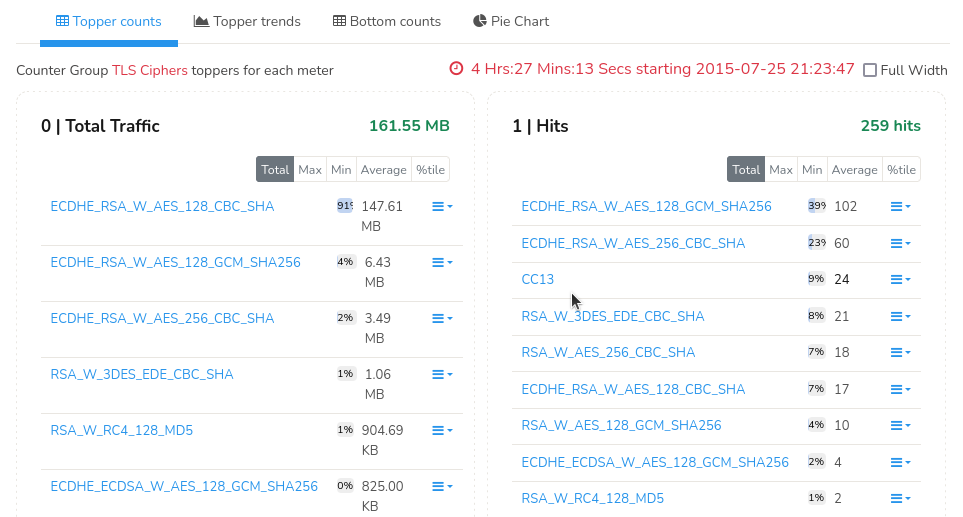

# SSL/TLS Metering

Three new counter groups give you great visibility into the SSL
encrypted traffic in your network.

1. **TLS Orgs** - Organizations that issue TLS Certificates that verify the identity of entities (websites, servers, etc.) and issue digital certificates that establish secure connections over the internet. Examples: GlobalSign, DigiCert, etc. Trisul captures these traffic by servers from subject part of the certificate that contains the organization name.
2. **TLS Ciphers** - A set of algorithms used to secure data transmitted over the internet. Example: encryption algorithm like AES, DES, authentication algorithms like SHA, MD5, and key exchange alogorithms like RSA, ECDH. Trisul captures these traffic by encryption and key exchange algorithms.
3. **TLS CAs** - Similar to TLS Orgs these traffic are captured by Trisul by certificate authority. Example: EV SSL, OV SSL, etc.

> Trisul detects usage of SSL/TLS using port independent heuristics.  
> Trisul handles SSL/TLS session resume.

## TLS Orgs

TLS Orgs allows for metering of traffic based on the entity specified in the Subject Common Name (a field in the certificate that contains the domain name or organization name) of the X.509 certificate (a digital certificate used to verify the identity of a website or organization). This counter group tells you how much of your SSL traffic is Google, Twitter, Dropbox, etc. And this visibiliy would otherwise be difficult to obtain.

:::note navigation

Select Retro -\> Retro Counters -\> Choose TLS Orgs from the dropdown
list

:::

### TLS Counter Group Tabs

The TLS counter groups on retro counter will open the Counter group TLS Orgs/TLS Ciphers/TLS CAs toppers for each meter of the selected counter group in four tabs namely,

1) [Topper Counts](/docs/ug/cg/ssl#topper-counts)

2) [Topper Trends](/docs/ug/cg/ssl#topper-trends)

3) [Bottom Counts](/docs/ug/cg/ssl#bottom-count)

4) [Pie Chart](/docs/ug/cg/ssl#pie-chart)

### Topper Counts

By default it will open the Topper counts tab that will allow you to view the toppers for each meter of the counter group from top down (ascending order).

*Figure: Meter 0 (Total Traffic) = Bytes per org, Meter 1 (Hits) = Number of
SSL/TLS flows*

### Topper Trends

Click on the Topper trends tab on the same module and view the topper trends for total traffic.

*Figure: Topper Trends for Counter Group Toppers*

### Bottom Count

On the same module click on the Bottom count tab to view the toppers for each meter of the counter group from bottom up (descending order)

*Figure: Bottom Count for Counter Group Topppers*

### Pie Chart

Click on the Pie chart tab on the same module or you can also generate long term usage reports with several charts like the pie chart shown below using Retro Tools.

:::note navigation

Select Retro -\> Retro Tools -\> Select Counter Group Toppers -\> Select
TLS Orgs

:::

*Figure: Pie Chart for Long Term Usage Report*

## TLS Ciphers

TLS Ciphers allows metering of traffic by the “cipher suite” used by SSL/TLS connections. The cipher suite is a combination of the encryption and the key-exchange
algorithm used. Example: 

- TLS_RSA_WITH_AES_128_CBC_SHA

- TLS_ECDHE_ECDSA_WITH_AES_256_GCM_SHA384
  
  To open TLS Ciphers countergroup,
  
  :::note navigation
  
  Select Retro -> Retro Counters -> Choose Ciphers from the dropdown
  list
  
  :::
  
  This will open [TLS counter group tabs](/docs/ug/cg/ssl#tls-counter-group-tabs) for Counter Group TLS Ciphers for each meter.

*Figure: Meter 0 (Total Traffic) = Bytes per suite, Meter 1 (Hits) = SSL/TLS
flows per suite*

## TLS Certificate Authorities

Trisul tracks the certificate chains of SSL/TLS connections. It takes the
Issuer Common Name of each certificate in the chain and meters it in the
following manner.

1. Issuer CN for last cert in chain -\> Metered as Root CA
2. Issuer CN for others -\> Metered as Intermediate CA

#### Usage Tip

This is optimized for long term queries, you can select a week or a
month as look at any suspicious root or intermediate CAs.

To open TLS Ciphers countergroup,

:::note navigation

Select Retro -> Retro Counters -> Choose CAs from the dropdown
list

:::

This will open [TLS counter group tabs](/docs/ug/cg/ssl#tls-counter-group-tabs) for Counter Group TLS CAs for each meter.

*Figure: Meter 0 (Inter CA) = flows as intermediate CA, Meter 1 (Hits) = flows as
root CA*

## Usage Tips

1. [SSL Cert resources](/docs/ug/resources/sslcerts) allow you to search for hashes in bulk
2. [SSL Cert FTS](/docs/ug/resources/ftsssl) allow you to search for arbitrary strings in certificates
