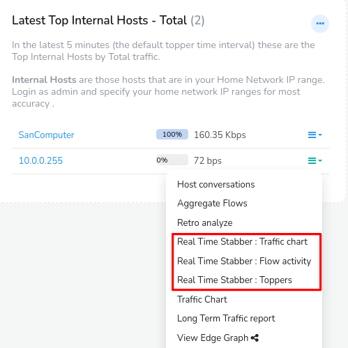
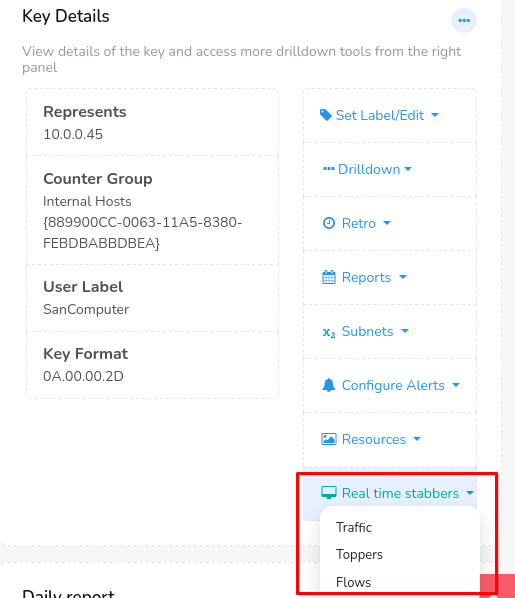
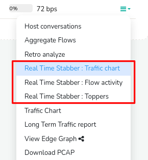
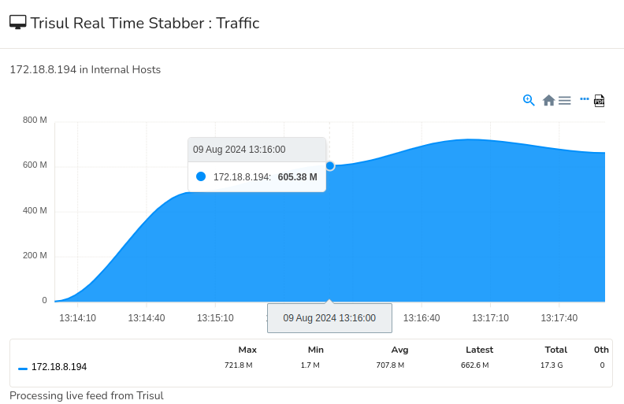
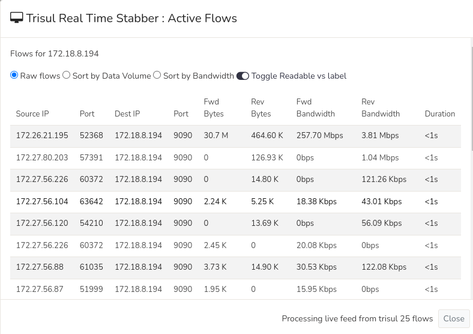
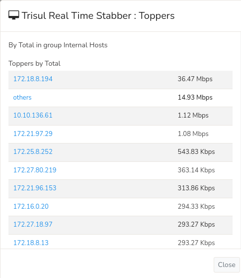

# Real Time Stabbers

Real time stabbers allow you to monitor various types of network
activity within a 5 second delay.

> A **Real Time Stabber** is a tool that allows you to get instant
> visibility into selected network traffic. The inspiration comes from
> the thermometer you **stab** into a piece of cake in the oven to check
> its temperature.

[Key Traffic Stabber](/docs/ug/cg/stabber#key-traffic-stabber)  

Graphs network traffic of any item in real time. *Example : Plot
transmitted and received traffic of your mail server.*  

[Counter Group Stabber](/docs/ug/cg/stabber#3-from-the-menu)  

Shows most active items in any counter group. *Example : Show most
active applications by total traffic.*  

[Flow Stabber](/docs/ug/cg/stabber#real-time-stabber-flow-activity)  

Currently active flows for a host or port. *Example : Show flows for IP
10.18.10.10*  

[Alert Stabber](/docs/ug/cg/stabber#alert-stabber)  

Real time animated view of all alert activity in your network.  

## Browser Requirements

1. **Websockets** This feature requires a Websockets capable browser.
2. **LocalStorage** Real time stabbers make extensive use of HTML5
   local storage.
3. **Firewall** Websockets feed arrive on TCP port 3003, open this on
   your firewall.

> You need a websockets capable browser like Firefox or Chrome

## Accessing Stabbers

There are three ways to access real time stabbers.

### 1. From the Context Menu in Any Module

1. Click on the little tag symbol on the right side beside any key item to bring up the
   contextual menu

2. Select one real time stabbers options from the choices shown below including, 
- Real Time Stabber: Traffic Chart

- Real Time Stabber: Flow Activity

- Real Time Stabber: Toppers

*Real Time Stabbers Option from Clicking Any Key Item Toolbar*

### 2. From any Key Dashboard

Lets say you are investigating an arbitrary item using the [Key Dashboard](/docs/ug/ui/key_dashboard)

Click on any key item from a dashboard that takes you into the key dashboard of that key. In the Key Details module click on the Real Time Stabbers from the menu as sshown in this example.

*Figure: Real Time Stabbers Options from Key Dashboard*

### 3. From the Menu

:::info navigation

:point_right: Select Tools&rarr;Real Time Stab Toppers

:::

1. Select a counter group from the dropdown list
2. Select a meter for that countergroup from the dropdown list
3. Click Live Update
4. A Stabber window of countergroup corresponding top activity of the meters selected is shown

## Key Traffic Stabber

Now lets explore each of the Real Time Stabber options in detail. Real Time Stabbers options include,

1) Real Time Stabber: Traffic Chart

2) Real Time Stabber: Flow Activity

3) Real Time Stabber: Toppers

*Figure: Real Time Stabber Options*

### Real Time Stabber: Traffic Chart

Use Real Time Stabber: Traffic Chart to continuously monitor traffic (bandwidth) used by a particular key item with a 5-second delay.

Click and drag to zoom a particular time interval with mouse. Use the [Chart Interaction Controls](/docs/ug/ui/charts#chart-interaction-controls) and [Legend table](/docs/ug/ui/charts#legend-table) for further inspection.

*Figure: Real time key traffic chart*

### Real Time Stabber: Flow Activity

Real Time Stabber: Flow Activity shows the real time flow activity for any host or port.

This is an example of live view, as each flow progresses the numbers keep updating in
real time.

*Figure: Real time top flows for an item*

### Real Time Stabber: Toppers

With Real Time Stabber: Toppers, you can view the top users of any counter group with a 5-second delay.

The image below shows a counter group stabber viewing top `Internal Hosts` based on the meter `Total`.

*Figure: Real time counter group toppers.*

## Alert Stabber

A real time view into all IDS alert activity in your network. As new
alerts come in they are animated and then transitioned onto the real
time visualization. See [Real Time Alert Stabber](/docs/ug/alerts/ids_stabber) for detailed documentation.
