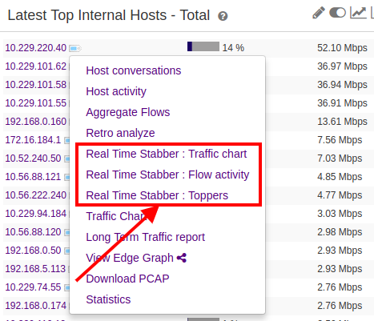
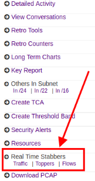
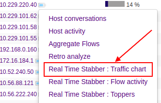
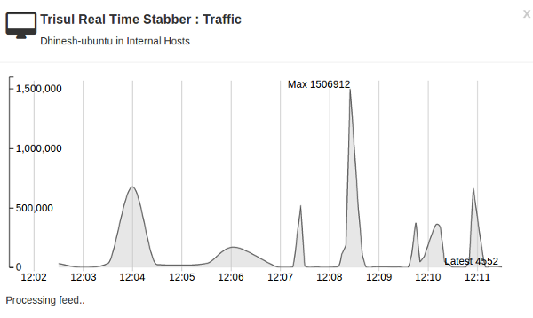
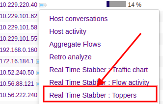
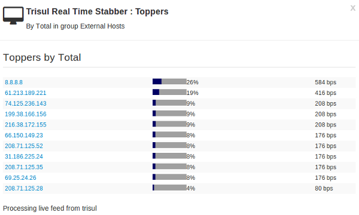
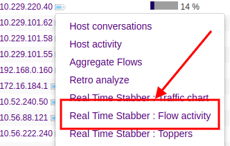
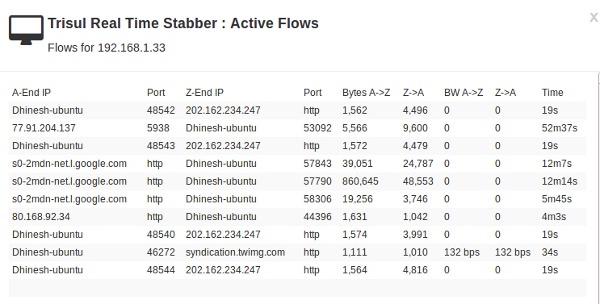
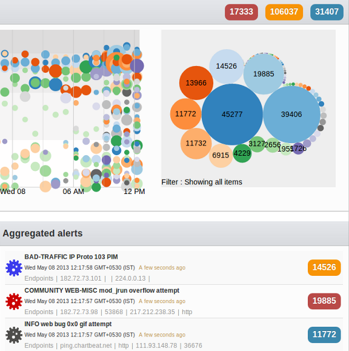

# Real Time Stabbers

Real time stabbers allow you to monitor various types of network
activity within a 5 second delay.

> A **Real Time Stabber** is a tool that allows you to get instant
> visibility into selected network traffic. The inspiration comes from
> the thermometer you **stab** into a piece of cake in the oven to check
> its temperature.

[Key Traffic Stabber](/docs/ug/cg/stabber#key-traffic-stabber)  

Graphs network traffic of any item in real time. *Example : Plot
transmitted and received traffic of your mail server.*  

[Counter Group Stabber](/docs/ug/cg/stabber#counter-group-stabber)  

Shows most active items in any counter group. *Example : Show most
active applications by total traffic.*  

[Flow Stabber](/docs/ug/cg/stabber#flow-stabber)  

Currently active flows for a host or port. *Example : Show flows for IP
10.18.10.10*  

[Alert Stabber](/docs/ug/cg/stabber#alert-stabber)  

Real time animated view of all alert activity in your network.  

## Browser requirements

1. **Websockets** This feature requires a Websockets capable browser.
2. **LocalStorage** Real time stabbers make extensive use of HTML5
   local storage.
3. **Firewall** Websockets feed arrive on TCP port 3003, open this on
   your firewall.

> You need a websockets capable browser like Firefox or Chrome

## Accessing Stabbers

There are three ways to access real time stabbers.

### 1. From the context menu in any module

1. Click on the little tag symbol beside any item to bring up the
   contextual menu
2. Select a real time stabbers from the choices shown

### 2. From any key dashboard

Lets say you are investigating an arbitrary item using the [Key Dashboard](/docs/ug/ui/dashboards#key_dashboard)

1. Click on a Real Time Stabbers from the menu as shown below

### 3. From the menu

:::note navigation

Select Tools -\> Real Time Stab Toppers

:::

1. Select a counter group
2. Select one *or* more meters
3. A set of stabber windows each corresponding to top activity of the
   meters selected is shown

## Key Traffic Stabber

Use this to continuously monitor traffic (bandwidth) used by a
particular item with a 5-second delay.

1. zoom - select a time interval with mouse
2. pan - ctrl + mouse
3. smoothen - enter a number -say 5 or 10 in the box

  
Real time key traffic chart.

## Counter Group Stabber

Top users of any counter group with a 5-second delay.

The image below shows a counter group stabber viewing top
`Internal Hosts` based on the meter `Incoming Bandwidth`.

  
Real time counter group toppers.

## Flow Stabber

Real time flow activity for any host or port.

1. This is a live view, as each flow progresses the numbers update in
   real time.

  
Real time top flows for an item.

## Alert Stabber

:::note navigation

Select Dashboards -\> Real Time Alerts

:::

A real time view into all IDS alert activity in your network. As new
alerts come in they are animated and then transitioned onto the real
time visualization.

1. Live view optimized to handle large volumes
2. Interactive bubbles allow you to sift through different alert types
3. Real time aggregated list gives you instant overview

