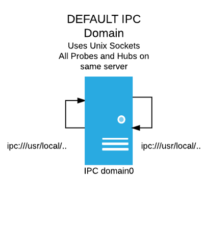
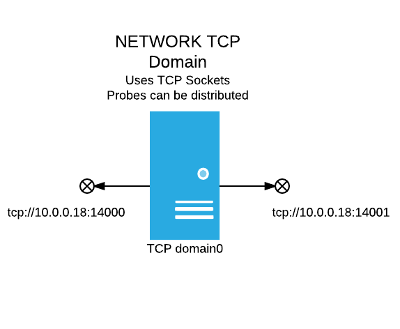

import Highlight from '/src/components/Highlighter/Highlight';

# Change Domain settings

A Trisul distributed domain is identified by :

1. a set of two network endpoints
2. a certificate+key pair

When you first install Trisul it creates a *domain0* that uses Unix
Sockets as endpoints. So by default, the Trisul-Hub and Trisul-Probe
will run on the same physical box. This page describes how you can
generate a new Domain Certificate to modify these settings.

## IPC vs TCP domain

Trisul uses ZeroMQ (0MQ) as the underlying transport layer. As mentioned
above, the default install of Trisul uses IPC Unix Sockets for
`domain0`, the default domain.

In the figure below, the domain0 uses Unix Sockets identified by the 0MQ
connection strings `ipc:///usr/local/var..`



The figure below shows a open distributed domain that uses TCP ports
14000 and 14001 identified by the 0MQ connection strings that start with
`tcp://10.1.18.102:14001`



## domain0.cert - the certificate file

Domain information is encoded in the Domain Certificate File that can be
found at  
`/usr/local/etc/trisul-hub/domain0/domain0.cert`

```language-bash
$ cat /usr/local/etc/trisul-hub/domain0/domain0.cert

#   ****  Generated on 2016-07-27 20:52:08 by CZMQ  ****
#   ZeroMQ CURVE Public Certificate
#   Exchange securely, or use a secure mechanism to verify the contents
#   of this file after exchange. Store public certificates in your home
#   directory, in the .curve subdirectory.

metadata
    domain-id = "domain0"
    domain-backend = ipc:///tmp/ctl_router_be
    domain-frontend = ipc:///tmp/ctl_router_fe
    domain-description = "Default Trisul Demo Domain"
curve
    public-key = "?$*:Ze]{UxMgkRM[K[{FmmEc@wq:P4p)+#qT0c5d"
```

On the hub node there is another file called the `domain0.cert_secret`
representing the private key file.

## Switching to a distributed domain

Changes to the domain settings just involve regenerating a new cert+key
pair — a new pair of files `domain0.cert` and `domain0.cert_secret`.

The following instructions tell you how to generate and install a new
certificate that switches from a default IPC domain to an Open TCP
domain.

:::note **Stop firewalld**  
Firewall would block communication between distributed nodes. To stop
firewall use `systemctl stop firewalld`.

:::

### Stop the domain and all contexts

This stops all Trisul processes on all nodes and then stops the domain0
processes.

```language-bash
$ sudo trisulctl_hub

stop context all
stop domain
quit
```

### Remove the old domain0.cert key pair

Remove the old certs from the *share* directory.

```language-bash
sudo rm /usr/local/share/trisul-hub/domain0.cert
sudo rm /usr/local/share/trisul-hub/domain0.cert_secret
```

### Create a new domain0 key pair

Use `trisulctl_hub create domain` to create a new certificate+key pair
with different TCP endpoints.

You enter the following information

|                     |                                                                                                               |
| ------------------- | ------------------------------------------------------------------------------------------------------------- |
| Domain ID           | use `domain0` - we’re trying to create a new cert                                                             |
| Domain Description  | a text description of the domain, goes in the cert file                                                       |
| Socket 1 (frontend) | A TCP socket ; eg tcp://192.168.2.76:12001. This is in ZeroMQ format. You should enter the IP of the Hub node |
| Socket 2 (backend)  | A TCP socket ; eg 12002. Use a local IP                                                                       |

A run would look like this

```language-bash
unpl@ubuntu:~$ sudo trisulctl_hub 

trisul_hub:ubuntu(domain0)> create domain

** CREATE DOMAIN ** 
This will create a new Trisul Network Analytics distributed domain ** 

Enter Domain ID (format=domain<number>)  : domain0 
Enter Description : Titanium products Trisul domain0

Now you will be asked to enter TWO TCP/IP Ports for use by the domain 
For TCP Ports    :  Format is  tcp://ip address:12500 ( eg : tcp://127.0.0.1:12500  ) 

Enter Socket 1 (frontend)  : tcp://10.1.119.2:12000
Enter Socket 2 (backend)   : tcp://10.1.119.2:12001


Wrote certificate and key files for domain domain0 in /usr/local/share/trisul-hub/
You may install the new domain now using 'install domain /usr/local/share/trisul-hub/domain0.cert' 
trisul_hub:ubuntu(domain0)> 
trisul_hub:ubuntu(domain0)> 
```

:::note **Sharing domain0.cert**  
Keep the `domain0.cert` certificate file in
`/usr/local/share/trisul-hub`. You need to share this cert with any new
probes you may deploy.

:::

### Install the new domain certificate

The new domain files have been placed at :  

1. `/usr/local/share/trisul-hub/domain0.cert` - Cert  
2. `/usr/local/share/trisul-hub/domain0.cert_secret` - Private key

Next you need to install the domain certificate on all probes and hub
nodes.

- share the `/usr/local/share/trisul-hub/domain0.cert` offline with all
  probe nodes

- install new domain cert on hub0

```
sudo trisulctl_hub install domain
/usr/local/share/trisul-hub/domain0.cert
```

say YES if it asks you if you want to “Update the existing domain0
certificate”

- install the new domain cert on each probe. The domain0.cert in this
  example is placed in the *mycerts* directory

```
sudo trisulctl_probe install domain /home/unpl/mycerts/domain0.cert
```

- then restart domain on all nodes

```
sudo trisulctl_probe restart domain  
sudo trisulctl_hub restart domain
```

Use `trisulctl` commands `list nodes` and `info context` to check if all
nodes have joined the new domain.All the distributed nodes must get
listed here.

### Run change_endpoints for hub context (for first probe only)

<Highlight color="#FF0000">RUN ON HUB</Highlight><Highlight color="#1877F2">ONLY FOR FIRST PROBE</Highlight>

By default , Trisul uses an IPC connection for each Hub node. If this is
the first remote probe you are adding. You  
need to switch the Hub to a TCP connection mode. Follow these steps.

```language-bash
/usr/local/share/trisul-hub/change_endpoints

.. enter domain [default = domain0]
.. enter hub [default = hub0]
.. enter context [default = context0]

.. next enter a local Hub IP to bind to - the probes will connect to this
.. next enter a starting port number
```

### Finishing up

Now `trisulctl_hub restart domain` and `trisulctl_probe restart domain`
on all the hub and probe nodes respectively. Then use `list nodes` to
see if they have connected. Finally `start context default` to start
Trisul.
