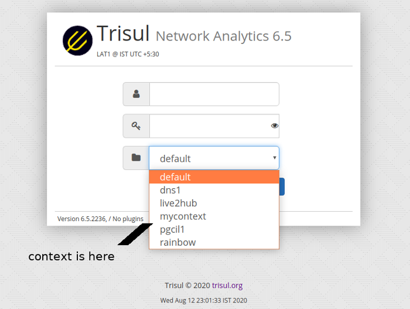
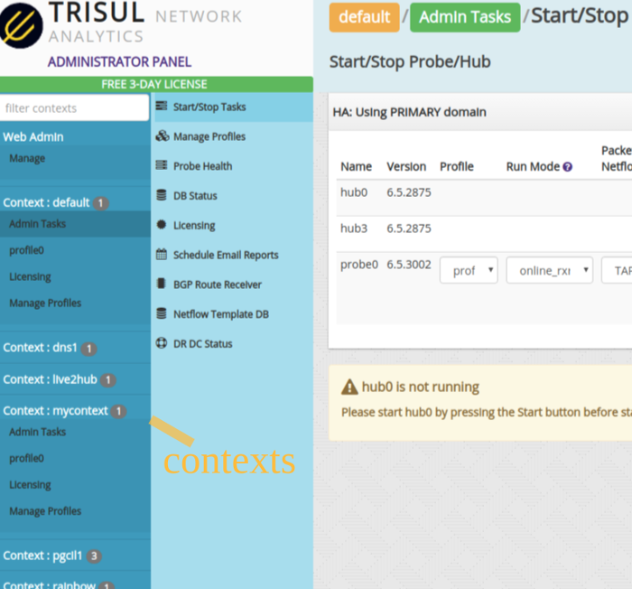
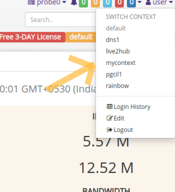

# Working with contexts

A Trisul [*context*](/docs/ug/domain#contexts) is a separate
instance of Trisul with its own isolated database, configuration, and
processes. The primary use cases for contexts are :

1. multi homing separate customer networks
2. managing different parts of a large network

The difference between a Trisul context and a new Trisul instance is the
shared webserver, user, and admin framework. You can create any number
of contexts with a Trisul production license.

This document describes how you can create a new context and manage
them.

#### Other links

[CLI tools for domain management](trisulctl) describes the `trisulctl_probe` and `trisulctl_hub` tools. Either tool can be used to manage contexts. In a distributed Trisul domain with multiple hubs and probes, ensure that all nodes are up before creating a context.

## Creating a new context

### Use the CLI tool command create context

`trisulctl_hub` and `trisulclt_probe` are CLI tools included with
Trisul. These are used to create and delete contexts. This command will
automatically create all required databases and configurations on all
the probe and hub nodes.

#### Context names

Context names are alphanumeric and allowed to contain underscores. We
suggest keeping the context names short less than 12 characters so they
display well on the user interface.

Login to the Trisul server and execute the following to create a new
context named `mycontext`

```language-bash
$ # as root
$ trisulctl_hub
..
trisul_hub:LAT1(domain0)> create context mycontext
```

You will see some messages indicating the request was successful.

You can verify the context was successfully created using the
`info context` command

```language-bash
$ # as root
$ trisulctl_hub
..
trisul_hub:LAT1(domain0)> info context mycontext
node           context_name   version      init    state    size_disk   data_window         #runs   profile        runmode
-----------------------------------------------------------------------------------------------------------------------------------
config0        mycontext      6.5.2875     INIT    RUNNING  240.0 kB    00h 00m 00s         0       profile0                      
hub0           mycontext      6.5.2875     READY   RUNNING  0 B         00h 00m 00s         0                                     
hub3           mycontext      6.5.2875     READY   RUNNING  0 B         00h 00m 00s         0                                     
probe0         mycontext      6.5.3002     INIT    DOWN     6.46 MB     00h 00m 00s         0       profile0       online_rxring  
```

    

### Login to the new context as admin

After the new context has been created, you can manage it from the web
interface.

If you are logged in to the Trisul Network Analytics web page, log off.

Now you will be presented with a new drop down box, which you can select
at login time to view the data for that particular context. But, we will
do that later. First we need to login as admin and start the new context
processes.

#### Login as admin

The login screen now has the new context dropdown, but for the `admin`
user this will be disabled.



*Login page with the new context*

Login as admin will bring you to the admin screen for the contexts.

### Configure and start the new contexts

Once you login as admin you will be shown the configuration for all the
contexts. See the below image.



*Select the context to open the configuration for that*

You can then select the context, configure it for example using the
Netflow Wizard, and then start it.

TO start the `newcontext` processes

- Click on the menu *Context: mycontext*
- Admin Tasks \> Start/Stop Tasks
- Then start the hub and probe

Now you have a brand new instance of Trisul with its own isolated
database.

#### Assign a user to a context

You can create users who are only allowed to view particular contexts.
To do that

- Go to Web Admin \> Manage Users
- Create a new User
- Select the contexts allowed for this user using *Allowed Contexts*
  option.

For more : [Web Admin Manage Users](/docs/ug/webadmin/manageusers)

### View reports from a context

While logging in simply select the context you wish to view.

If you are already logged in you can simply switch the context from the
top level menu itself.



*Already logged in users can switch context using the menu*

## Deleting contexts

Using the CLI tool you have options of :

1. Deleting the context entirely (use CLI `delete context` )
2. Only delete the data but keep the configuration (use CLI
   `reset context` )

Needless to say, deleting context will permanently remove all data from
the backend database for that context only. Ensure this is what you want
to do.
