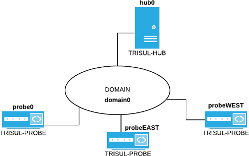

# Trisul Distributed Domain Concepts

Trisul 7.0 is a *streaming* *distributed* analytics platform. There are
“Trisul Probes” which acquire and process network data and there are
“Trisul Hubs” which provide the database function. The “Trisul Probes”
are not just dumb collectors but actually contain the main streaming
analytics function. You can even connect the output of a Trisul Probe to
a separate backend like Elastic Search.

import DocCardList from '@theme/DocCardList';

<DocCardList />

The following diagram illustrates the components involved

1. the **domain** *domain0*
2. the **trisul-probe** nodes *probe0* *probeEAST* and *probeWEST*
3. the **trisul-hub** node *hub0*



*Figure: Trisul domain components*

The domain represents a top level management group within which you
create a topology of *probe* nodes and *hub* nodes. All the nodes are
logical entities and you can install them all on a single physical
machine or distribute them on different machines.

## Domain Nodes Terminology

The following logical concepts are key to understanding a Trisul domain.

1. **Domain** - the top most level management group
2. **Context** - a separate monitoring instance. You always start,
   stop, and view data within a context.
3. **Profiles** - a probe configuration
4. **Probes** - the packet capture and streaming analytics
5. **Hubs** - a database node

## Domain

The topmost entity in Trisul called a **domain**. The default domain you
are likely using is called `domain0`.

A domain is a top level membership group which includes *probes* and *hubs*. Each *probe* and *hub* instance must belong to one and only one
domain. You can also have multiple domains - each domain is disjoint
from every other domain but the hardware can be shared.

## Contexts

A context is a separate database that represents an instance of Trisul
monitoring a particular network or dataset. You start and stop contexts
as a unit. You also view reports and perform analytics within a context.
By default Trisul puts all data into a single context called `context0`.
You can create additional contexts using the `trisulctl_hub` tool.

The rules

1. a context accepts data from multiple probes
2. a single probe can supply data to multiple contexts
3. a context database is stored on a single hub - currently only on `hub0`
4. you select a context while logging in to the web interface

:::note **Contexts**: A context is a separate database

:::

## Profiles

Profiles are just configuraton for probes inside of a context. Typically
you would want each probe in a context to use the same profile. A
profile includes counter groups, thresholds, flow
trackers, and the other things that you would find when you login as
Admin.

:::note **Profiles**: are just configuration for probes

:::

## Probes

Probes are the main processing component of Trisul. They run the main
processing pipeline from the packet acquisition to streaming stats
generation. The function of probes are

1. high speed packet capture
2. packet storage
3. netflow packet capture
4. run the analytics pipeline
5. host all the LUA scripts written by users
6. store packet **locally** after encryption
7. send the analytics stream to a hub node (currently `hub0` )

A probe can run in multiple contexts and multiple domains. There will be
different instances of the probes running isolated from each other.

Probes are managed using the `trisulctl_probe` command line tool 
:::note **Probes**: transform packets into analytics streams.

:::

:::note **Packages**: The “trisul-probe” package provides the Probe function

:::

## Hubs

Hubs provides the database and querying functionality. Data from all the *Probes* stream into to a *Hub* and are stored here. The only data that
stays on the *Probe* are the raw packets.

Hubs are managed using the `trisulctl_hub` command line tool
:::note **Packages** The package “trisul-hub” provides the Hub function. The
package “webtrisul” which resides on the same node provides the
webserver.

:::

## Security

The authentication used to connect various nodes to the domain is ZeroMQ
CURVE security using certificates. CURVE uses elliptic curve encryption
and cryptography. See [CurveMQ](http://curvezmq.org/) for more.

1. Each node needs a certificate key pair to connect to the domain
2. The command line tools trisulctl_probe and trisulctl_hub allow you
   to manage the whole setup easily

A domain is the top level group to which probes and hubs are members.
This section describes the concepts and operations on the domain.

> The central concept to a Trisul Network Analytics domain is the
> [CURVE](http://curvezmq.org/) “certificate” key pair. The nodes that
> connect to the domain must authenticate using this certificate. The
> steps in this section therefore mostly deal with creating this
> certificate and installing them.

## Domain Certificate

The domain is identified by a file called the “Domain Certificate” and
an associated private key. The cert works as follows:

1. contains the 2 Network Endpoints called “frontend” and “backend”
   that probes and hubs connect to
2. contains the public key
3. along with the domain certificate there is a *private key* file
   called `domain0.cert_secret` that is only installed on the Hub node
   and not visible to other nodes

The default domain called `domain0` is a local domain. If you open up
the file `/usr/local/etc/trisul-hub/domain0/domain0.cert` you will find
that the endpoints are of the form `ipc://..` This is a local IPC socket
because by default Trisul Probe and Trisul Hub reside on the same box.
If you want to move to a TCP socket you need to create a new certificate
as shown below with the new network ports.

### Creating a New Domain Certificate

It is recommended that you create and use a fresh domain0.cert file
after playing with Trisul for a while. This is because the Trisul
packages all include the same file so you can get started.

#### Create a New Domain Certificate

1. Type `trisulctl_hub`
2. Enter command `create domain`
3. Enter a domain name : must start with “domain” - eg “domainEAST”
4. Enter 2 network endpoints : for example tcp://192.168.2.80:7000 and
   7001 for ports 7000 and 7001

Check if the certificate is created successfully in `/usr/local/share/trisul-hub/domain0.cert`

It should look something like this

```language-bash
root@trisulorg-ubuntu-1gb-sfo2-01:/usr/local/etc/trisul-probe/domain0# cat domain0.cert 
#   ****  Generated on 2016-07-27 20:52:08 by CZMQ  ****
#   ZeroMQ CURVE Public Certificate
#   Exchange securely, or use a secure mechanism to verify the contents
#   of this file after exchange. Store public certificates in your home
#   directory, in the .curve subdirectory.

metadata
    domain-id = "domain0"
    domain-backend = "tcp://10.10.234.90:12000"
    domain-frontend = "tcp://10.10.234.90:12001"
    domain-description = "Default Trisul Demo Domain"
curve
    public-key = "?$*:Ze]{UxMgkRM[K[{FmmEc@wq:P4p)+#qT0c5d"
```

#### Install the New Domain Certificate

Now you need to install the new certificate on the hub and then
redistribute it to all the other nodes.

1. first check if `create domain` worked. There should be a
   domain0.cert and domain0.cert_secret in /usr/local/share/trisul-hub.
   Replace domain0 with domainXX if you have named it differently
2. Type `trisulctl_hub`
3. Stop running domain `stop domain domain0`
4. Type `install domain /usr/local/share/trisul-hub/domain0.cert`
5. Confirm - if domain already exists, say “YES ” to replace the
   certificate file.
6. Restart domain `start domain`

Now you need to distribute the new `domain0.cert` file to all probes and
hub nodes.

#### Install Domain Certificate on Probe and Hub

Say you got the new domain0.cert file in /home/mydir on a probe node. To
update the certificate do :

1. Type `trisulctl_probe`
2. Stop the domain `stop domain domain0`
3. Install the new certificate
   `install domain /home/mydir/domain0.cert`
4. Start the domain

Follow the same process to update the new domain certificate extra hub
nodes.

## Probe Authentication

Probe certificate. The only details in the probe certificate are its
name and description.

```language-bash
root@trisulorg-ubuntu-1gb-sfo2-01:/usr/local/etc/trisul-probe/domain0# cat probeTRISUL.cert
#   ****  Generated on 2017-02-01 17:59:25 by CZMQ  ****
#   ZeroMQ CURVE Public Certificate
#   Exchange securely, or use a secure mechanism to verify the contents
#   of this file after exchange. Store public certificates in your home
#   directory, in the .curve subdirectory.

metadata
    node-id = "probeTRISUL"
    node-description = "TRISUL.ORG site "
curve
    public-key = "OhxF2Vk)Negg(Z=&pPxI7Vi*e84o$Ty<vyTKpNd+"
```
