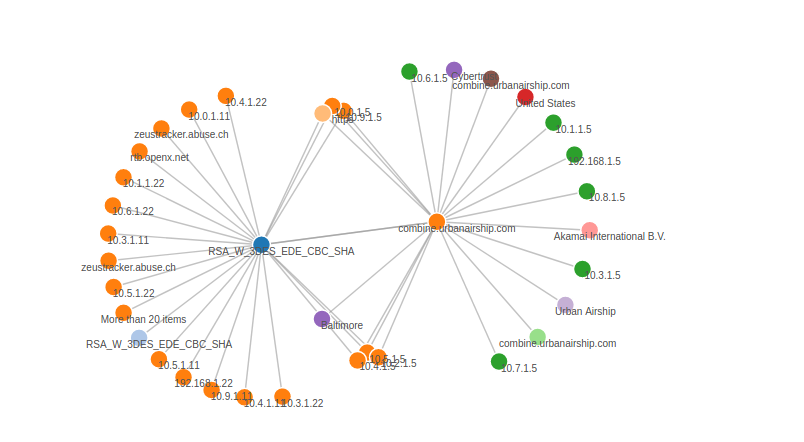
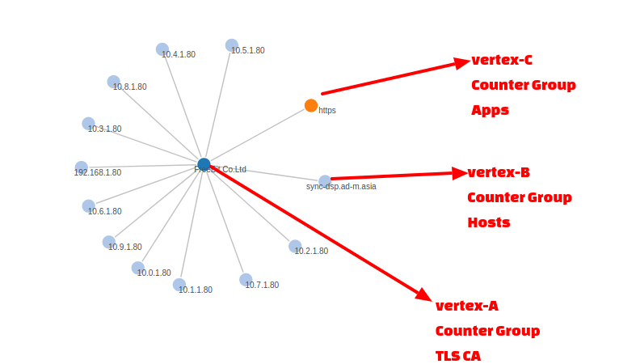

# Trisul Edges – Streaming Graph Analytics

*Trisul Edge* brings the power of graph analytics to the Trisul platform. It lets you discover relationships between various metric items. This section introduces the *Trisul Edge* feature and then describes how to use the Trisul User Interface to explore these relationships

import DocCardList from '@theme/DocCardList';

<DocCardList />

## Introducing Trisul Edges

Trisul is a real time streaming analytics platform. This means we use streaming algorithms to process data in a *one pass* manner rather than the traditional way of storing data in Lucene (Elastic Search) or a RDBMS (say PostGres) and processing searches and queries on demand. A Trisul Probe can capture hundreds of metrics from network traffic but until today it did not capture how the *metrics were related to each other* beyond the flow connection. We could tell that metrics for Protocol, Ports, IP Addresses were related to a flow, but we could not tell that a TLS Cipher Suite used was related to an IP Address, a TLS Organization, or a Country. In previous releases , we used something called a “Flow Tagger” that used the *network flow* as a anchor entity which you could enrich with tags.

*Figure: Edge Graph Showing Flow Taggers*

With Trisul Edges, we bring advanced graph database features into Trisul itself. Each entity in Trisul metrics also generates information about related entities. In Graph Database architecture, the central concept is to store “connections” and “graphs of connections” as sets of **edges** and **vertices**.

When you enable Trisul Edges, as Trisul processes packets, it generates a new type of stream called an Edge stream. Then we apply various streaming algorithms on this edge stream to make it manageable and practical to use. For instance, we dont want to store an unbounded graph for very high cardinality relationships.

## Vertices and Edges

An Edge connects two Vertices. In Trisul the rules are

- Vertices are keys that belong to a Counter Group or an Alert Group
- Edges are connections between vertices

Consider the following graph.

*Figure: Representation of Vertices and Edges in Edge Graph*

In Trisul you start traversing graphs from a “root vertex”. In the image shown above we want to check which nodes are connected to the *TLS Certificate Authority* named “Freebit.Co.Ltd”. The graph then opens up one level to reveal its adjacent vertices. In this case we have vertices from 3 different counter groups Internal Hosts (10.x), External Hosts, and Applications. You can then expand the other nodes to reveal its adjacencies and explore the graph network.

## Limits

Trisul uses a memory cap on the number of allowed neighbors per vertex. This is to prevent an explosion of edges for vertices with very large cardinality such as http protocol. Imagine how many IPs would be neighbors of the HTTP protocol.

The limits currently in effect are :

1. Max vertices – unlimited
2. Max neighbors per vertex – 1KB / hour. Roughly 100 uniques per hour. We will revisit this converative limit based on user feedback in the field.
