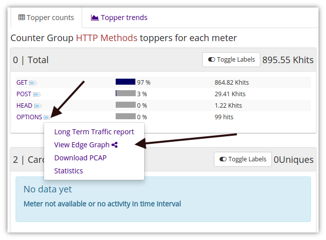

# Working with Edges

The entry point into exploring the streaming graph database of Trisul is to select two items

1. a*root vertex*from where you can enter the graph.
2. a time window

All exploration is done in a tool called the “Edge Graph Explorer”.

## Enable Feature

New installations of Trisul will already have*Edges*enabled. If you are upgrading an older install, ensure that you add the following line in[trisulProbeConfig.xml](/docs/ref/trisulconfig#edges)

```xml
<Edges> <Enable>True</Enable> </Edges>
```

## View Edge Graph

In a number of places in Trisul, you will see a list of keys within a counter group.

- Select the “View Edge Graph” menu to bring up the Graph Explorer.
- If you use “Retro Analysis” the time period is automatically set to the focus time window.



*Figure: View Edge Graph Menu Option*

## Tools > Edge Graph

To set an arbitrary node as the “root vertex”

Select Tools → Edge Graph

In the form that is shown there are four fields

| Group    | Select a Counter or Alert group from the drop down list |
| -------- | ------------------------------------------------------- |
| Key      | Enter a key within the counter group                    |
| From, To | Time Window                                             |

## Graph Explorer

The graph explorer is a simple point and click tool that allows you to expand and explore the graph network.

When you first open the Graph Explorer

- The immediate adjacent nodes are shown
- Each vertex group is of a different color
- Hover mouse over a node for more drilldown options
- Click on a node to open*its*1 level adjacent neighbors

The tool options are :

| View Label     | Shows labels or readable keys. For example, how hostnames or IP addresses for the*Hosts*counter group |
| -------------- | ------------------------------------------------------------------------------------------------------- |
| Treemap view   | Use a Tree map to show the graph. This is a cleaner option in some cases                                |
| Flow grap view | Use a force directed graph to display                                                                   |

:::tip

If the force graph is too messy, select a highly connected node, drag it a empty area and shake it a bit. The graph settles into a better layout.

:::
