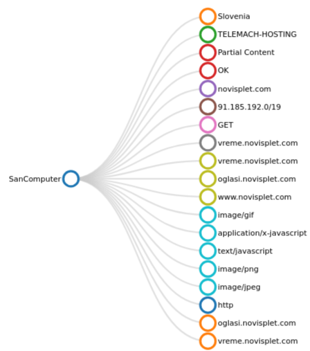

# Working with Edges

The entry point into exploring the streaming graph database of Trisul is to select two items

1. A *root vertex* from where you can enter the graph.
2. A time window

All exploration is done in a tool called the “*Edge Graph Explorer*”.

## Enable Feature

New installations of Trisul will already have *Edges* enabled. If you are upgrading an older install, ensure that you add the following line in [trisulProbeConfig.xml](/docs/ref/trisulconfig#edges)

```xml
<Edges> <Enable>True</Enable> </Edges>
```

## View Edge Graph

- To generate an Edge Graph, navigate to the [*Key Dashboard*](/docs/ug/ui/key_dashboard) by selecting a key from the dashboard. Within the Key Dashboard, locate the [*Key Details*](/docs/ug/ui/key_dashboard#key-details) section. From there, initiate the Edge Graph display by clicking on the "*Drilldown*" button and selecting "*View Edge Graph*". This is one covenient way to view an edge graph from anywhere like dashboards with *keys*.


*Figure: View Edge Graph Menu Option*

- But you can access *Edge Graph* directly using specific criteria, for that,

:::info navigation
:point_right: Go to Tools&rarr;Edge Graph
:::

This will open up the *search criteria* form for the *edge graph* with [*hide/show search form*](/docs/ug/ui/elements#hide-show-search-form) option.


*Figure: Search Criteria for Edge Graph*

Fill in the *Edge Graph* form with the help of the following fields and descriptions to define a search criteria.

| Field         | Description                                                                       |
| ------------- | --------------------------------------------------------------------------------- |
| Counter Group | Select a counter group from the list                                               |
| Time Frame    | Select a time range from the [Time Selector](/docs/ug/ui/elements#time-selector)  |
| Key           | Enter a key within the counter group to set as the "root vertex"                  |

Click *Show Graph* to view the edge graph for the search criteria defined by you.

## Edge Graph Overview 

### Graph Explorer

The Graph Explorer is an intuitive, point-and-click interface designed for navigating and examining the graph network.

  
*Figure: Edge Graph Explorer*


The *Edge Graph* explorer options include:

| Options                    | Description                                                                       |
| -------------------------- | --------------------------------------------------------------------------------- |
| Flow graph view             | Displays the graph network in a flow-based layout, illustrating the relationships between nodes and edges.                                                                                         |
| Treemap view               | Renders the graph network as a treemap, using nested rectangles to represent the hierarchical structure of the nodes and edges. This is a cleaner option in some cases                            |
| Label View                 | Toggles the display of labels for nodes and edges, providing additional context and information about the graph entities.                                                                            |
| Only Show Vertices of Type | Filters the graph network to display only nodes of a selected type, allowing for focused analysis on specific entities or groups.                                                                 |
| Show All                   | Resets the graph network to its default view, displaying all nodes and edges without any filters or restrictions.                                                                                     |                                                                                                                    
:::tip
To declutter a messy force graph, select a highly connected node, drag it to an empty area, and gently "shake" it to settle the graph into a better layout. 
:::

Upon initial generation, the Graph Explorer presents the following features:

### Initial View
- Displays immediate adjacent nodes for easy reference
- Vertices are grouped and color-coded for visual distinction

### Tree Map View

The *Tree Map View* represents the graph network as a branching layout, illustrating the organization of nodes. 


  
*Figure: Edge Graph- Tree Map View*

This visualization:
- Shows a clear and organized structure, with relative nodes branching out from a central root
- Highlights the relationships between nodes and their connection to the root vertex

Suitable for a clean and intuitive visualization of the graph network


### Interactive Features  
- **Hover**: Mouse over a node to reveal additional drilldown options.  
- **Click**: Select a node to expand and display its 1-level adjacent neighbors, enabling further exploration of the graph network. By clicking on a *key* you can further drilldown to two options:
    - Go to the [*key dashboard*](/docs/ug/ui/key_dashboard) of the selected *key*.
    - *Set as root node* option allows you to generate a new edge graph with the selected *key* as root node.

  
*Figure: Initial View and Interactive Features of Edge Graph*


