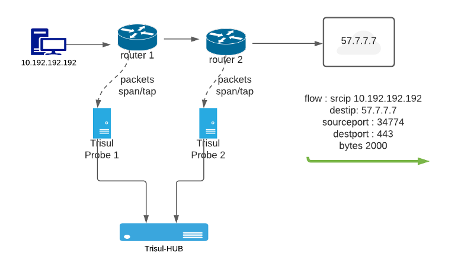
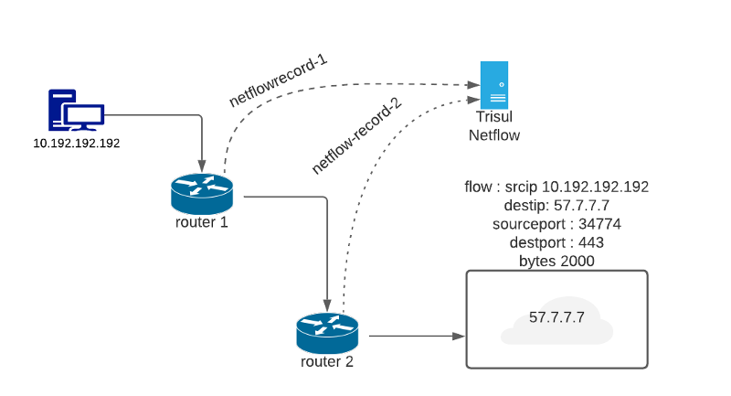

# Flow Legs and duplication

Trisul Network Analytics continuously receives flow telemetry either
from packets or from Netflow. In some cases the same flow maybe received
from multiple devices one for each leg. De-duplication refers to the
process where multiple flow legs are correlated.

## When dup flows are received

Duplicate flows can be received in both Netflow and Packet modes. The
following diagrams shows these two scenarios.

### Packet mode flow legs

In packet mode, customers can deploy multiple Trisul Probe nodes at
different locations in their network, these probes then report to a
central hub node. This is the distributed model of Trisul.

  
*Figure showing flow legs being received by Trisul Hub from two probes*

In the above example the flow parameters are

1. The flow *F* : Source IP 10.192.192.192 Port 34774 Dest IP 57.7.7.7
   Port 443
2. The flow *F* reported by Trisul Probe 1 to the hub
3. The flow *F* reported by Trisul Probe 2 to the hub

### Netflow mode flow legs

In Netflow mode, the same flow which traverses multiple netflow enabled
devices can produce duplicate *flow leg* records. This affects both
distributed and single deployments of Trisul.

  
*Figure Flow leg Netflow records being received for the same flow from
two separate routers*

In the above example the flow parameters are

1. The flow *F* : Source IP 10.192.192.192 Port 34774 —\> Dest IP
   57.7.7.7 Port 443
2. The flow *F* reported by router 1
3. The flow *F* reported by router 2

## Trisul handling of duplicate flows

The default behavior of Trisul is to keep the flows as-is because the
router or probe information is also kept with the flow. This allows
customers to select a router interface and view the flows for that
interface. Optionally one can choose to merge the flows into a single
flow if such drilldowns are not desired. Here are the list of options
supported by Trisul.

| Handling                           | Config                                                          | Notes                                                                                                                                                                                             |
| ---------------------------------- | --------------------------------------------------------------- | ------------------------------------------------------------------------------------------------------------------------------------------------------------------------------------------------- |
| Keep flows as-is                   | Default behavior                                                | Allows you to keep the flow-leg information which allows you to drilldown from router and probes                                                                                                  |
| Merge flows                        | [Netflow Config File](/docs/ref/netflow-config.html#parameters) | Set the `MergeMultipleSources` Option to TRUE to de-duplicate the flows. This however removes the router information and customer will not be able to drilldown from a router interface to a flow |
| Keep flows but Correlate dup flows | [Web Trisul Config](/docs/ug/webadmin/web_options.html)         | Enable the `Flow Legs Correlation` option. This allows you to merge the flows from multiple router and show it in a nice display                                                                  |
| NAT correlation                    | [Web Trisul Config](/docs/ug/webadmin/web_options.html)         | Keeps the flow legs but apply source port NAT heuristics to show flow legs                                                                                                                        |

In the rest of this page we will describe the Flow Leg correlation.

## Explore flows with Flow Leg correlation

If `Flow Legs Correlation` option is set in Web Trisul Options, then the
flow query tools automatically correlate the flow legs and show them in
the fashion below.

  
*Figure : Explore Flows tool showing correlated flow legs.*

You can see that there is a visual grouping indicating these are flow
legs.

### NAT

If `Include NAT Flow Legs Correlation` Web Trisul option is set to TRUE,
Trisul applies various NAT heuristics to detect and mark flow legs and
it is shown in the same manner above.
