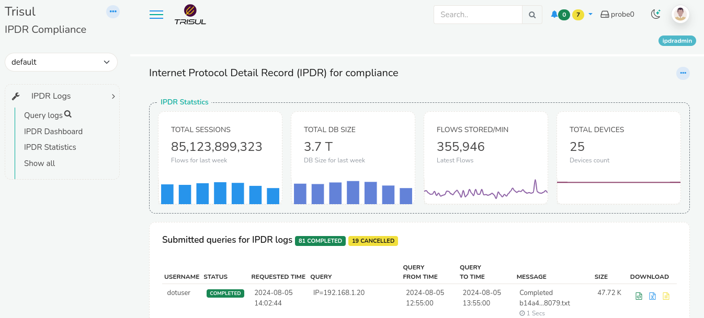
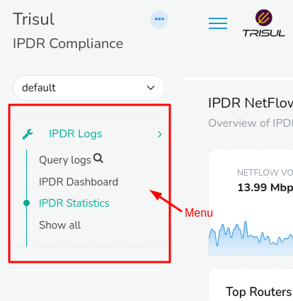

# Trisul IPDR

Trisul IPDR (Internet Protocol Detail Record) is built primarily for the requirement of Depatment of Telecommunication (DoT) Compliance for Internet Service Providers (ISPs). But it is not exclusive for ISPs, various stakeholders also utilize Trisul IPDR including LEAs, Network Admins, Security teams etc. 

With Trisul IPDR you can,

1. Query using IPDR Query Form

2. View Dashboard and Generate Reports

3. View Statistics
   
   To login to Trisul IPDR,
   
   :::note navigation
   
   Login as Username: `dotuser`
   
   And Passord: ipdr@@123
   
   :::
   
   Once you have logged in, you will be taken to Trisul IPDR Login screen with IPDR menu and IPDR Dashboard.
   
   
   
   ### IPDR Menu
   
     
   
   On the Left side of the screen you can find the IPDR menu where you can navigate to,
   
   1) [Query Logs](/docs/ug/flow/querying_using_ipdr)
   
   2) [IPDR Dashboard](/docs/ug/flow/ipdrdashboard)
   
   3) [IPDR Statistics](/docs/ug/flow/ipdrstatistics)
   
   4) Show all. Click on Show all to view all other tools and dashboards for analysis.
