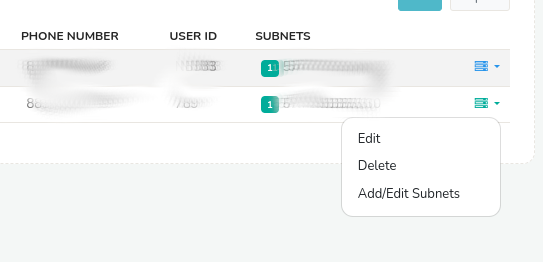

# IPDR Export format

This page describes the fields when you export flows using this IPDR *IP Data Record* feature.

## The IPDR report fields

As per the compliance requirement the ISPs need to provide the following sets of fields to the agency.

The fields come from three sources

- Network Traffic – Netflow or PCAP
- AAA – Integration with AAA system/ RADIUS etc
- Customer System – The fields collected by the CAF (Customer Acquisition Form) provide the contact info, phone number etc.

### Table

| Name             | Source      | Notes                                                                          |
| ---------------- | ----------- | ------------------------------------------------------------------------------ |
| Protocol         | Flow        | UDP or TCP or ICMP or any other IP protocol of the flow                        |
| Source IP        | Flow        | Source IPv4 or IPv6 address of the flow                                        |
| Source Port      | Flow        | TCP or UDP Port                                                                |
| Destination IP   | Flow        | Dest IPv4 or IPv6 address of the flow                                          |
| Destination Port | Flow        | TCP or UDP Port                                                                |
| Start Time       | Flow        | Start time of the flow in YYYY-MM-DD-HH:MM:SS up to second                     |
| End Time         | Flow        | End time of the flow in YYYY-MM-DD-HH:MM:SS up to second                       |
| Duration         | Flow        | Duration of flow in seconds                                                    |
| NAT IP           | Flow        | NAT IP – usually this is the public IP, if the source IP is a private IP space |
| NAT Port         | Flow        | NAT Port                                                                       |
| Device           | Flow        | The router or other device that exported this flow                             |
| UserID           | AAA         | The user ID obtained from AAA                                                  |
| SubscriberID     | AAA         | Subscriber ID used by some ISP to link with customer databases                 |
| CustName         | Customer DB | Customer name                                                                  |
| Address          | Customer DB | Address                                                                        |
| Email            | Customer DB | E-Mail                                                                         |
| Phone            | Customer DB | Phone number                                                                   |
| Alt-Phone        | Customer DB | Alternate Phone Number                                                         |
| UserID           | Customer DB | A user ID or shortname                                                         |

## Exporting IPDR into a document

You can view new and previous IPDR queries in the IPDR Dashboard.

:::note navigation

Goto IPDR Logs → IPDR Dashboard

:::

Completed queries allow you to download the results in three document formats

- Text Report
- XLSX
- CSV

The buttons are shown in the image below

For most cases we prefer the XLSX report. If the number of flows are huge say greater than 250K then use the text report format.

The MS Excel fields looks like this below.

## NAT details

If the NAT is performed on the device exporting the NetFlow the information is automatically added and available. If NAT is done in a different device, then please enable NetFlow on that device. CGNAT is similar.

## AAA details

For ISP, using PPPoE or other technologies to connect users, then we need to add the AAA information to the flows. This is because the IP Address is dynamic and can be re-used by a number of customers. Trisul IPDR supports the following modes of AAA

- AAA Syslog -from systems like FreeRADIUS
- AAA databases – periodically send AAA logs into a FTP directory on the Trisul IPDR server, the information is automatically picked up and merged.

## Customer details

Adding customer details for static IP can be done in two methods

- Automatically use a REST API – since this is going to be custom work, please contact us with the API details from the ISP end.
- Enter or upload static IP to customer mappings

The following section describes how enter customer mappings.

### Adding Customer to IP mappings

For ISPs who provide business services with static IPs for their customers, the manual mapping is the easiest option.

The flow is

- Add customers first
- Assign IP addresses to customers

Login as admin

:::note navigation

Goto Context: default → Admin Tasks → IPDR Customers

:::

The column subnets shows the IP Addresses addressed to each customer along with other details.

#### Add Customer

Press the Add button to add a new Customer.  
Fill in the details and add the customer.

#### Add IP Subnet to Customer mapping

Press the Add/Edit Subnet option

Then add the IP Address in the format you can use the plain IP address `192.168.1.23` or `192.168.1.23/32` CIDR format.

Once done simply press the back button to go back to the customer mappings.

#### Bulk import from Excel/CSV format

You can also import an entire customer database at once via a CSV file. If you have an EXCEL file you can save it as CSV and import it in.

The CSV format is shown here:

A sample working CSV file can be downloaded from here [Sample_IPDR_Customer_Import.CSV](/assets/SAMPLE_IPDR_CUSTOMER_SUBNET_MAPPINGS.csv) You can edit the information as needed.

- Step 1 : Select the CSV file
- Step 2 : Select the column numbers, if you followed the sample file above you can skip this step and directly press IMPORT
- Step 3 : Confirm
