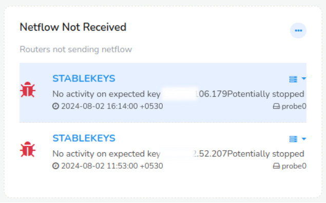

# IPDR NetFlow Statistics

IPDR NetFlow statistics dashboard contains modules of statistical network usage data that ISPs collect.

Lets explore the Trisul IPDR NetFlow Statistics dashboard from this example.

Trisul IPDR NetFlow Statistics dashboard consists of the following modules.

## NetFlow Volume

This module displays the total volume of network traffic flowing through ISP's infrastructure in bits per second (example, Mbps, Gbps). Clicking on the value takes you to the [Key dashboard](/docs/ug/ui/key_dashboard) where you can drill down for further details.

1) Click on the little graphical icon next to the title. That is the **historical chart** where you can view the NetFlow volume for the past. You can set any custom date in the time frame to view the past data of that particular time.

2) The **percentage** on the right side is the value by how much percentage has Netflow volume increased or decreased from the last minute.

3) The graphical **chart** in this module represents the real-time Netflow volume data since one hour. And you can hover over the chart at any point of time to view the NetFlow Volume at that time.

## Total Bandwidth

Total Bandwidth module gives the sum of all bandwidth used by customers in bits per second (example, Gbps). Clicking on the value takes you to the [Key dashboard](/docs/ug/ui/key_dashboard) where you can drill down for further details.

- Click on the little graphical icon next to the title. That is the **historical chart** where you can view the total bandwidth data for the past. You can set any custom date in the time frame to view the past data of that particular time.

- The **percentage** on the right side is the value by how much percentage has total bandwidth usage increased or decreased from the last minute.

- The graphical **chart** in this module represents the real-time total bandwidth data since one hour. And you can hover over the chart at any point of time to view the total bandwidth at that time.

## Total Routers

This module shows the total number of routers in the ISP's network. Clicking on the value takes you to the [Key dashboard](/docs/ug/ui/key_dashboard) where you can drill down for further details.

The graphical **chart** in this module represents the real-time total number of routers since one hour. And you can hover over the chart at any point of time to view the total number of routers at that time.

## NetFlow Records

This module shows the number of flow records generated by the ISP's network in Krps (Kilo records per second). Clicking on the value takes you to the [Key dashboard](/docs/ug/ui/key_dashboard) where you can drill down for further details.

- Click on the little graphical icon next to the title. That is the **historical chart** where you can view the NetFlow records data for the past. You can set any custom date in the time frame to view the past data of that particular time.

- The **percentage** on the right side is the value by how much percentage has NetFlow records data increased or decreased from the last minute.

- The graphical **chart** in this module represents the real-time NetFlow records data since one hour. And you can hover over the chart at any point of time to view the netflow records data at that time.

## Top Routers- Bandwidth

This module shows the top routers that has the maximum bandwidth usage in table format. You can click on any router on the table that will take you to the [Key dashboard](/docs/ug/ui/key_dashboard)of that particular router.

## Top Routers- NetFlow Bandwidth

This module shows the top routers sending NetFlow that has the maximum bandwidth usage in table format. You can click on any router on the table that will take you to the [Key dashboard](/docs/ug/ui/key_dashboard)of that particular router.

## NetFlow Not Received

