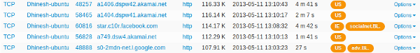
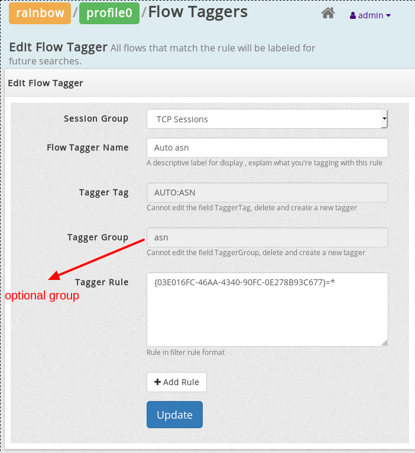
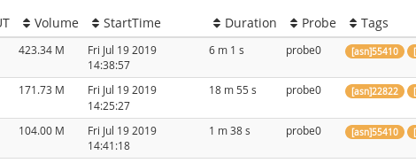

---

sidebar_position: 01

sidebar_label: Flow Taggers

---

# Flow Taggers

Flow Taggers assign one or more text labels to flows in real time. These
labels are created by rules you specify. You can then search for flows
containing these text tags.

  
Figure: Tags are shown alongside flows

#### Some examples

1. Mark flows that generated an alert with the tag `"ALRT"`
2. Mark flows to China or Ukraine as `"CHUKR"`
3. Mark all non-HTTP flows to your subnet 10.18.10.0/24 as `"SUSPECT"`

### How it works

Flow taggers allow you to do things that are remarkably hard to do
retrospectively. For example, you can create a flow tagger that will
mark all flows from your internal network to China/Ukraine. The way this
works is, If Trisul sees activity in the *Country* counter group for
keys *CN,UA* then the corresponding flow is marked with the *tag* you
provide.

1. Flows are tagged based on rules you create on counter activity
2. A single flow can be marked with multiple tags.
3. You can pull up flows by tag name at any time

## Configuring

You need to restart Trisul for configuration changes to take effect

To create a flow tagger

:::note navigation

Goto Customize -\> Flows -\> Flow Taggers

:::

You will see a list of existing taggers. Trisul ships with a few
taggers, which are disabled by default. Click on *Create a new flow
tagger*

Fill out the details as shown

|         |                                                                      |
| ------- | -------------------------------------------------------------------- |
| **Tag** | A short string. Alphanumeric only                                    |
| Name    | A descriptive name, this name will appear while viewing tagged flows |
| Group   | An optional tag group to name space the tags                         |
| Rule    | A string in [Trisul Filter Format](/docs/ref/trisul_filter_format)   |

### Entering the rule

#### Directly enter the rule

If you are familiar with the [Trisul Filter Format](/docs/ref/trisul_filter_format) you may enter the string
directly here. For example : Flows to China and India can be marked by
the expression `{00990011-44BD-4C55-891A-77823D5916B}=CN,IN` This means
the keys CN and IN in the counter group Country (identified by the GUID)

#### The rule builder

This is the easier way to construct the *Tagger Tag* expression. See
[Rule Builder](/docs/ug/tools/rule_builder)

## Automatic flow tagging

Automatic flow tagging allows you to automatically mark flows with keys
from a counter group. For example, you can mark all flows with the
country codes or web category. This is the same concept as “Log
Enrichment” in other systems.

To configure automatic flow tagging.

1. Prefix your tag name with `AUTO:`
2. In the rule, select a counter group and enter `*` for the key

##### Example

To automatically tag flows with the URL Category

1. Enter `AUTO:myurlcat` for the tag name
2. The rule is created by selecting HTTP URL Category and then `*` as
   the key
3. The final rule is `{0F3D2DC3-107C-4348-8561-757734AF4666}=*`

### Tagger groups

A flow tag is nothing but a string label added to each flow. Using
Tagger groups you can add a namespace to the tags. When you add tags to
a namespace they are grouped together when using the [Aggregate
Flows](/docs/ug/tools/aggregate_flows) tool.

The following shows an Automatic flow tagger that attaches the AS number
of source and destination IP to each flow. We have added a tag group
called “asn”

Tags generated by this tagger automatically get an extra `[asn]`
attached to the tag.

## Viewing

You can view the flow tags in a couple of ways.

1. Use the [Flow taggers](/docs/ug/tools/flow_tagger) tool to see
   a list of top flows for each tag you have set up.
2. Search for flows by tagname using the [Explore
   flows](/docs/ug/tools/explore_flows) tool.
3. Use the [Aggregate Flows](/docs/ug/tools/aggregate_flows) tool.
