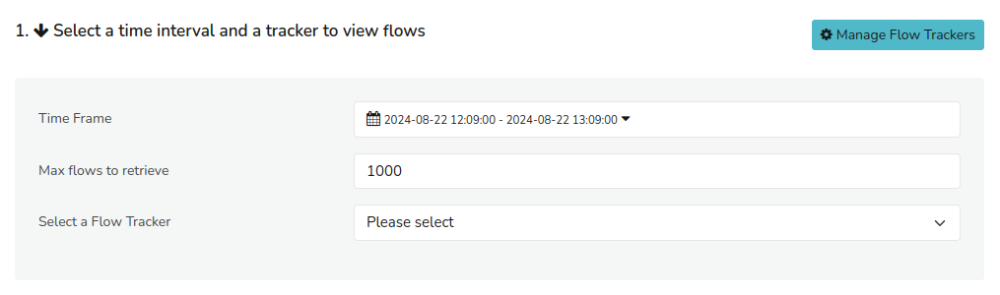
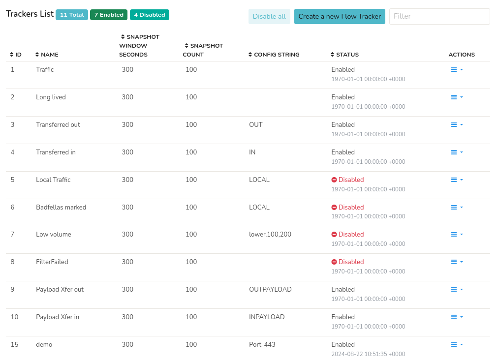
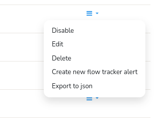
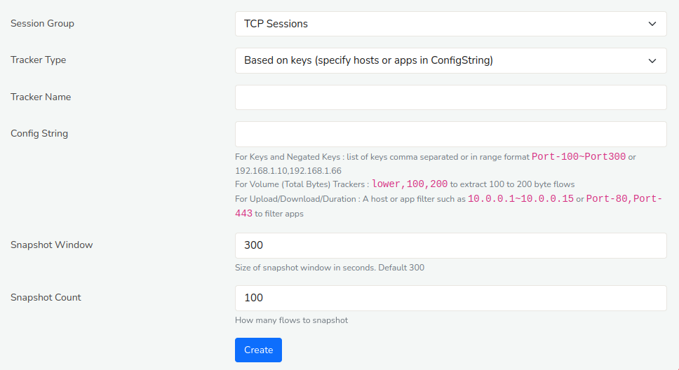

# Flow Trackers

A flow tracker is used to capture and save snapshots of top flows
matching a range of criteria.

## Intro

The Trisul database can potentially end up with hundreds of millions of
flows every day. Using flow trackers you can perform quick topper
analysis of the flow database over large timeframes.

A common use case of Flow Trackers is to track the so called ‘Elephant
flows’. Those are flows transferring a huge volume of data. But as you
shall see below this is not the only type of tracker. Flow trackers are
also necessary for you to use [flow tracker alerts](/docs/ug/alerts/ft).

This section outlines the number of things you can do with *Flow Trackers*. 

1) [**View**](/docs/ug/flow/tracker#view-flow-trackers): View flow data and analytics.
2) [**Manage**](/docs/ug/flow/tracker#manage-flow-trackers): Manage flow tracking configurations and settings.
3) [**Create**](/docs/ug/flow/tracker#create-flow-trackers): Create custom flow tracking profiles and criteria.

## View Flow Trackers

To **View** *Flow Trackers*
:::info Navigation
:point_right: Go to Tools&rarr;Flow Trackers
:::

    
*Figure: View top flows based on certain criteria*  

Once you have landed on the *Flow Trackers* page as shown in the sample, you can view the flows in three steps.  

* Step 1: **Select a Time Frame** from the [*Time Selector*](/docs/ug/ui/elements#time-selector) to narrow down the flow data to a relevant interval.  
* Step 2: **Specify Max flows to retrieve** allowing you to focus on the most significant or relevant flows, and avoid information overload.  
* Step 3: **Select a Flow Tracker** to view flows that match specific criteria, such as top talkers, bandwidth usage, or application-specific traffic, enabling targeted analysis and insights.

## Manage Flow Trackers

To **Manage***Flow Trackers*,

:::info navigation
:point_right: Go to Tools&rarr;Flow Tracker&rarr;Manage Flow Trackers
:::

The following window shows the currently configured Flow Trackers.
  
*Figure: Flow Trackers List*

There are Trisul built in trackers for quick access and you can also create your own flow trackers specifying certain criteria.

### Built in Trackers

The following sample flow trackers are available. 

| Flow Tracker    | Description   |
| --------------- |-------------------------------------  |
| Traffic         | Overall volume of network traffic |
| Long Lived      | Connections with the longest duration|
| Transferred-Out | Highest volumes transferred **out** your network. Where Source IP is in the Home Net and destination IP is not |
| Transferred-In  | Highest volumes transferred **into** your home network where Source IP is outside your Home Network and Destination IP is inside|
| Local Traffic   | Traffic within your local network|
| Badfellas Marked| Suspicious or Malicious traffic|
| Low Volume  	  | Connections with minimal data transfer|
| Payload Xfer Out| Highest volume of TCP Payload data transferred **out of** your network. Does not include TCP handshake packets|
| Payload Xfer In | Highest volume of TCP Payload data transferred **into** your home network. Does not include TCP handshake packets|
| Non HTTP/S | Sample tracker shows you how to match flows that dont match certain tuples | 

### Options 

Each of the Flow Trackers has an Options menu item on the far right side.  It contains the following options.

*Figure: Menu Options* 

|Option| Note|
|----|----|
|Disable| Disable this tracker |
|Edit | Modify the criteria |
|Delete | Delete this tracker |
|Create new Flow Tracker Alert| Flow tracker alerts let you know when certain flows cross thresholds, example when flows in the Download Flow Trackers crosses the value 1GB. See [Flow Tracker Alert](/docs/ug/alerts/ft) |
|Export to JSON| You can export this tracker to JSON. Can later be imported as an App|

:::warning Delete still keeps data
Deleting a flow tracker will not delete from the historical database flows that have already been classified. Merely prevents new flows from being classified
:::

## Create Flow Trackers

Creating a flow tracker consists of specifiying a **Criteria** for selecting flows.

To **Create** a new *Flow Tracker*,

:::info navigation
:point_right: Go to Tools&rarr;Flow Tracker&rarr;Manage Flow Trackers&rarr;Create a New Flow Tracker
:::

The following form is shown

*Figure: Creating a flow tracker*

### Session Group

TCP Sessions is the only option allowed by default.

### Tracker Type

The *Tracker Type* is combined with the *Config String* field to specify the criteria.

There are two categories 

1. **Key based** : Track top flows by filtering IP Address, Subnets, Ports, or Port Ranges
2. **Volume based** : Track flows within a range of bytes transferred. This
   option lets you track flows that transfer a range of bytes say
   between 500 and 1000 bytes. This has application in very specific
   security scenarios and you cannot combine it with port and IP based
   filters.

| Tracker Type | Type | ConfigString | What it means  |
| -------------- | ---| -------------| -----|
| Based on keys | Key | **Tuples** Key  IPs or Ports or Interfaces or Protocol | Matches flows with these IP/Ports i   |
| Based on Negated keys | Key | Tuples | Matches flows Other than these  |
| Based on total bytes |Volume   | Optional Ranges |  Total bytes transferred. You can specify a volume constraint to track flows transferring a range of bytes.  |
| Based on upload| Volume |Tuples|  Total bytes uploaded from host within Home Network to outside the Home Network. You can specify a port or IP range filter to narrow down which flows will be considered for this|
| Based on download| Volume | Tuples | Total bytes from host outside Home Network to within the Home Network.|
| Based on upload payload | Volume | Tuples | Total TCP Payload bytes downloaded. This does not include the IP and TCP and other headers. Filter allowed.|
| Based on upload|Volume | Tuples |  TCP Payload bytes uploaded. Filter allowed.|
| Based on flow duration seconds|Volume| None | Long lived flows based on duration|

### Tracker Name

A short name for the tracker.

### Config String

A filter string that allows you to specify what subset of flows you want to consider.

| Tracker Type            | Config String                                                                          |
| ----------------------- | ---------------------------------------------------------------------------------------|
| For type “Based on Total Bytes”  | `lower,100,500` track flows between 100 and 500 bytes, prefer the lower side.  `higher,500,2000` track flows between 500 and 2000 bytes, prefer the higher side                                    |
| All other tracker types | A filter string (See below)                                                            |

#### Filter String Format

Some examples

| Config String               | Filter                                      |
| --------------------------- | ------------------------------------------- |
| `192.168.1.8`               | Flows involving 192.168.1.8                 |
| `192.168.1.8,192.168.1.33`  | Flows involving 192.168.1.8 OR 192.168.1.33 |
| `192.168.1.1~192.168.1.255` | Flows in subnet 192.168.1.x                 |
| `espn.com`                  | Using hostname instead of IP                |
| `http,https`                | Port 80 and Port 443                        |
| `Port-2000`                 | Port 2000                                   |
| `Port-2000~Port-6000`       | Port 2000 to 6000                           |
| `!192.168.1.8`              | Not from 192.168.1.8                        |
| `!192.168.1.8~192.168.1.18` | Not between 192.168.1.8 and 19              |
| `103.10.31.100_00000003`    | Flows on router `103.10.31.100` interface `3` |
| the ! character             | Use in front of any filter to negate        |

#### Tracking flows in range 

The main application for tracking flows transferring low payload is in
specific security scenarios. In case you are interested in this type of
tracker here is some additional information.

| Flow Trackers | Description                                                  |
| ------------- | ------------------------------------------------------------ |
| **lower,x,y** | Track flows transferring lower volumes in the range x and y  |
| **upper,x,y** | Track flows transferring higher volumes in the range x and y |

Say you have configured flow trackers to track 100 flows, and there are
150 flows in the range 100 to 200 bytes. **upper,100,200** will count
the higher of the 150 flows and **lower,100,200** will count the lower
100 of the 150 flows.

### Snapshot Window

Size of the snapshot window in seconds. A streaming analytics setting.  Default 300 seconds = 5 minutes.

### Snapshot Count

How many Top-K flow matches should be tracked in one streaming window.  Default 100. 

## Advanced Topics

:::tip Advanced LUA API
If you want to specify a complex criteria that isnt covered by the standard flow trackers, you can write small LUA scripts using the [LUA Flow Tracker API](/docs/lua/flow_tracker)
:::

Also  [Flow Tracker Alert](/docs/ug/alerts/ft) section.
