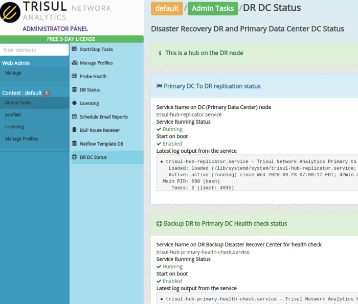

# Configuring Primary Backup DR systems

This document describes how you can setup a backup Trisul Network Analytics system as a DR (Disaster Recovery) node.

Terminology : In some places , we use DR node to refer to the Backup node, and DC node to refer to the Primary node. DC stands for Data Center.

:::note

Terminology : In some places , we use DR node to refer to the Backup node, and DC node to refer to the Primary node. DC stands for Data Center.

:::

## Prerequisities

If you are configuring Disaster Recovery for a pre-existing Trisul install, ensure you copy the data over manually using scp first. By default, the sync intially only copies the latest 7 days during intialization.

### Per context DR

The Primary-Backup configuration needs to be configured on a per-context basis. The instructions on this page applies to the *default* context. Multi tenant customers with multiple contexts need to configure for each context separately.

### Service names

The systemd service names are

trisul-hub-replicator

Run on the PRIMARY (DC) node. Sets up the incremental replication processes from the primary. For contexts other than the default context this service is called `trisul-hub-replicator-contextname`

trisul-hub-primary-health-check

Runs on the BACKUP (DR) node. Checks the PING reachability of PRIMARY nodes. For contexts other than the default context this service is called `trisul-hub-primary-health-check-contextname`

## Configuring DR on Primary and Backup sites

### Create home directories for the trisul user

On both the Primary and Backup sites , Trisul processes run under the username `trisul.trisul`. This will be used by the replication process to synchonize the data.

Repeat the following process on both the primary and backup site.

Edit /etc/passwd  
Assign a shell to the `trisul` user as shown below

`trisul:x:999:999:Trisul Daemon User:/home/trisul:/bin/bash`

Ensure home directory exists for the trisul user

`root@ubuntuDR:~# mkhomedir_helper trisul`

Create a password

```bash
root@Ubuntu:~# passwd trisul
Enter new UNIX password: 
Retype new UNIX password: 
passwd: password updated successfully
```

### Create a SSH key pair for automatic ssh

:::note

Do these for both PRIMARY-BACKUP and BACKUP-PRIMARY directions.

:::

#### Use ssh-keygen

Login as the trisul user and use `ssh-keygen` to create a key pair. Press ENTER to skip the passphrase.

```bash
su trisul

trisul@Ubuntu:~$ ssh-keygen
Generating public/private rsa key pair.
Enter file in which to save the key (/home/trisul/.ssh/id_rsa): 

skip the passphrase
..
```

#### Use ssh-copy-id to setup login

Use `ssh-copy-id` to create an automatic login for the `trisul` user. THis will be used by rsync to transfer data to the backupsite.

On Primary :

```bash
ssh-copy-id trisul@backup-ip-address
```

On Backup :

```bash
ssh-copy-id trisul@primary
```

At this point , both sides should be able to login to each other without a password.

## Configure the primary site replication

On the primary site run the `install-replication-primary.sh` script to create the replication service.

```bash
root@Ubuntu:/usr/local/share/trisul-hub# ./install-replication-primary.sh 
Configuring this node as a PRIMARY site in a PRIMARY-BACKUP (DR-DC) configuration

You will be asked a series of questions. Hit ENTER to accept defaults

Enter username   (default trisul) : 
Enter domain    (default domain0) : 
Enter hub          (default hub0) : 
Enter context  (default context0) : 
Enter IP of BACKUP site hub       : 192.168.2.141
Thanks ! Configuring scripts for replication, now testing connection
--------------------------------------------------------------------
PING 192.168.2.141 (192.168.2.141) 56(84) bytes of data.
64 bytes from 192.168.2.141: icmp_seq=1 ttl=64 time=0.197 ms

--- 192.168.2.141 ping statistics ---
1 packets transmitted, 1 received, 0% packet loss, time 0ms
rtt min/avg/max/mdev = 0.197/0.197/0.197/0.000 ms

  * Creating configuration file /usr/local/etc/trisul-hub/domain0/hub0/context0/DCDRReplicationSettings.conf
  * Checking rsync user home directory for RSYNC
  * Installing systemd services into trisul-hub-replicator.service
  * systemctl daemon-reload 
  * Use [systemctl enable trisul-hub-replicator] to enable on reboot
  * Login as trisul on this site and run [ssh-copy-id trisul@192.168.2.141]  to create automatic login for RSYNC
  * Customize in config file /usr/local/etc/trisul-hub/domain0/hub0/context0/DCDRReplicationSettings.conf
```

#### Further customization for PRI-BAK replication

Further customization can be done by editing the `DCDRReplicationSettings.conf` file shown above.

## Configure the backup node health check

The backup node service performs a health check on pre-defined IP addresses in the primary site. If ALL the IPs are unrechable for a predefinied period of time [default 7 minutes], the service declares the PRIMARY site to be down. Then starts the Trisul Probe Processes on the backup site and the service stops.

Use install-replication-backup.sh to configure the backup node.

```bash
root@ubuntuDR:/usr/local/share/trisul-hub# ./install-replication-backup.sh 
Configuring this node as a BACKUP site in a PRIMARY-BACKUP (DR-DC) configuration

You will be asked a series of questions. Hit ENTER to accept defaults

Enter username       (default trisul) : 
Enter domain        (default domain0) : 
Enter hub              (default hub0) : 
Enter context      (default context0) : 
IPs for health check (space separated): 192.168.2.140
Enter IP of paired  PRIMARY hub       : 192.168.2.140

  * Creating configuration file /usr/local/etc/trisul-hub/domain0/hub0/context0/DRDCHealthCheck.conf
  * Checking rsync user home directory for RSYNC
  * Installing systemd services into trisul-hub-primary-health-check.service
  * Use [systemctl enable trisul-hub-primary-health-check] to enable on reboot
  * Login as trisul on this site and run [ssh-copy-id trisul@]  for restore sync 
  * You can adjust timeouts , retries, advanced RSYNC options in the config file below
  * Customize in config file /usr/local/etc/trisul-hub/domain0/hub0/context0/DRDCHealthCheck.conf
```

#### Further customization for PRI-BAK replication

Further customization can be done by editing the `DRDCHealthCheck.conf` file shown above.

## Start services on primary and backup nodes

On the PRIMARY node, the trisul-hub-replicator service pushes the incremental changes continuously to the backup site.

On the PRIMARY node.

**On the PRIMARY node**

```bash
systemctl start trisul-hub-replicator
```

On the BACKUP node.

```bash
systemctl start trisul-hub-primary-health-check
```

### View log files about the status of the processes

on primary  
`journalctl -fu trisul-hub-replicator`

on backup  
`journalctl -fu trisul-hub-primary-health-check`

## Failover

The Failover process is automatic.

When the PRIMARY site fails, the predefined IP addresess become unreachable from the backup site. The trisul-hub-primary-health-check service on the backup site starts the Trisul processes on the backup site and stops.

Packet Mode

arrange the packets to be sent to the backup system

Netflow mode

the Netflow streams have to be sent to the backup probe addresses. This can be accomplished by a load balancer or other methods.

## Restoration

The restoration process needs manual intervention. First ensure that the conditions that caused the failure have been corrected.

The process is :

- ### on PRIMARY : Bring up the PRIMARY system
  
  Boot the backup system and ensure it is working. Login to the system and make ensure :
  
  - able to PING the backup node
  - able to SSH into the backup node

- ### on PRIMARY : Stop any running Trisul Processes
  
  Ensure all processes are stopped on the primary system

```bash
trisulctl_hub stop context all
```

### on BACKUP : Copy the data to the PRIMARY

Now we need to copy the data from the running backup system onto the primary. This will include all the data that was collected during the downtime of the primary.

:::info

This step can take some time as the delta is copied from the BACKUP back to the PRIMARY node. We recommend you use a `screen` session to run this.

:::

```bash
# preferably use a screen session

cd /usr/local/share/trisul-hub

./restore_sync_dr_dc.sh /usr/local/etc/trisul-hub/domain0/hub0/context0/DRDCHealthCheck.conf
```

This will run for a while, copying all the changes back to the DC site.

when the copying finishes you will see a message like the following.

```bash
..
sent 37 bytes  received 12 bytes  32.67 bytes/sec
total size is 0  speedup is 0.00
BACKUP WEBTRISUL DB
--- Successfully Finished Sync ---
--- The PRIMARY/DC site data is now ---
--- synchronized with the BACKUP/DR site ---

--- Now you can stop the BACKUP/DR ---
--- and start the PRIMARY/DC site ---
Wed Sep 23 07:07:27 EDT 2020
root@ubuntuDR:/usr/local/share/trisul-hub# 
```

Now you are ready to

### on BACKUP : Stop the probes

You can manually stop the probes on the backup node. You should not stop the hub nodes however. Run the following command to stop the default context on probe0.

```bash
trisulctl_hub stop context default@probe0
```

### on BACKUP : Switch back to BACKUP mode

Run this to go back to BACKUP mode.

```bash
systemctl start trisul-hub-primary-health-check
```

### on PRIMARY : Start the processes

On the primary node start up the processes

```bash
trisulctl_hub 
start context default
```

### on PRIMARY : switch back to PRIMARY mode

This step will put the system back into PRIMARY BACKUP configuration.

```bash
systemctl start trisul-hub-replicator
```

This completes the process.

To view the status of the Replicator and Health Check processes, login as Administrator to either the primary or backup node. To view the status of the *default* context, do :

:::note

Select Context: default > Admin Tasks > DC DR Status

:::



The following information is shown:

| Mode                | Whether the current node is configured as a PRIMARY (DC) or a BACKUP (DR node |
| ------------------- | ----------------------------------------------------------------------------- |
| Replication status  | Whether the replication process is *running*, *enabled* on boot               |
| Replication log     | Last few lines of the replication log, you can check the timestamps           |
| Health check status | On the Backup (DR) node, whether the health check processes are active        |
| Health check log    | Last few lines of the health check process log                                |
