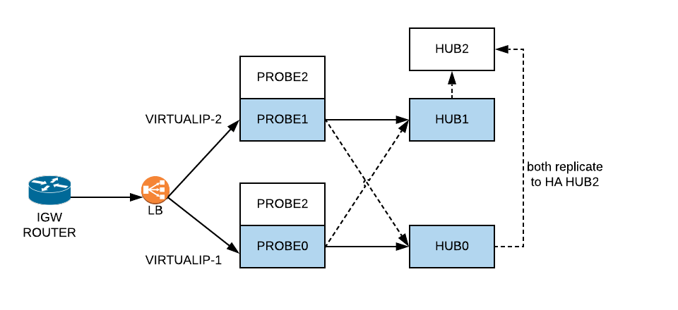

# High Availability

Trisul Network Analytics supports the following high availability options

**HA**

A high availability redundant hub probe setup within the same data centre. The cluster can withstand a single node failure with no loss of data or access

**DR**

setup a disaster recovery node typically in another data center.

import DocCardList from '@theme/DocCardList';

<DocCardList />

## HA

The Trisul HA setup is based on multihoming. A single Trisul Probe flushes to two hubs – a primary and a HA hub.

### HA Architecture Scenario

A typical HA setup is shown below. This particular setup has two hubs and two probe nodes. There is an additional HA hub and a HA probe node.

*Figure: HA Setup*

The topology is described below.

- Probe 0 and Probe 1 are production probes. The total load Is distributed to the two probes. 4 IGW each
- Probe 2 is the HA standby probe for both Probe 0 and Probe 1 (N+1 HA configuration)
- Probe 0 and Probe 2 share a Virtual IP Address VIP1, Probe 1 and Probe 2 shared a virtual IP VIP2
- On Probe0 or Probe1 failure, LB forwards traffic to Probe2 (the HA probe). Probe2 takes over as the new Probe-X that failed, The rest of the dataflow is not impacted.
- Hub 2 acts as the standby HA node for Hub0 and Hub1.
- When Hub0 fails the probe automatically switches to Hub1 and vice versa.
- The reports pull from all nodes hence there is no data loss.

Contact Trisul Network Analytics for more information. There are multiple options we can suggest.

## DR

In this mode a separate Trisul instance is run in another data center. Then using Trisul’s built-in RSYNC based incremental backup solution the data is replicated continuously to the DR site.

The following diagram shows the working.

*Figure: DR Setup*

The DR site hubs and probes must be of same sizing (CPU, Memory, IO) as the nodes in the primary DC site.

Contact Trisul Network Analytics for more information. There are multiple options we can suggest.
