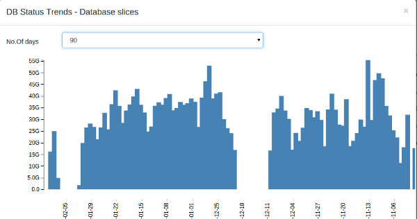

# System requirements

Computing requirements needed to run Trisul.

## In Packet Capture mode

Single machine in the default **Packet Capture Mode** with typical small
enterprise load of 50-200Mbps. \[ See [Setup Trisul for Packet Capture
Mode](/docs/ug/install/setup-pkt-capture) \]

| Hardware            | System Requirements                                                                                                                                                                                                        |
| ------------------- | -------------------------------------------------------------------------------------------------------------------------------------------------------------------------------------------------------------------------- |
| **Bare Metal**      | 4 Core 3Ghz Intel i3/i5/i7/or Xeon class, 8GB RAM, 2x1Gb LAN. SATA or 10K SAS for PCAP storage                                                                                                                             |
| **Virtual Machine** | 8 vCPU Cores, 12GB RAM, 2x1Gb LAN. VM Port Group mirror feature enabled to receieve the raw packets. VM is not recommended in Packet Capture mode when total load is greater than 500Mbps. Consider bare metal deployment. |

## In Netflow mode

Single machine in **NETFLOW mode** monitoring a router/switch with 1Gbps
load. \[ See [Setup Trisul for NETFLOW
mode](/docs/ug/netflow/) ]

| Hardware            | System Requirements                                                        |
| ------------------- | -------------------------------------------------------------------------- |
| **Bare Metal**      | 4 Core 3Ghz Intel i3/i5/i7/or Xeon class, 8GB RAM, 2x1Gb LAN. SATA storage |
| **Virtual Machine** | 6 Core 3Ghz Intel i3/i5/i7/or Xeon class, 8GB RAM, 2x1Gb LAN. SATA storage |

Virtual Machine is preferred in Netflow mode for enterprise class load.

## Operating system

Trisul is available on the following operating systems. Go to the
[Download Center](https://www.trisul.org/download/) to get access to the latest packages

| OS               | Bits            |
| ---------------- | --------------- |
| Ubuntu 18.04 LTS | 64-bits         |
| Ubuntu 16.04 LTS | 64-bits         |
| CentOS 7.x       | 64-bits         |
| Docker image     | on any host O/S |

If you have a distributed system, Trisul Probes and Trisul Hubs can be
installed on different O/S.

------------------------------------------------------------------------

## Scaling

The load profile of the Probe and Hub components.

| Node type    | Description                          | Load profile                                                                                                                                                                                                     | Scaling tip                                                              |
| ------------ | ------------------------------------ | ---------------------------------------------------------------------------------------------------------------------------------------------------------------------------------------------------------------- | ------------------------------------------------------------------------ |
| Trisul Hub   | Database node                        | Very high disk write IOPS, high read IOPS when queried, sequential write pattern, high network I/O to probe nodes                                                                                                | Add RAM 4GB per probe, 2 3Ghz Cores per probe                            |
| Trisul Probe | PCAP storage and streaming analytics | Very high CPU bound, high memory usage, diversity of traffic, TCP Reassembly features. For PCAP storage high sequential Disk I/O need RAID-0 array for \> 1Gbps disk. High network I/O when flushing to Hub node | Add more CPU cores, bigger cache, faster memory, 10G NIC or accelerators |

If you are placing Trisul Hub and Probe on the same box, then simply add
up the requirements.

### Trisul Hub sizing

The Trisul hub is a data storage and query node with a high bandwidth
and low latency I/O to the Trisul Probes.

| Mode | scaling metric                                           | additional resource needed |
| ---- | -------------------------------------------------------- | -------------------------- |
| Hub  | For every medium volume probe + every 5 concurrent users | 1 3Ghz Core + 2GB DDR4     |

Disk sizing is a key concern of the hub. The way Trisul-Hub works is
data from each probe is stored in a separate layer. Since Trisul is used
a lot in security applications no data is summarized or rolled up. To
get an idea of how much data is being added every day, you can let
Trisul run for a while and then check the following

Login as Admin -\> Context (default) -\> Admin Tasks -\> DB Status

You can get the database growth per day by looking at the “Database
slices” table. Click on the icon to bring
up a trend of database growth. This can help you size the system into
the future.

### Probe sizing : Packet capture

Some guidelines in table below for sizing the Trisul Probe node.

| Mode        | scaling metric                                        | additional resource needed |
| ----------- | ----------------------------------------------------- | -------------------------- |
| Raw Packets | For every 200-400Mbps with TCP Reassembly features    | 1 3Ghz Core + 4GB DDR4     |
| Raw Packets | For every 200-400Mbps without TCP Reassembly features | 0.5 3Ghz Core + 1GB DDR4   |

##### Typical Configuration - Packet Capture

A typical 500-700Mbps full blown SMB 500 IP license can run on the
following hardware. Conservative numbers

- Intel Core i7 with 8 Cores , 16GB RAM
- add 4xSATA in RAID-0 for PCAP storage

For more diverse networks say 8Gbps ; add more memory and Cores

- 2X Intel 3.2Ghz Xeon with 24 Cores and 128GB
- for PCAP you need larger RAID-0 - with 200Mbps/spindle as a raw rule
  of thumb

### Scaling Netflow mode

The relevant scaling metric is Netflow volume. The mapping typically is

- Enterprise networks : Netflow traffic is 0.5-1% of total. So 1Gbps =
  500Kbps-1Mbps
- Service provider networks : Netflow traffic is 1-3% of total. So 1Gbps
  = 10-30 Mbps. ISP networks we see are dramatically more diverse in
  terms of traffic profile than enterprise netflow. This results in more
  number of endpoints and unique flows , this translates to more memory
  and slightly more CPU resources

| Mode               | scaling metric                   | additional resource needed   |
| ------------------ | -------------------------------- | ---------------------------- |
| Enterprise Netflow | for every 10Mbps NETFLOW traffic | \+ 1 3Ghz Core + 4GB RAM     |
| ISP Netflow        | for every 10Mbps NETFLOW traffic | <u>1 2 3Ghz Core</u> 8GB RAM |

##### Typical Configuration - Netflow mode

A typical 800-1Gbps Enterprise Netflow with unlimited number of router
interfaces will run on the following hardware. Conservative

- Intel Xeon/Core 3Ghz 8 Cores , 8GB RAM

While these are typical numbers, every network is different. You can
install Trisul-Probe then observe the netflow volume using the *Netflow
Sources* dashboard.

Click Dashboards  Show All  Netflow Sources

The following charts are displayed :

| chart shown         | meaning                                 | remarks                                               |
| ------------------- | --------------------------------------- | ----------------------------------------------------- |
| Router Interfaces   | Bandwidth seen on top router interfaces |                                                       |
| Flow Records        | Netflow records per second              |                                                       |
| Flow Sources        | Bandwidth per netflow exporter (router) |                                                       |
| Netflow data volume | Total Netflow bandwidth                 | Use the max observed value from this chart for sizing |