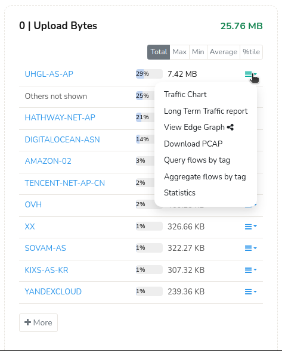
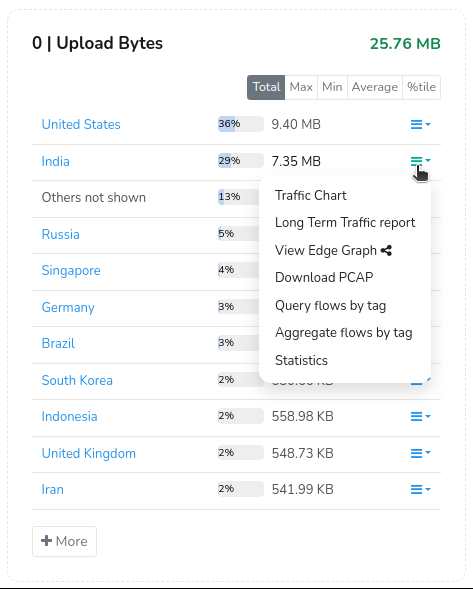

# Geo Plugin

The Geo plugin is an add-on package to Trisul. It enhances the base Trisul functionality by adding

1. A Country Counter group – for country wise traffic metering
2. AASNCounter Group – for Autonomous System Number wise metering
3. ACITYCounter Group – for City/Region wise metering.
4. A Prefix Counter Group – for IP Prefix (ASBGPblocks) wise metering
5. BGPmetrics forISPapplications

The plugin can connect to MaxMind and IP2LOC online databases with yourAPIKEY, periodically download, and integrate Geo Metrics from them into Trisul.

## Samples

Here is a screenshot to give you an idea of what functionality is added by this plugin.

| <br/>Traffic byASN | <br/>Traffic by country |
| ------------------------------------------------ | -------------------------------------------------------- |

## Setup

### Installation

This plugin is distributed as aRPM/DEBpackage. Follow instructions in the[Downloads](https://trisul.org/download)page to install the**trisul-geo**package

### Starting

Once installed, the plugin will become effective the next time you restart Trisul Probe.

## Database used and API Key

In order to work accurately, this plugin needs an upto-date Geo location database. We currently support geo location databases from[Maxmind](https://www.maxmind.com/)The basic install includes an out of data database inCSVformat. Once install they are automatically updated weekly.

:::tip

To automatically download databases you need to sign up with[Maxmind](https://www.maxmind.com/)for anAPIKey. Then put that key into the feed configuration file shown below.

Use[cfgedit](/docs/ref/plugin_configuration )to edit the config settings. Select the*Trisul Geo*option in the menu.

Once installed Trisul will automatically keep the databases updated at 2AM everyday. See the Frequency parameter in the config file.

:::

The main parameters you may be interested to edit are :

| Parameter         | Default                | Note                                                                                                                                                                                                                                                                                                 |
| ----------------- | ---------------------- | ---------------------------------------------------------------------------------------------------------------------------------------------------------------------------------------------------------------------------------------------------------------------------------------------------- |
| ReloadListSeconds | 3600                   | Trisul checks for new files every so many seconds.                                                                                                                                                                                                                                                   |
| SampleRate        | 32                     | In packet mode, sample rate. Lookup Geo database only once every so many packets                                                                                                                                                                                                                     |
| MeterCountry      | TRUE                   | Enable Country Wise metering                                                                                                                                                                                                                                                                         |
| MeterASN          | TRUE                   | EnableASNWise metering                                                                                                                                                                                                                                                                             |
| MeterCity         | FALSE                  | Enable City/Location metering –This will result in about 500MBRAMextra usage, disabled by default                                                                                                                                                                                                |
| MeterPrefix       | TRUE                   | Enable Network Prefixs (AS numbers as found inBGP)                                                                                                                                                                                                                                                  |
| MeterASPATH       | FALSE                  | Meter AS Path based on theBGPPeering established by Trisul with the routers<br/>Feature used inISPenvironments                                                                                                                                                                                   |
| HomeASNumbers     |                        | Enter the ASNumber of the Trisul customer. This is required to calculate Upload/Download direction for the ASNumber Counter group<br/>Feature used inISPenvironments                                                                                                                               |
| DebugLevel        | 0                      | Set this to 1 to print every IP lookup                                                                                                                                                                                                                                                               |
| BGPRibsPath       | /usr/local/var/ramdisk | The location where the TrisulBGPRoute receiver process will save the routing database.<br/>Feature used inISPenvironments                                                                                                                                                                        |
| AddFlowEdges      | true                   | Add flow edges from Country/Prefix/ASNumber.                                                                                                                                                                                                                                                         |
| DirectionalMode   | true                   | This impacts the ASNumber counter group. If*DirectionalMode*is set toTRUE, external IPs are checked for ASNumber match in the geo databases. This is appropriate for enterprise and non-transit ISPs. When*DirectionalMode*is set toFALSE, then both IPs are matched against theASNdatabases |

## Editing the config file

The Geo.xml contains config parameters as well as global ‘feed’ items. The config items shown in the above table are updated in the usual manner. Using the[cfg.edit tool on the probe](/docs/ref/plugin_configuration )

The feeds are updated on the hub node as shown below.

## How updates work

Trisul is a distributed system. The Geo.xml specifies*feeds*which are downloaded only once on the Hub node by a background cron process. The hub then*pushes*these feeds to all probes.

## Editing feed updates

To change the feed updates or to remove feeds, edit the file in the feeds directory on theHUBnodes.

1. Logon to the hub node
2. Go to the feeds directory`/usr/local/var/lib/trisul-config/domain0/allcontexts/feeds/`
3. Each plugin is represented by aGUID. The Geo plugin is`feed-99...`
4. cd to the`feed-99..`directory
5. Open the rules.xml file

It contains feed source lines like this

Enter your MaxmindAPIKEYin the provided spaceYOURLICENSEKEYHERE. ForISPcustomers, enter your AS Number in the provided space as well.

```xml
<Source>
    <URL>https://download.maxmind.com/app/geoip_download?edition_id=GeoLite2-Country-CSV&license_key=YOURLICENSEKEYHERE&suffix=zip</URL>
    <Target>GeoLite2-Country-CSV.zip</Target>
  </Source>
  <Source>
    <URL>https://download.maxmind.com/app/geoip_download?edition_id=GeoLite2-ASN-CSV&license_key=YOURLICENSEKEYHERE&suffix=zip</URL>
    <Target>GeoLite2-ASN-CSV.zip</Target>
  </Source>To disable a feed remove the`<Source>`block or change its name to something like`<Source_Disabled>`
```

1. To enable a feed, enter a new`Source`block or uncomment any`Source_Disabled`block
2. Currently only the feeds mentioned in the file are supported.

## Commercial

For high accuracy it is reccommended to purchase a license from https://www.maxmind.com for the following GeoLite2 products.

1. GeoLite2 Country
2. GeoLite2ASN
3. GeoLite2 City

Please contact the list vendor directly for a subscription.

## License

The following statement

```
This product includes GeoLite2 data created by MaxMind, available from
<a href="https://www.maxmind.com">https://www.maxmind.com</a>.
```
