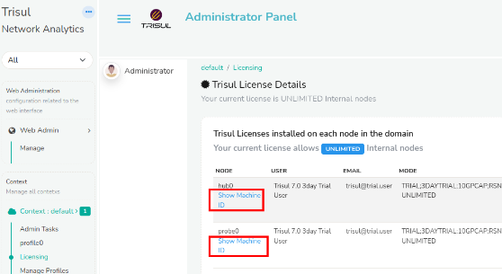
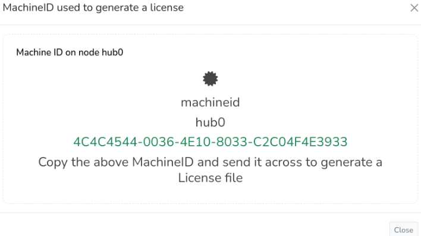
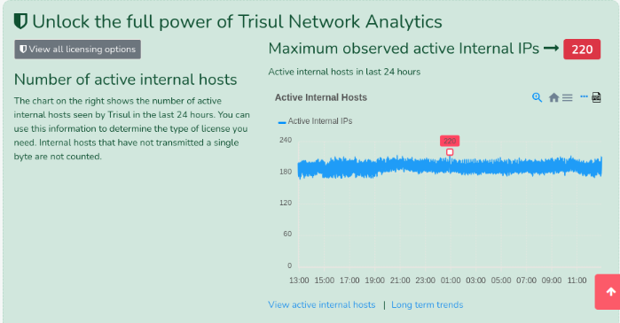

# Installing a new License

This section describes how you can install a new License File to replace the default[Free 3-day](https://trisul.org/free)rolling window license.

## Introduction to Trisul Licensing

Trisul Network Analytics licenses are :

1. Perpetual
2. Need one license per physical node
3. Tied to a machine ID

License types are :

1. Free 3-Day License : The free license gives you tremendous value as it gets you all of the real time analytics and the most recent 3 days for historical analysis
2. Production License : depends on the number of active internal endpoints in your Home Network space
   1. Small Business : 500 simultaneously active Internal IPs
   2. Medium : 3000 simultaneously active Internal IPs
   3. Unlimited : As many as your hardware can support

For more information see the[LicensingFAQ](https://trisul.org/pricing)

## Machine ID

Once you have decided which license type suits you, you need to get the Trisul Machine ID that uniquely identifies the server or VM on which you are running Trisul.

### Getting the Machine ID

:::note navigation

Login as Admin → Select Context :default → Licensing

:::

*Getting the machine-id from the Admin UI*  

Click on the machine ID link against each node to get the machineID as shown below

*Showing the Upload button used to install new license files*  

### Alternate method: get Machine ID using command line

Using this alternate method to get the machine ID. Type the following command as send us its output.

 BASHCopy`sudo trisul --machineid`

The string looks like this :

 BASHCopy`[root@localhost ~]# trisul --machineid 4087ACCD-4B0B-DE11-833A-00248CB93BDE [root@localhost ~]#` 

## Finding out how many internal IPs I have

The license size depends on the number of maximum number of simultnaneously active Internal IPs. To get this number

:::note navigation

Login as Admin → Select Context → Licensing

:::

The chart shows the active internal hosts in the past 24 hours. Click on “Long Term Trends” to see a longer time window

## Installing the License.xyz.txt file

A new license file is typically named*License.\{emailid\}.txt***You need a License file for each Hub and Probe node**

### Install using Web Interface

This is the recommended method suitable for most deployments. You just have to upload the new license to the Hubs and Probe nodes using the*License page*

:::note navigation

Login as Admin → Select Context :default → Licensing

:::

On the Licensing page you can click on the Upload Button shown in the image below to select the new License file and upload it.

*Showing the Upload button used to install new license files*  

### Alternate method: Install new licenses using the Command Line

The following alternate method places the new License files directly in the correct directories. You can use this method if the User Interface is not suitable for you. For example : when you want automatic deployment of license files.

#### Install license on Trisul Probe node

1. Put the new license file in`/usr/local/etc/trisul-probe`
   1. **Change the name**of the new file to`LicenseKey.txt`**OR**
   2. **Edit the**[LicenseFile parameter in trisulProbeConfig.xml](/docs/ref/trisulconfig#app )to point to the new file. The`trisulProbeConfig.xml`file is a per-context config file found under`/usr/local/etc/trisul-probe/domain0/probe0/context0`directory.

#### Install license on Trisul Hub node

1. Put the new license file in`/usr/local/etc/trisul-hub`
   1. **Change the name**of the new file to`LicenseKey.txt`**OR**
   2. **Edit the**[LicenseFile parameter in trisulHubConfig.xml](/docs/ref/trisulconfig#app )to point to the new file. The`trisulHubConfig.xml`file is a per-context file found under`/usr/local/etc/trisul-hub/domain0/hub0/contextXYZ`directory.

#### Restart Trisul Hub and Probe node

:::info

Please restart both hub and probe node to take effect

:::

## View the License file in effect

:::note

Login as Admin → Select Context → Licensing

:::

The current license file is displayed as shown in the screenshot above.

## Moving an existing License to new hardware

If you move any Trisul node (Probe or Hub) to a new machine or VM, send us the new machineid and we will reissue the License.

## Upgrading a Trisul 6.5 production license to 7.0

See[How to upgrade 6.5 production license](/docs/ug/install/license65update)
