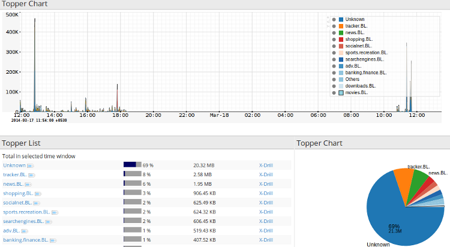

# URL Filter Plugin

URL Blacklisting is a common way to enforce enterprise web surfing policy. A blacklist contains a number of well known URLs categorized into groups like ‘video’/‘internet radio’/‘news’/‘prOn’/‘games’ etc. They are then automatically blocked by web proxies or firewalls.

## Location

In a file called `PI-21AA9300-A03A-45C9-94D6-0B62BD8313F6.xml` in */usr/local/etc/trisul-probe/domainX/probeX/contextX* Use the **cfgedit** tool.

### What does the URLFilter plugin provide

New URLCategory counter group

Allows you to meter traffic by category. This allows you to do things like “Chart the Radio and News traffic for yesterday”

Correlated with flows and packets

Allows you to pull up sessions and packets for any suspicious category

The following screenshot shows :

1. Long term charts of various categories
2. Total volume of traffic in each category
3. PIE chart to give you a rough idea



URL Filter

We got the above screenshot by

1. Going to Retro Analysis
2. Selecting 11 hours of traffic
3. Applying the [Counter Group Activity](/docs/ug/cg/retrotools ) tool for the URLCategory group

You might want to “Cross Drill” if you wish to see which IPs surfed pron etc

## Setup

### Installation

This plugin is distributed as a RPM package. Download the appropriate RPM for your platform.

#### To install

Upon install the plugin will automatically install a demo database in tokyo cabinet format in DemoURLFilterDB.tch.

##### CentOS

```
[root@localhost bldtools]# rpm -Uvh trisul_urlfilter-1.0.111-0.i386.rpm
Preparing...                ########################################### [100%]
   1:trisul_urlfilter       ########################################### [100%]
Creating temp staging area..
Creating categories..
Processing URL Category BL..1009 entries
Processing URL Category government.BL..555 entries
Processing URL Category gamble.BL..11292 entries
Processing URL Category forum.BL..7087 entries
Processing URL Category hacking.BL..823 entries
Processing URL Category chat.BL..15158 entries
Processing URL Category spyware.BL...24132 entries
Processing URL Category religion.BL..8447 entries
Processing URL Category homestyle.BL..231 entries
Processing URL Category warez.BL..978 entries
..
..`
```

##### Ubuntu

`sudo dpkg -i trisul-urlfilter_1.2.212_amd64.deb`

#### To uninstall

##### CentOS

`rpm -e trisul_urlfilter`

##### Ubuntu

`sudo dpkg -r trisul-urlfilter`

### Starting

Once installed, the plugin will be effective the next time you restart Trisul.

## Database

The plugin can accept any blacklist in the following format.

Copy`blacklist    |__ gambling        |__domains (file containing a single blacklisted url per line)`

The only provider of blacklists in this format is Shallalist from [Shalla Secure Services](https://www.shallalist.de/categories.html).

You need to independently procure this list from them.

### Commercial – Recommended

Shall Secure Services offers a daily updated version of this list for a fee.

Please contact the list vendor [Shallalist](http://www.shallalist.de/) **directly** for a commercial license. We highly recommend you get that to enhance the accuracy of the plugin.

### Private use

The list from Shalla Secure Services is free if you intend to use it for private purposes. Once again, check with the list vendor directly if you have any questions.

## Auto updating the database

The accuracy and utility of this classification depends on the database that powers it.

The //urlfilter// plugin will automatically download and apply the latest database at a set schedule. You can control when and how frequently the database is updated.

### Controlling the auto update process

Once the plugin is installed, the file */usr/local/share/trisul/plugins/UrlFilter.xml* contains the parameters for automatic updates. The parameters you want to edit are

|           |                                                                                         |
| --------- | --------------------------------------------------------------------------------------- |
| Run At    | At what time do you want to run the download + update                                   |
| Frequency | How frequent do you want to run the auto update in seconds ? Note 86400 seconds = 1 day |

```
<TrisulPluginConfiguration>
    <Policy>
        <description>Controls how the URL filter plugin works </description>
        <ReloadListSeconds>3600</ReloadListSeconds>
    </Policy>

    <Update>
      <Sources>
        <Source>
          <URL>http://www.shallalist.de/Downloads/shallalist.tar.gz </URL>
          <Target>shallalist.tar.gz </Target>
        </Source>
      </Sources>
      <Output>
        <Filename>DemoURLFilterDB.tch</Filename>
      </Output>
      <Post>
        <Cmd>mkurlfdb</Cmd>
      </Post>
      <Run>
        <RunAt>0200</RunAt>
        <Frequency>86400</Frequency>
      </Run>
    </Update>

</TrisulPluginConfiguration>
```

### Updating manually

Whether you purchase the commercial license from http://www.shallalist.de/ or get the personal license, you will end up with a single file called `shallalist.tar.gz`

You need to process this file into a compact database that Trisul understands using a tool called *mkurlfdb*

First put the blacklist in a temporary area (say /tmp)  

Copy
`

```bash
cd /tmp
gunzip shallalist.tar.gz
cd /usr/local/lib/trisul_urlfilter/plugins
./mkurlfdb /tmp/shallalist /usr/local/share/trisul/plugins/DemoURLFilterDB.tch
```

Note Next, restart Trisul for the new blacklist to take effect.
