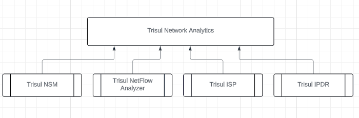

# What is Trisul

Trisul Network Analytics is a software suite that takes network packets or flow data, and them into insightful traffic metrics, flow analysis, alerts, and metadata.
The applications of Trisul include deep network traffic management, network security monitoring, threat hunting, incident response, and audit.

Users of Trisul view these analytics reports on a comprehensive dashboard based user interface accessed by a web browser.

### Platforms

:::info  Software based 
**Linux based** Trisul runs on Ubuntu and RHEL/CentOS/OracleLinux based systems. 

It has native support for advanced high speed packet capture and load balancing mechanisms like RX_RING, PF_RING, AF_PACKET, and various proprietary hardware acceleration.
:::

## Products

Using specialized configuration and extensions we've tailored the Trisul platform into products that fit specific use cases. 

:::tip[Doc Note]
:memo:  This Trisul Network Analytics User Guide covers the common parts of these four products. The unique workflows associated with each of these four products can be found in their respective guides.
:::

## Who Benefits From Trisul

Trisul will help the following organizations

- **Enterprises**: Both traffic monitoring and security teams in
  enterprises will benefit from the deep visibility provided by Trisul.
- **NSM teams**: Network security monitoring teams can monitor all the entities and metadata in a practical manner using Trisul. Down to
  the packet level.
- **ISP**: ISPs use Trisul for compliance and large scale Netflow based
  visibility. We are in some of the largest ISPs in the world.
- **Analysts**: Analysts can analyze large PCAP dumps using Trisul to
  investigate deeply
- **MSP/SOC**: Managed Security services use Trisul for consulting to
  build a complete baseline from traffic, flow, security angles. They
  can also use Trisul to build a Security Operations Centre using the
  Multi Homing capabilities.
- **Developers/Enthusiasts**: Advanced users can use the Trisul APIs to
  build their own tools on top of the Trisul platform. We feature an
  open and well documented API using plain Lua and Ruby.

## Quick Features List

The following table contains a list of things you can do with Trisul. You can find them on the main menu. 

| Feature               | Description    |
| --------------------- | ----------|
| Platform              | Linux based with support for special hardware accelerators   |
| Technology            | Streaming analytics with a custom backend storage and reporting included. No need to deploy and maintain a Elastic Search cluster or expensive log management products  |
| Traffic Analysis      | More than just bandwidth or basic SNMP or Netflow monitoring. Over 150+ traffic metrics out of the box at all layers.   |
| Flow Monitoring       | Supports Netflow technologies as ingest mechanism. If ingesting packets, Trisul builds flow records and stores them. The specially designed flow database can scale to billions of flows per day with instant query times.   |
| Metadata collection   | A key element of NSM - Network Security Monitoring is the ability to log metadata. HTTP URLs, Domain details, SSL/TLS certificates, reconstructed binaries downloaded. |
| Security Alerts       | Interfaces with IDS systems like Suricata to ingest alerts. The alerts are integrated into the other types of data.    |
| Packet storage        | A sophisticated packet indexing and storage system is included. You can create custom policies down to the flow level to regulate the storage requirements.   |
| Graph Analytics | Trisul EDGE is a new feature set that brings Graph Analytics. Graph analytics builds relationship networks between various network entities seen by Trisul. For example, you can click on a particular “Certificate Authority” to open up its neighbors and see which organizations and IPs have used certificates issued by them. |

