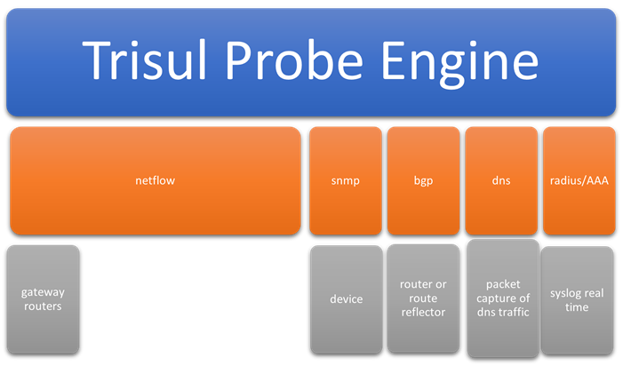

# For ISPs

# Introduction

Several ISPs have deployed Trisul in their networks to gain deep
insights into their peering and routing efficiencies. In addition to the
normal metrics, device, and interface level drilldowns made available in
Trisul Netflow Analytics.

import DocCardList from '@theme/DocCardList';

<DocCardList />

The Trisul ISP configuration adds the
following.

1. Peering Analytics
2. Prefixes IPv4 and IPv6
3. AS analytics
4. Mapping ASN, Prefixes, Geo location to gateway routers and
   interfaces
5. Private Peering analytics with content providers
6. Route analytics
7. Custom metering of downstream customers usage patterns

### Network integration diagram

The following diagram is an overview of integration points (some are
optional) for a Netflow based ISP analytics solution.

  
Network Integration Diagram

The following data source ingestion are supported. Except the Netflow
others are optional.

|            |                                                                                                                                                                         |
| ---------- | ----------------------------------------------------------------------------------------------------------------------------------------------------------------------- |
| Netflow    | This is mandatory. All versions of Netflow/JFlow/IPFIX/Sflow/Netstream are supported. ISP Netflow best practices must be followed such as sampling and ingress policies |
| SNMP       | Optional: for SNMP interface traffic. Useful to add on dashboards along with Netflow interface traffic                                                                  |
| BGP        | Optional: if customer requires Route Analytics and Peer vs Origin AS breakup.                                                                                           |
| DNS        | Optional: if customer needs the OTT Analytics App. TO identify content such as Amazon,Netflix,Youtube,Whatsapp, Insta etc                                               |
| Radius/AAA | Optional: If customer wants to map IP address to dynamically subscriber ID. Needs real time syslog capability from the AAA side.                                        |

## Features of Trisul ISP

Apart from the usual Trisul Network Analytics features, our ISP Module
has several special monitoring features. They can be grouped as

| Field             | Description                                                                                                                                                                                                                                                                                                                                                                                                                                         |
| ----------------- | --------------------------------------------------------------------------------------------------------------------------------------------------------------------------------------------------------------------------------------------------------------------------------------------------------------------------------------------------------------------------------------------------------------------------------------------------- |
| AS Analytics      | Autonomous system traffic monitoring. AS to AS traffic matrix, AS drilldown. Flexible AS Monitoring at global level, per router, and per interface.Peer AS monitoring.Use case is ISP can keep track of AS traffic flows at minute level                                                                                                                                                                                                            |
| Prefix Analytics  | Prefixes are important for traffic engineering purposes. Like AS analytics, Prefix analytics is also available at global level, per router, and per interface                                                                                                                                                                                                                                                                                       |
| Routing           | Full BGP support.Trisul includes a high performance built in route receiver that can peer with dozens of gateways.AS Path analytics tells you busiest paths and segments for both upstream and downstream customers.AS Path analytics is available at global level (busiest route in ISP Network) and also at per-interface and per-router level.Powerful graphical and tabular tools are available. ISP can track Peer AS and Origin AS separately |
| Country           | Main use case is to see traffic egressing country on optimal traffic route east or west coast depending on final destination. Per Country in/out traffic is provided again at global level, per router, and per interface granularity.                                                                                                                                                                                                              |
| Drilldowns        | The above mentioned AS,Prefix,Country analytics can also be done in a drilldown method. Rather than starting with a router/interface you can start with a AS Number and see where the traffic is coming from for that AS                                                                                                                                                                                                                            |
| Device Monitoring | Using the powerful Routers and Interfaces tool customers can track any router and any interface and drilldown to usage                                                                                                                                                                                                                                                                                                                              |

## BGP and Netflow

The Trisul ISP feature is enabled in the starter configuration by mixing
Netflow and BGP.

- To Configure BGP in Trisul, Refer [Trisul-BGP](/docs/ug/isp/bgp)

<!-- -->

- To install Trisul APPs and dashboards specific to ISP analytics, Refer
  [ISP Analytics](/docs/ug/isp/isapps#install_trisul_apps)
