# ISP Analytics Dashboard

Several ISPs have deployed Trisul in their networks to gain deep
insights into their peering and routing efficiencies. In addition to the
normal metrics, device, and interface level drilldowns made available in
Trisul Netflow Analytics , the Trisul ISP configuration adds the
following.

1. Peering Analytics
2. Prefixes IPv4 and IPv6
3. AS analytics
4. Mapping ASN, Prefixes, Geo location to gateway routers and
   interfaces
5. Private Peering analytics with content providers
6. Route analytics
7. Custom metering of downstream customers usage patterns

Trisul provides a global level dashboard for ISP Analytics that includes
several menus with various functionalities.

To install the ISP dashboard apps, Refer [ISP Analytics
Dashboard](/docs/ug/isp/isapps#install_trisul_apps)

## ISP Overview

ISP Overview is a top level dashboard in Trisul ISP Analytics. It
provides a overall stats about the Active AS, prefixes, paths, total
routers, interfaces and countries.

Also it provides statistical information on the total volume of Upload
and Download of AS Traffic in bytes.

:::note navigation

To access, Login as user & Select Dashboard -\> Show All -\> Enter ‘ISP
Overview’ in Filter

:::

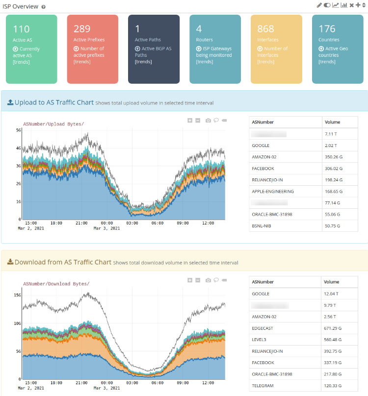  
ISP Overview

## Peering Analytics

Peering analytics provides ASN Traffic mapping for routers and
interfaces. ISP Peering analytics shows detailed information about the
Top Upload and Download AS peers for respective Router and Interface.
The traffic flows are further split by upstream vs downstream.

With the help of this Dashboard, You can view ASN Mappings for Routers
and Interfaces. The default shows the Flow-ASN which represents the
actual routing table.

**Received from upstream:** How much data is received by the interface
(IN) from these upstream AS  
**Transmit to upstream:** Data transfer to upstream AS  
**Receive from downstream:** Received from downstream AS  
**Transmit to downstream:** Data transfer to downstream AS  
Typically, the Receive from Upstream and Transmit to Downstream totals
will match as will the Transmit to Upstream and Receive from downstream.

#### Data columns

The following table explains the data in the columns

| Field             | Description                                                               |
| ----------------- | ------------------------------------------------------------------------- |
| ASN               | AS Number                                                                 |
| Name              | AS Name – Code as assigned                                                |
| Full name         | Full AS Name                                                              |
| Volume            | Total bytes transferred (MB/GB/TB/PB)                                     |
| Average Bandwidth | Average bandwidth for this traffic flow                                   |
| Uniq AS Path      | Unique active routes (need BGP) This is an estimate                       |
| Uniq Prefix       | Unique prefixes (need to configure cardinality counting feature for this) |
| Options           | Drilldown options for this AS                                             |

:::note navigation

To access, Login as user & Select Dashboard -\> Show All -\> Enter
‘Peering Analytics’ in Filter

:::

| Field      | Description                                                 |
| ---------- | ----------------------------------------------------------- |
| Time Frame | Select a desired date and time using the custom time option |
| Routers    | Select a desired router from the list of available routers  |
| Interface  | Select an interface associated with the router selected     |

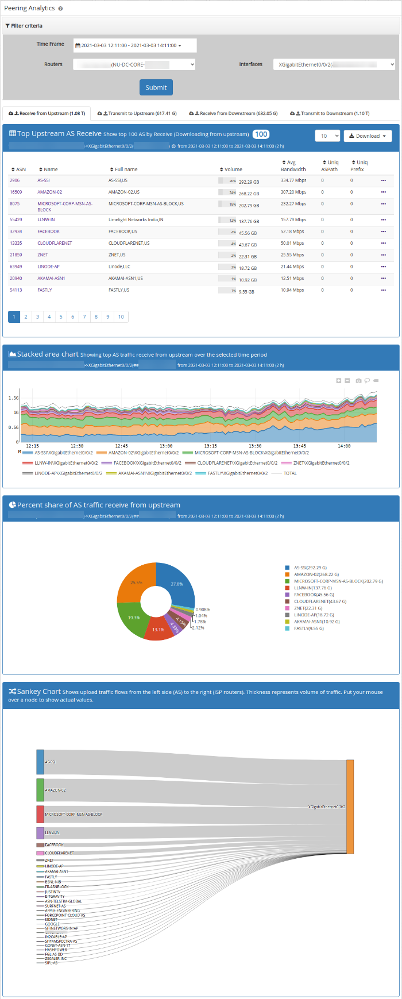  
Peering Analytics Charts

Every Peer-AS associated to the router and interface in upstream and
downstream can be deeply analysed using the *`options`* dropbox.

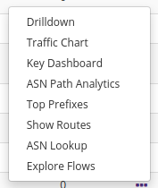  
options

#### Drilldown

Peering Analytics in Trisul provides a deep drilldown of each peer AS to
know the Transmit/Recieve from upstream/downstream of the particular
peer AS with interfaces.

Refer [Peering Analytics
Drilldown](/docs/ug/isp/isp_analytics_dashboard#peering-analytics-drilldown)

#### Traffic Chart

Traffic charts provide history of Peer AS x Interface from
Upstream/Downstream

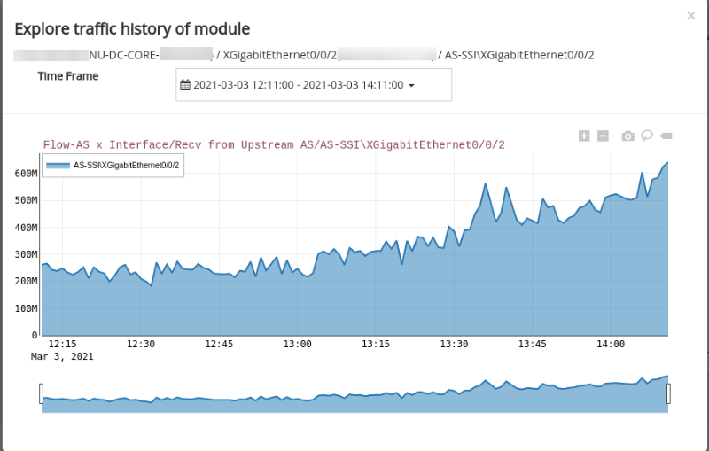  
Peering Analytics - Traffic Chart

#### Key Dashboard

Key Dashboard provides a graphical interpreatation of traffic history of
Peer AS x Interface with few other details like Key, user label,
counter-group etc.

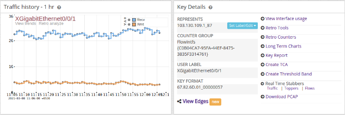  
Peering Analytics - Key Dashboard

#### Top Prefixes

It provides a list of top 99 prefixes that is associated with the Peer
AS.

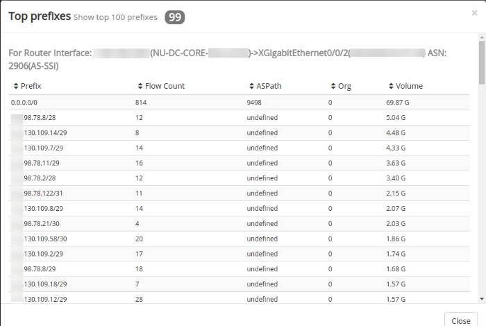  
Peering Analytics - Top Prefixes

#### Explore flows

Explore flows maps every flow that is associated with the Peer AS. To
know more about explore flows, Refer [Explore
Flows](/docs/ug/tools/explore_flows)

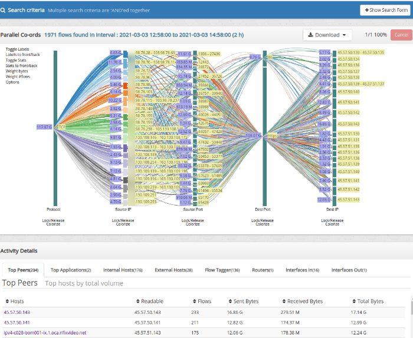  
Peering Analytics - Explore Flows

## Prefix Analytics

Prefix analytics provides external prefix mappings for routers and
interfaces. Your prefixes real time and historical traffic mapped to
gateways, next hops, and AS. You can also see external prefixes usage
per gateway.

Monitor top prefixes on a per interface basis. Helps with traffic
engineering selecting which prefix to announce to which peer etc.

#### Data Columns

The following table explains the data in the columns

| Field         | Description                                                                                                                                                                                 |
| ------------- | ------------------------------------------------------------------------------------------------------------------------------------------------------------------------------------------- |
| Routed Prefix | The prefix as routed will match the route in the RIB of the router                                                                                                                          |
| BGP Prefix    | The prefix matched with the BGP route receiver database.This can be different                                                                                                               |
| Peer-AS       | IF BGP prefix is found, the peer AS from the BGP route                                                                                                                                      |
| Origin-AS     | If BGP Prefix is found, the origin AS from the BGP route                                                                                                                                    |
| Organization  | The organization, Trisul has an option of maintaining a separate customer database that contains prefix from one AS but announced by another. Example is Akamai servers announced by an ISP |
| Volume        | Total volume (GB/TB/PB)                                                                                                                                                                     |
| Bandwidth     | Avg bandwidth / sec                                                                                                                                                                         |
| Options       | Further options to drilldown into the prefix                                                                                                                                                |

:::note navigation

To access, Login as user & Select Dashboard -\> Show All -\> Enter
‘Prefix Analytics’ in Filter

:::

| Field      | Description                                                 |
| ---------- | ----------------------------------------------------------- |
| Time Frame | Select a desired date and time using the custom time option |
| Routers    | Select a desired router from the list of available routers  |
| Interface  | Select an interface associated with the router selected     |

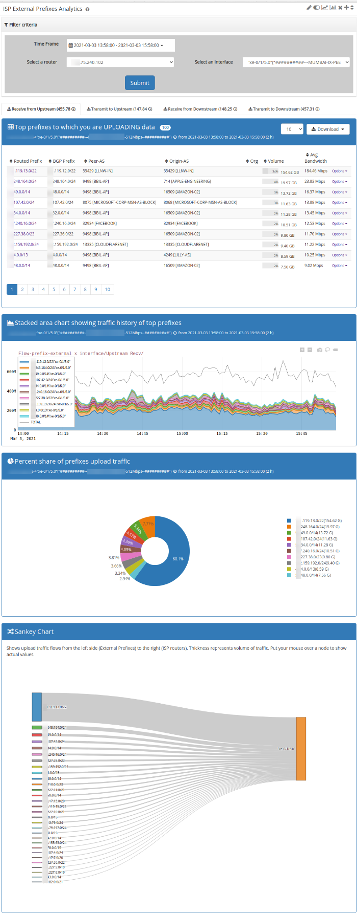  
Prefix Analytics Charts

Every Prefix associated with each interface in the upstreams and
downstreams can be deeply analysed using the *`options`* dropbox.

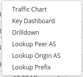  
options

#### Traffic Chart

Traffic chart provides a pictorial representation of the traffic history
of External Prefix x Interface from Upstream/Downstream

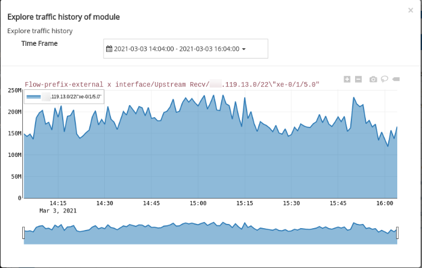  
Prefix Analytics - Traffic Chart

#### Key Dashboard

Key Dashboard provides a graphical interpreatation of traffic history of
External Prefix x Interface with few other details like Key, user label,
counter-group etc.

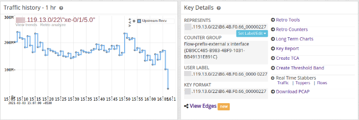  
Prefix Analytics - Key Dashboard

#### Drilldown

Prefix Analytics in Trisul provides a deep drilldown of each prefix with
interfacea.

Refer [Prefix Analytics
Drilldown](/docs/ug/isp/isp_analytics_dashboard#prefix_analytics_drilldown)

## Peering Analytics Drilldown

Peering Analytics drilldown provides deeper analysis of AS with
interfaces.

:::note navigation

To access, Login as user & Select Dashboard -\> Show All -\> Enter
‘Peering Analytics Drilldown’ in Filter

:::

| Field      | Description                                                    |
| ---------- | -------------------------------------------------------------- |
| Time Frame | Select a desired date and time using the custom time option    |
| AS Number  | Enter an AS Number you need to drilldown eg 9498(Bharti Artel) |

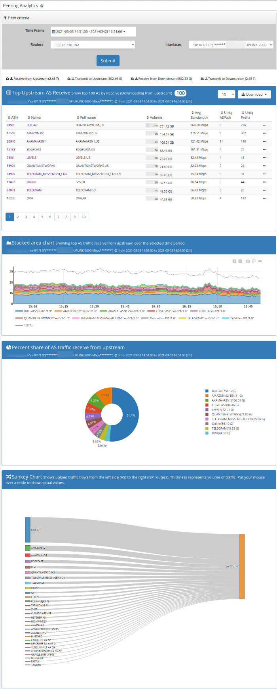  
Peering Analytics Drilldown

## Prefix Analytics Drilldown

Prefix Analytics drilldown provides deep analysis of a prefix with
interfaces.

Track traffic flows for a single prefix in the entire network. Helps
with traffic engineering and verification.

:::note navigation

To access, Login as user & Select Dashboard -\> Show All -\> Enter
‘Prefix Analytics Drilldown’ in Filter

:::

| Field      | Description                                                 |
| ---------- | ----------------------------------------------------------- |
| Time Frame | Select a desired date and time using the custom time option |
| Prefix     | Enter a prefix you need to drilldown                        |

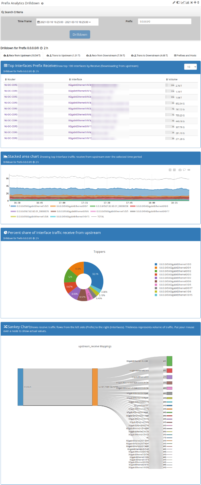  
Prefix Analytics Drilldown

## ISP Country Analytics

Country analytics provides country mappings for routers and interfaces.
Countries real time and historical traffic mapped to gateways, next
hops, and AS. You can also see every country’s usage per gateway.

Traffic volumes to different countries. Helps plan gateway locations
efficient routing policy.

#### Data Columns

The following table explains the data in the columns.

| Field         | Description                                                                                                   |
| ------------- | ------------------------------------------------------------------------------------------------------------- |
| Key           | The Country Code                                                                                              |
| Label         | The name of the country                                                                                       |
| Volume        | Traffic upload from this country – when seen in the Upload Tab and top download when seen in the Download Tab |
| Avg Bandwidth | Traffic Bandwidth average for selected time period                                                            |
| Options       | More options                                                                                                  |

:::note navigation

To access, Login as user & Select Dashboard -\> Show All -\> Enter ‘ISP
Country Analytics’ in Filter

:::

| Field      | Description                                                 |
| ---------- | ----------------------------------------------------------- |
| Time Frame | Select a desired date and time using the custom time option |
| Routers    | Select a desired router from the list of available routers  |
| Interface  | Select an interface associated with the router selected     |

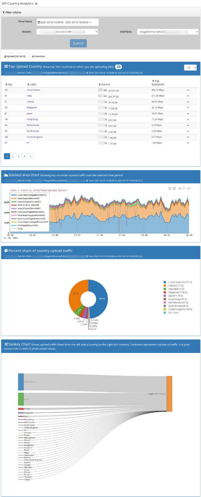  
Country Analytics Charts

Every country associated to the router and interface in upstream and
downstream can be deeply analysed using the *`options`* dropbox.

#### Traffic Chart

Traffic chart provides history of Country x Interface from
Upstream/Downstream.

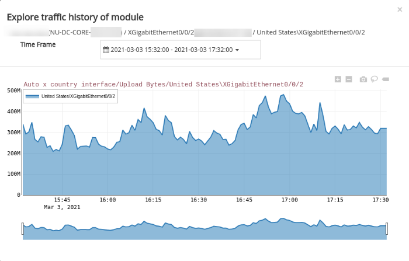  
Country Analytics - Traffic Chart

#### Key Dashboard

Key Dashboard provides a graphical interpreatation of traffic history of
country x Interface with few other details like Key, user label,
counter-group etc.

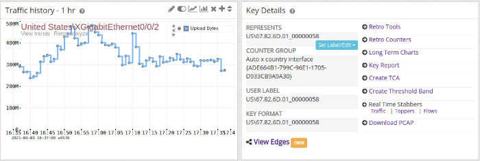  
Country Analytics - Key Dashboard

#### Drilldown

Country Analytics in Trisul provides a deep drilldown of each country to
know the Transmit/Recieve from upstream/downstream of the particular
country with several other interfaces.

Refer [Country Analytics
Drilldown](/docs/ug/isp/isp_analytics_dashboard#country-analytics-drilldown)

## Country Analytics Drilldown

Country drilldown provides deep analysis of top countries with
interface.

The Geo Country Drilldown helps with providing the analysis of Interface
toppers associated with every router.

:::note navigation

To access,select ISP Analytics Dashboard -\> Country Analytics Drilldown

:::

| Field      | Description                                                 |
| ---------- | ----------------------------------------------------------- |
| Time Frame | Select a desired date and time using the custom time option |
| Prefix     | Enter a prefix you need to drilldown                        |

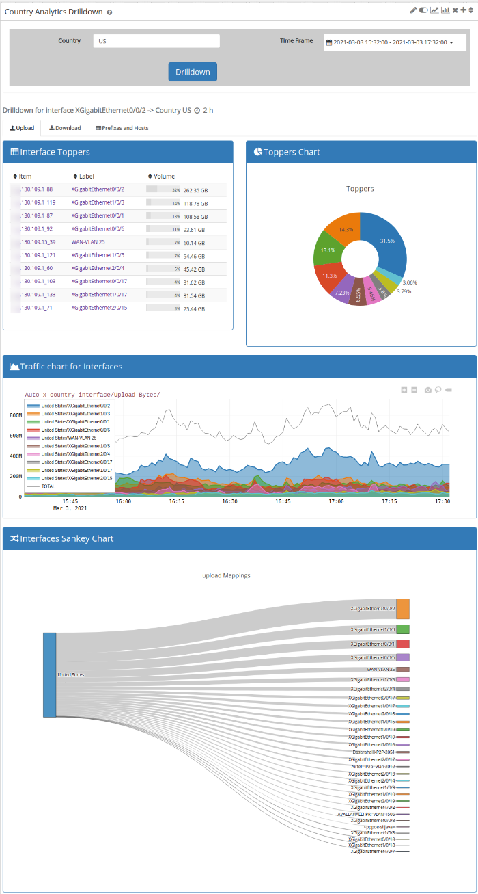  
Country Analytics Drilldown

## Path Analytics

ISP Path analytics Dashboard provides detailed analysis of the Top AS
paths.

Monitor top routes in your network and track per hop usage. Helps route
capacity planning.

#### Interpreting Path Analytics Volumes

The path analytics feature is based on collating ASPath information with
a router interface. The following diagram explains the details.

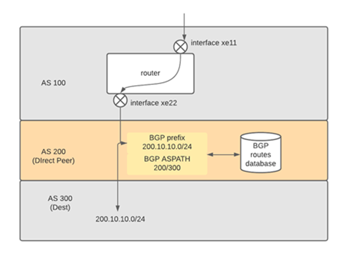  
Path Analytics Numbers

The picture shows a flow ingress interface xe11 on upstream then egress
xe22 on downstream. The destination prefix is 200.10.10.0/24 and the AS
PATH for the egress side is 200/300. The AS 200 is a transit AS. The
volume is 1GB. This data is shown in the AS Path analytics as below.

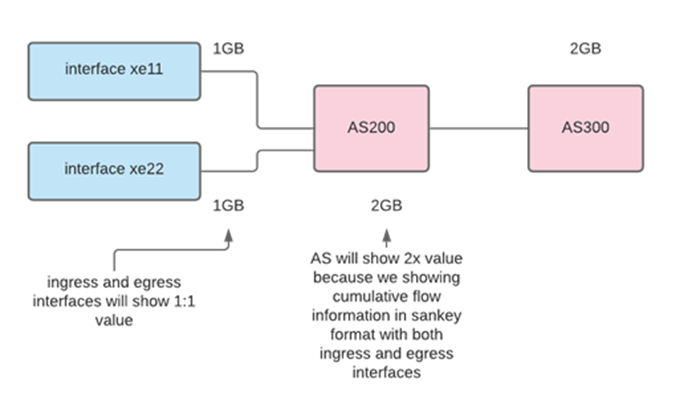  
Path Analytics interface vs AS node numbers

**APPLICATION NOTE**: Note that the interface traffic numbers will be
exact but the AS numbers will be 2X because both the ingress interface
and egress interface flow are collated. Keep that in mind while
interpreting the chart. It is focused on interface -\> AS flows, hence
the interface numbers are important.

:::note navigation

To access, Login as user & Select Dashboard -\> Show All -\> Enter ‘Path
Analytics’ in Filter.

:::

| Field          | Description                                                    |
| -------------- | -------------------------------------------------------------- |
| Routers        | Select from a list of available routers                        |
| Interface      | Select an interface associated with the selected router        |
| Time Frame     | Select a time frame from the custom time menu                  |
| Filter ASN     | Enter an AS Number to filter result, eg.9498                   |
| Remove Toppers | Remove the top N flows from view to reveal the smaller flows   |
| Show max nodes | Show approximately these many nodes on the sankey (default 30) |

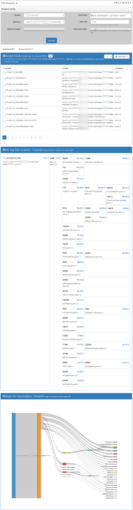  
Path Analytics

## Sankey Crossdrill

Sankey crossdrill is a Crosskey feature that provides sankey charts by
matching a cross-key filter with any metric.

Cross keys allow you to create any mapping from X to Y. For example you
can create a Cross Key counter group by merging “Internal Hosts of
ISP-Peer” to “Flow-ASN” counter group. This will then track Internal IP
to ASN flows. This dashboard helps you view the Sankey diagram for such
counter groups.

:::note navigation

To access, Login as user & Select Dashboard -\> Show All -\> Enter
‘Sankey Crossdrill’ in Filter

:::

| Field          | Description                                                    |
| -------------- | -------------------------------------------------------------- |
| Counter Group  | Select a desired cross-key counter group                       |
| Meter          | Select a desired metric                                        |
| Time Frame     | Select a time frame from the custom time menu                  |
| Remove Toppers | Remove the top N flows from view to reveal the smaller flows   |
| Filter Item    | Type text to filter crosskey items                             |
| Show max nodes | Show approximately these many nodes on the sankey (default 30) |
| Inverse Filter | Shows all traffic except the filter item                       |

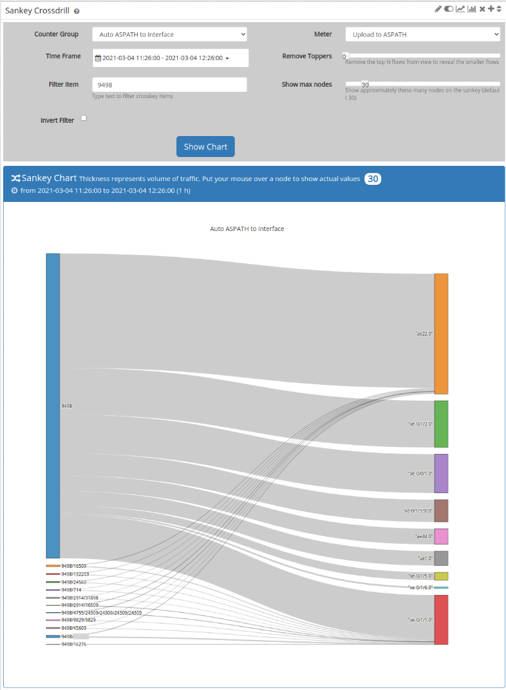  
Sankey Crossdrill
