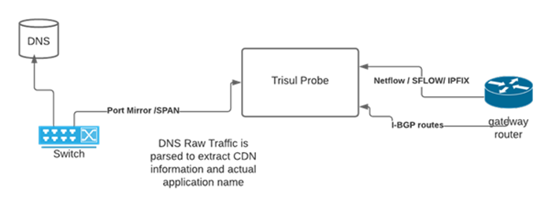
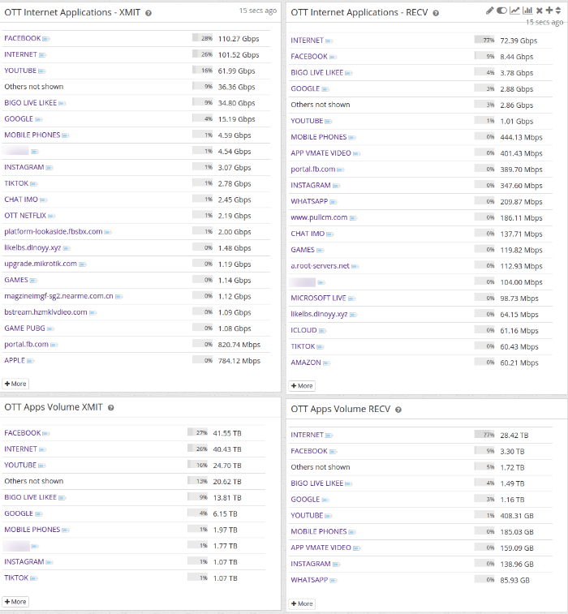

# OTT Analytics in trisul

Some ISP need visibility into OTT (Over the Top) media platforms such as
Netflix, Prime, Disney, Hotstar, Zee5, Jio and also non OTT apps like
YouTube, Whatsapp, Instagram. With the AS Analysis you can get
visibility upto Google but into split into Google and YouTube.

It is an application monitoring to track popular apps on your network.
Used for marketing optimization.

## OTT Internet Apps

This app works by integrating a real time DNS packet capture feed into
the Trisul pipeline. The following diagram shows the integrations.

  
OTT diagaram

This is combined with a fully customizable rules file that converts
domain names into applications. The built in rules file can identity
over 125 apps including YouTube, WhatsApp, Facebook Video, Instagram,
many OTT Platforms, local content like Jio Saavn, Zee5, SunTV, Microsoft
, Office 365, Skype, cloud providers like Amazon, GCP, Azure, and so on.
The customer can tune the file on a rolling basis as new services are
seen. No restart is required.

OTT App monitoring is available in two formats.

- For the entire network
- On a per interface basis, however unlike the other apps there is a
  limit of 4 interfaces per router.

:::note navigation

To access, Login as user & Select Dashboard -\> Show All -\> Enter ‘OTT
Internet Apps’ in Filter

:::

  
OTT dashboard
