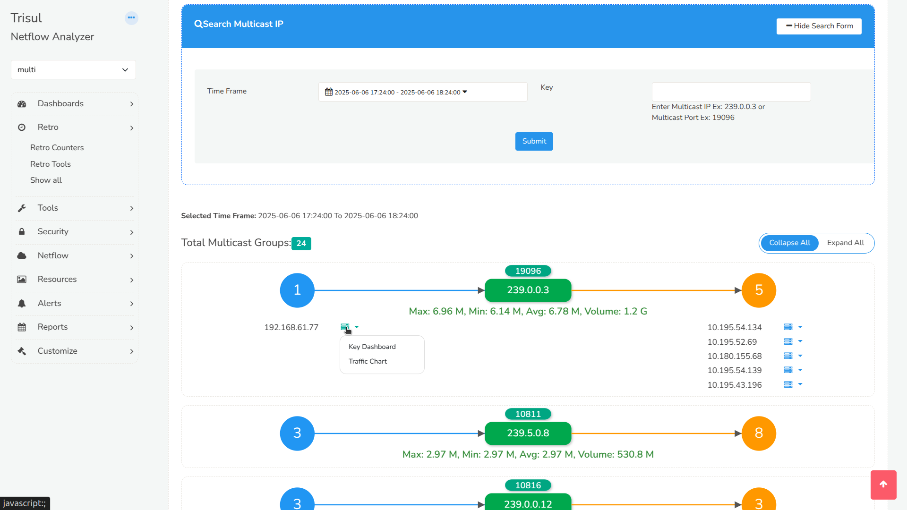

# Multicast GraphX

Multicast GraphX is an interactive visualization tool that helps you explore multicast traffic patterns in your network. It displays a clear and organized layout using D3.js, showing which IPs are sending and receiving multicast data.

This tool is especially helpful for financial services and securities organizations, where multicast is widely used for distributing market data and similar real-time feeds across the network.

## Downloading Multicast GraphX

:::info navigation

Login as admin and,  
:point_right: Go to Web Admin &rarr; Manage &rarr; Apps
:::

From the list of Trisul apps, download Multicast GraphX.

>Note: Make sure the ICMP Multicast App is also installed and active.

## Viewing Multicast GraphX

:::info navigation

Login as user and,  
:point_right: Go to Dashboard &rarr; Show All &rarr; Multicast GraphX
:::

## Using Multicast GraphX

  
*Figure: Showing Multicast Graphx*

- Select a time range to view historical multicast activity.

- Choose a Counter Group from the dropdown (e.g., Host, ASN).

The graph displays:

- A **center** node showing the Multicast IP and Port

- A **left** bubble representing the number of sender IPs

- A **right** bubble representing the number of receiver IPs

Click on either bubble to expand the list of senders or receivers.

Each sender or receiver in the list provides a dropdown menu with:

- Traffic Chart – view bitrate over time

- Key Dashboard – jump to a detailed Trisul dashboard for that IP

## Traffic Statistics

For each multicast group, you can also view:

- Maximum, Minimum, and Average bitrate

- Total Volume of data transferred

## Enhanced View for ASN Groups

If the selected Counter Group is ASN, the interface additionally displays logos of popular Autonomous Systems such as Microsoft and Google—making it easy to visually identify top ASNs.
