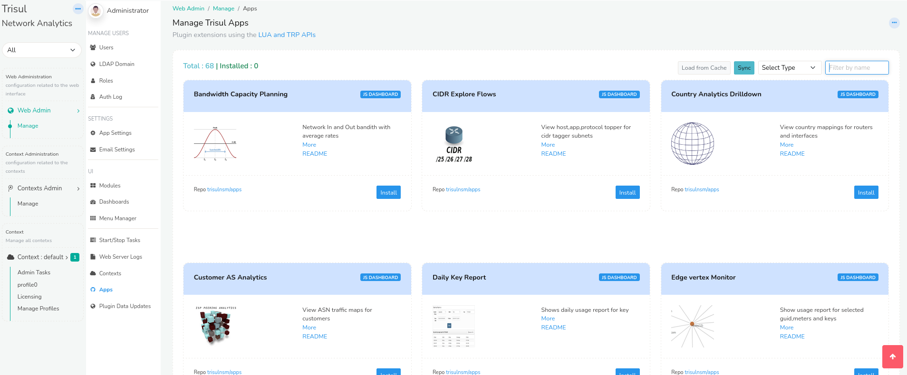

# Enabling NBAD

## Overview

**Meta NBAD** is a Trisul Apps-based Network Behavior Analysis and Detection solution designed to provide visibility into network traffic, application behavior, security events, and operational anomalies.

The solution combines flow analytics, Layer 7 visibility, behavioral monitoring, traffic investigation, and alerting capabilities through a collection of Trisul Apps and dashboards. It operates using passive network monitoring and analyzes network traffic in real time as well as historically.

To access Trisul Apps, Login as admin user

:::info navigation

:point_right: Select Web Admin &rarr; Manage &rarr; Apps

:::

From here you can install, upgrade, or uninstall Trisul Apps.




## Installation

### Prerequisites

Before installing Meta NBAD, ensure that:

- Trisul is already deployed and operational
- Required monitoring interfaces are configured
- Administrative access to Web Admin is available
- Required Trisul Apps packages are accessible

### Installing the Meta NBAD App

The Meta NBAD functionality is provided through Trisul Apps. Installation can be verified through the Web Admin interface.


:::info navigation
:point_right: Go to [Trisul Apps](https://github.com/trisulnsm/apps) and install NBAD Meta Apps
:::

Verify that required applications such as:

- NFGEN – NetFlow Generator
- TCP Analyzer
- DDoS Monitor
- [Stable Keys](https://github.com/trisulnsm/apps/tree/apps7/analyzers/stablekeys)
- [ShiftX](https://github.com/trisulnsm/apps/tree/apps7/analyzers/shiftx)

are installed and enabled.

### Initial Configuration

After installation:

- Configure monitoring interfaces
- Verify traffic ingestion
- Configure export settings if required
- Enable required dashboards and alert groups
- If NFGEN is installed, restart the Trisul probe to apply the NetFlow/IPFIX export configuration changes

Restart the probe using:

```
sudo systemctl restart trisul-probe
```

Traffic visibility and dashboards can then be verified from the user interface.

