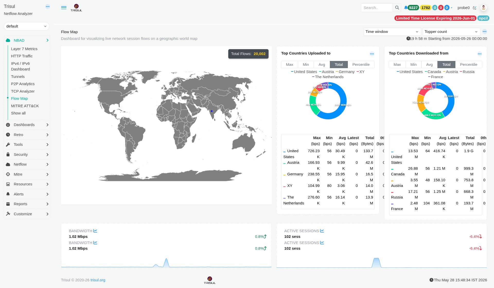

# Flow Map

The Flow Map dashboard visualizes live network session flows on a geographic world map. It provides an at-a-glance view of where your network traffic is going geographically, and which countries are the largest sources and destinations of traffic.

:::info navigation
:point_right: Go to NBAD &rarr; Flow Map
:::

*Figure: Flow Map: live geographic session map, top upload/download countries, bandwidth and session sparklines*

Visualises live network session flows on a geographic world map. Provides an at-a-glance view of where traffic is going geographically and which countries are the largest sources and destinations.

## Map Module

| Element | Description |
|---|---|
| World map | Displays active session flows as geographic connections between the probe location and destination countries. Connections are visualised as arcs across the map. |
| Total Flows | Overlay showing the total number of active flows within the selected time window. Example: `20,002 total flows`. |

## Country Modules

| Modules | Description |
|---|---|
| Top Countries Uploaded to | Countries receiving the highest volume of outbound traffic from the monitored network. Displayed as a donut chart with an accompanying metrics table. Supports Max, Min, Avg, Total, and Percentile view toggles. |
| Top Countries Downloaded from | Countries generating the highest inbound traffic toward the monitored network. Uses the same chart, metric columns, and toggle options as the upload panel. |

## Country module metric columns

| Column | Description |
|---|---|
| Max (bps) | Peak bandwidth transmitted to or received from the country during the selected time window. |
| Min (bps) | Lowest bandwidth observed for the country within the selected period. |
| Avg (bps) | Average bandwidth across the measurement window. |
| Latest (bps) | Most recent recorded bandwidth value. |
| Total (Bytes) | Total volume of data transferred to or from the country during the selected time range. |
| 0th (bps) | Percentile baseline value used for anomaly threshold and band calculations. |

## Dashboard controls

| Control | Description |
|---|---|
| Time window | Defines the analysis period applied across all dashboard panels. Default range is the last `19h 58m` starting from midnight of the current day. |
| Topper count | Controls the number of top-ranked entries displayed in country panels, such as top 5 or top 10 countries. |
| ··· menu | Per-panel action menu providing options such as data export, fullscreen view, and drilldown into counter group retro analysis. |

## Summary sparklines

| Metric | Description |
|---|---|
| Bandwidth | Displays total current bandwidth across all active flows along with a percentage-based trend indicator (`↑` / `↓`). |
| Active Sessions | Displays the total number of active sessions at dashboard load time together with a trend indicator. |