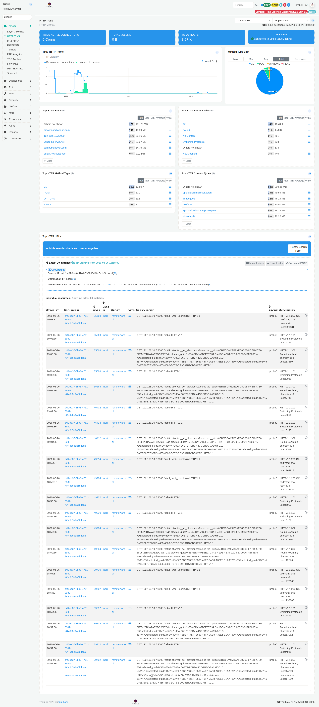

# HTTP Traffic

The HTTP Traffic dashboard provides full visibility into unencrypted HTTP activity on your network. It breaks down traffic by host, method, status code, content type, and URL and surfaces the raw HTTP resource log for forensic investigation.

:::info navigation
:point_right: Go to NBAD &rarr; HTTP Traffic
:::

*Figure: HTTP Traffic: summary tiles, method split, top hosts, status codes, and URL-level resource log*

## Summary tiles

| Tile | Description |
|---|---|
| Total Active Connections | Current number of open HTTP connections at the time the dashboard is loaded. |
| Total Volume | Total HTTP traffic volume transferred during the selected time window. |
| Total Hosts | Number of unique HTTP host values observed from the `Host:` header. |
| Total Alerts | Count of alerts associated with HTTP activity through the single-value alert channel. |

## Modules

| Modules | Type | Description |
|---|---|---|
| Total HTTP Traffic | Time-series chart | Displays inbound (downloaded) versus outbound (uploaded) HTTP bandwidth over time. Traffic directions can be toggled using the chart legend. |
| Method Type Split | Donut chart | Distribution of HTTP methods such as GET, POST, OPTIONS, and HEAD. Unusual spikes in POST or OPTIONS traffic may indicate API abuse, automated activity, or CORS probing attempts. |
| Top HTTP Hosts | Ranked list | HTTP destinations ranked by bandwidth consumption. Each host entry links to a detailed per-host drilldown view. |
| Top HTTP Status Codes | Ranked list | Breakdown of HTTP response codes including 200 OK, 302 Found, 101 Switching Protocols, 304 Not Modified, and others. Elevated error responses may indicate scanning activity, backend failures, or configuration issues. |
| Top HTTP Method Type | Ranked table | Tabular representation of HTTP method activity with Max, Min, Avg, and Total metrics. Complements the Method Type Split visualization. |
| Top HTTP Content Types | Ranked list | MIME type distribution for observed HTTP traffic. Common examples include `application/microsoftpatch`, `image/png`, `text/html`, and `video/mp2t`. Large or uncommon binary MIME types may require investigation. |
| Top HTTP URLs | Resource log | Raw HTTP resource log grouped by Source IP and Destination IP. Includes Time, Source IP/Port, Destination IP/Port, Opts, Resource ID, Probe, and Contents fields. PCAP download is available for each entry. |

## HTTP resource log columns

| Column | Description |
|---|---|
| Time IST | Timestamp of the HTTP transaction in local time. |
| Source IP / Port | Client IP address and ephemeral source port initiating the request. |
| Dest IP / Port | Server IP address and destination port, typically 80 or 8080. |
| Opts | Option flags associated with the resource record. |
| Resource ID | Internal identifier linking to the complete HTTP resource record. |
| Probe | Probe instance that captured the transaction. |
| Contents | HTTP method, full URL path, protocol version, and response code summary. |