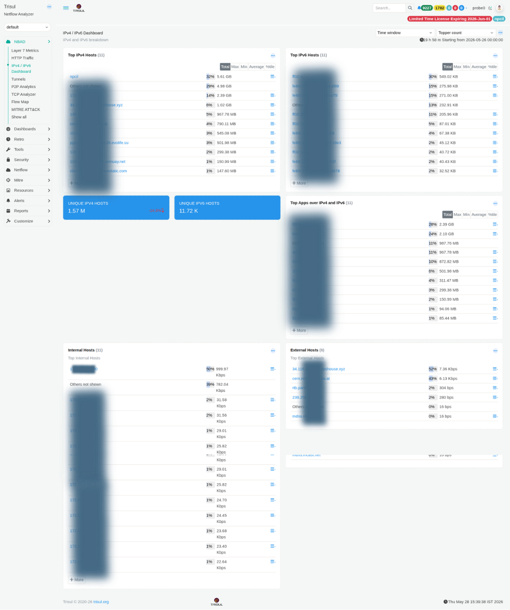

# IPv4 / IPv6 Dashboard

The IPv4 / IPv6 Dashboard provides a side-by-side view of host and application activity across both protocol families. It is useful for understanding IPv6 adoption in your network, identifying IPv6-only hosts, and comparing traffic patterns between the two address families.

:::info navigation
:point_right: Go to NBAD &rarr; IPv4 / IPv6 Dashboard
:::

*Figure: IPv4 / IPv6 Dashboard: top hosts, unique host counts, top apps, internal vs external breakdown*

## Summary tiles

| Tile | Description |
|---|---|
| Unique IPv4 Hosts | Total number of distinct IPv4 addresses observed during the selected time window. Example: `1.57 M`. |
| Unique IPv6 Hosts | Total number of distinct IPv6 addresses observed during the selected time window. Example: `11.72 K`. |

## Modules

| Modules| Scope | Description |
|---|---|---|
| Top IPv4 Hosts | All IPv4 | Ranked list of IPv4 hosts based on total bandwidth usage. Internal hosts are displayed by IP address, while external hosts may be resolved to names if DNS resolution is enabled. |
| Top IPv6 Hosts | All IPv6 | Ranked list of IPv6 hosts by total bandwidth. Includes both link-local (`fe80::`) and global unicast addresses, helping identify whether IPv6 traffic remains internal or communicates externally. |
| Top Apps over IPv4 and IPv6 | Both families | Unified application ranking across IPv4 and IPv6 traffic. Useful for identifying dual-stack applications and services communicating exclusively over IPv6. |
| Internal Hosts | Internal | Top internal IP addresses ranked by bandwidth usage. Helps identify high-volume systems, servers, or endpoints requiring further analysis. |
| External Hosts | External | Top external IP addresses communicating with the network, ranked by bandwidth consumption. Useful for identifying heavily used external services or unusual external communication patterns. |