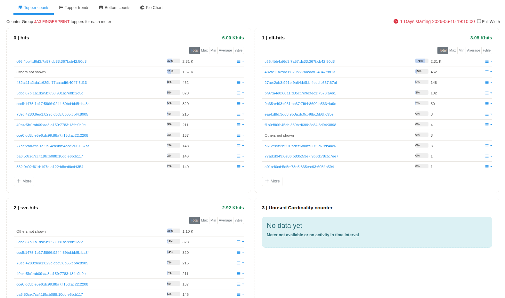

# JA3 Fingerprints

The **JA3 Fingerprints** application generates JA3 hashes from TLS ClientHello messages observed on the network. Each TLS ClientHello is converted into a JA3 fingerprint by extracting selected handshake fields and generating an MD5 hash of the resulting fingerprint string.

The application also loads a fingerprint database (`tls-fingerprints.json`) to associate known JA3 hashes with human-readable client descriptions.

---

## Installation

The JA3 Fingerprints application is available through the **Trisul Apps Repository**.

Install the application using the **Apps** page in the Trisul Web Interface or manually from the GitHub repository.

---

## Navigation

:::info navigation
:point_right: Go to NBAD &rarr; JA3 Fingerprints
:::

The JA3 Fingerprints dashboard displays all JA3 hashes observed from TLS ClientHello traffic during the selected time interval.

---

## JA3 Fingerprints Dashboard

*Figure: JA3 Fingerprints dashboard displaying the **JA3 PRINT** counter group. The dashboard provides a summary of JA3 hashes generated from observed TLS ClientHello messages.*

The dashboard displays the **JA3 PRINT** counter group.

| Property      | Value                     |
| ------------- | ------------------------- |
| Counter Group | JA3 PRINT                 |
| Description   | JA3 TLS Client Hello Hash |
| Bucket Size   | 60 Seconds                |

---

# Meter Selection

The JA3 application exposes a single meter.

| Meter    | Description      |
| -------- | ----|
| **Hits** | Records the number of TLS ClientHello messages that generated the corresponding JA3 fingerprint. |

---

## Topper Counts

The **Topper Counts** view displays the JA3 fingerprints with the highest number of observations during the selected time interval.

Each row represents one unique JA3 fingerprint.

| Parameter           | Description                                                                  |
| ------------------- | ---------------------------------------------------------------------------- |
| **JA3 Fingerprint** | MD5 hash generated from the JA3 fingerprint string.                          |
| **Percentage**      | Relative contribution of the fingerprint within the displayed Topper Counts. |
| **Hits**            | Number of TLS ClientHello messages that generated the fingerprint.           |

The **Others not shown** entry represents fingerprints that are not included in the displayed Top-N list.

---

## Fingerprint Database

Known JA3 fingerprints are loaded from the bundled fingerprint database.

When a generated JA3 hash matches an entry in the database, the associated client description is attached to the fingerprint. This allows known browsers, applications, or TLS implementations to be identified within Trisul.

---

### References

* JA3 Fingerprints Repository
  https://github.com/trisulnsm/ja3prints

* JA3 Fingerprinting Specification
