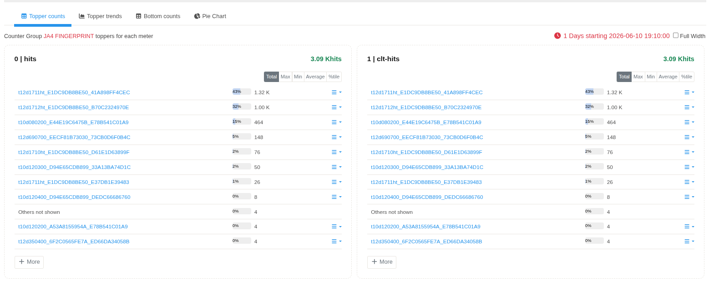
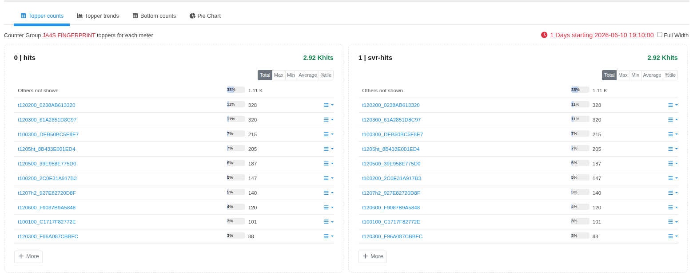

# JA4 Fingerprints

The **JA4 Fingerprints** application generates JA4 fingerprints from TLS ClientHello messages observed on the network. JA4 is a modern TLS fingerprinting method that provides stable client fingerprints for encrypted TLS traffic.

The application also loads a fingerprint database to associate known JA4 fingerprints with human-readable client descriptions.

---

## Installation

The JA4 Fingerprints application is available through the **Trisul Apps Repository**.

Install the application using the **Apps** page in the Trisul Web Interface or manually from the GitHub repository.

---

## Navigation

:::info navigation  
:point_right: Go to NBAD → JA4 Fingerprints
:::

## JA4 Fingerprints Dashboard

*Figure: JA4 Fingerprints dashboard displaying the **JA4 PRINT** counter group. The dashboard provides a summary of JA4 fingerprints generated from observed TLS ClientHello messages.*

The dashboard displays the **JA4 PRINT** counter group.

| Property      | Value                            |
| ------------- | -------------------------------- |
| Counter Group | JA4 PRINT                        |
| Description   | JA4 TLS Client Hello Fingerprint |
| Bucket Size   | 60 Seconds                       |

---

## Meter Selection

The JA4 application exposes a single meter.

| Meter    | Description   |
| -------- | --------- |
| **Hits** | Records the number of TLS ClientHello messages that generated the corresponding JA4 fingerprint. |

---

## Topper Counts

*Figure: Topper Counts view displaying the most frequently observed JA4 fingerprints ranked by the **Hits** counter.*

The **Topper Counts** view displays the JA4 fingerprints with the highest number of observations during the selected time interval.

Each row represents one unique JA4 fingerprint.

| Parameter           | Description     |
| ------------------- | --------------- |
| **JA4 Fingerprint** | JA4 fingerprint generated from the observed TLS ClientHello.                 |
| **Percentage**      | Relative contribution of the fingerprint within the displayed Topper Counts. |
| **Hits**            | Number of TLS ClientHello messages that generated the fingerprint.           |

The **Others not shown** entry represents fingerprints that are not included in the displayed Top-N list.

---

## Fingerprint Database

Known JA4 fingerprints are loaded from the bundled fingerprint database.

When a generated JA4 fingerprint matches an entry in the database, the associated client description is attached to the fingerprint. This enables known browsers, applications, or TLS client implementations to be identified within Trisul.
