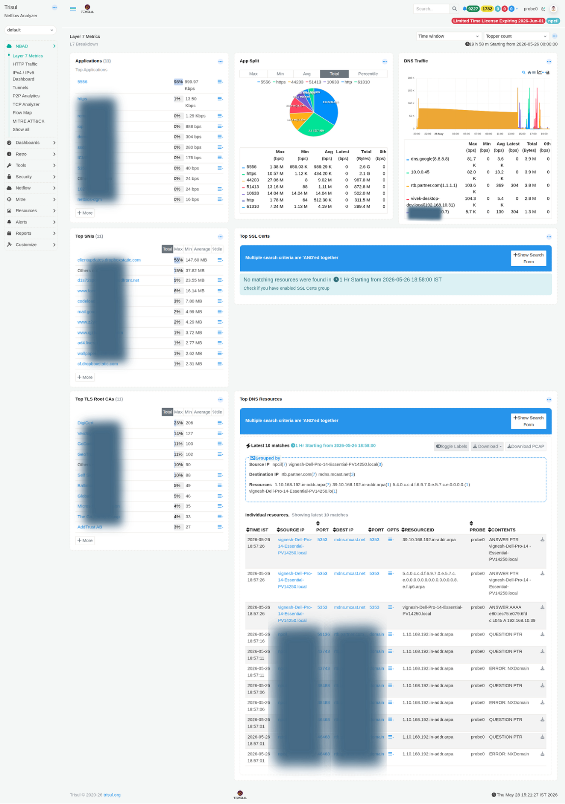

# Layer 7 Metrics

The Layer 7 Metrics dashboard provides a complete L7 breakdown of your network traffic. It is the starting point for understanding application usage, encrypted traffic patterns, and DNS behaviour.

:::info navigation
:point_right: Go to NBAD &rarr; Layer7 Metrics
:::

*Figure: Layer 7 Metrics: applications, SNIs, TLS Root CAs, DNS traffic, and top DNS resources*

### Layer7 Modules

| Modules | Type | Description |
|---|---|---|
| Applications | Ranked list | Top applications by bandwidth. Each entry links to a counter group drilldown. Percentage share and Max/Min/Avg/Total metrics are shown per application. |
| App Split | Donut chart | Displays bandwidth distribution by application. Supports toggling between Max, Min, Avg, Total, and Percentile views to compare traffic share across different time dimensions. |
| DNS Traffic | Time-series + table | Stacked chart showing DNS query volume per resolver. The accompanying table includes Max, Min, Avg, Latest, and Total metrics for each resolver. Useful for identifying DNS amplification activity or abnormal resolver usage. |
| Top SNIs | Ranked list | Lists the most frequently observed Server Name Indication (SNI) values from TLS handshakes. Provides visibility into encrypted HTTPS destinations without requiring TLS decryption. Useful for shadow IT discovery and CDN usage analysis. |
| Top SSL Certs | Ranked list | Shows the most frequently observed SSL/TLS certificates. Requires the SSL Certs resource group to be enabled. A notification prompt is displayed if the resource group is inactive. |
| Top TLS Root CAs | Ranked list | Displays the distribution of TLS Root Certificate Authorities observed in certificate chains. A high percentage of self-signed certificates may indicate internal services, private PKI usage, or potentially suspicious infrastructure. |
| Top DNS Resources | Resource log | Displays recent DNS resource records grouped by Source IP and Destination IP. Includes columns for Time, Source IP/Port, Destination IP/Port, Resource ID, Probe, and Contents. PCAP download is available for each entry. |
---

## Metric columns (counters)

| Column | Description |
|---|---|
| Max (bps) | Peak bandwidth observed for the item within the selected time window. |
| Min (bps) | Lowest bandwidth observed during the selected time range. Useful for identifying baseline or idle traffic levels. |
| Avg (bps) | Average bandwidth calculated across all measurement intervals in the selected window. |
| Latest (bps) | Most recent bandwidth value available at the time the dashboard was loaded. |
| Total (Bytes) | Total volume of data transferred during the selected time period. |
| 0th (bps) | Baseline percentile value used in threshold band and anomaly calculations. |
| %tile | Percentage contribution of the item relative to total observed traffic. |

---