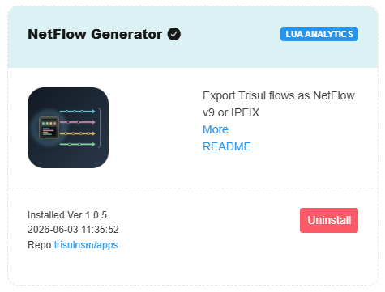

# NFGen Flow Conversion

NBAD includes an NFGen engine that can convert supported flow formats into NetFlow for export. This enables interoperability between devices using different flow technologies and downstream systems that expect NetFlow records.

## Enabling NFGen

To access Trisul Apps, Login as admin user

:::info navigation

:point_right: Select Web Admin &rarr; Manage &rarr; Apps

:::



**NetFlow Generator** is available as a Trisul App. To enable flow format conversion, install the NetFlow Generator app from the Trisul Apps repository and configure the desired export format

## Configuring NFGen

The NFGen configuration file is located at:

```
/usr/local/var/lib/trisul-probe/domain0/probe0/context0/config/trisulnsm_nfgen.lua
```

Modify the configuration file to define the export format and destination parameters as required by your deployment.


## Supported Export Formats

NFGen currently supports exporting flow records in the following formats:

* NetFlow v5
* NetFlow v9
* IPFIX (v10)

> NFGen can convert supported incoming flow formats into a standardized NetFlow export format, allowing seamless integration with existing flow analysis and monitoring infrastructure.
