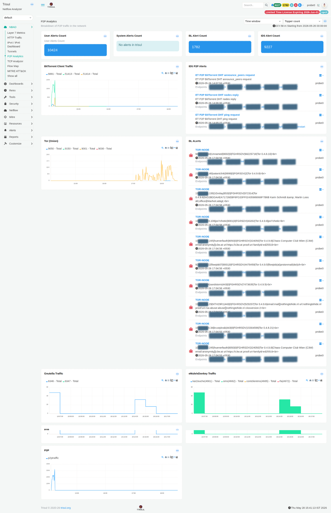

# P2P Analytics

The P2P Analytics dashboard provides a breakdown of peer-to-peer traffic detected on your network. It correlates traffic-level data with IDS and blacklist alerts to give both a volume view and a security view of P2P activity.

:::info navigation
:point_right: Go to NBAD &rarr; P2P Analytics
:::

*Figure: P2P Analytics: alert counts, BitTorrent, Tor, Gnutella, eMule traffic charts, and live IDS/BL alerts*

Breakdown of peer-to-peer traffic on the network. Correlates traffic-level data with IDS and blacklist alerts to provide both a volume view and a security view of P2P activity.

## Alert count tiles

| Tile | Source | Description |
|---|---|---|
| User Alerts Count | Trisul user alerts | Total number of active user-defined alerts currently configured in the system. |
| System Alerts Count | Trisul self-monitoring | System-generated alerts from Trisul internal monitoring, including events such as packet drops, memory pressure, or resource exhaustion. |
| BL Alert Count | Threat intelligence feeds | Blacklist alerts triggered by connections matching known malicious IPs, domains, or Tor exit nodes. |
| IDS Alert Count | IDS (e.g. Suricata) | Intrusion detection alerts generated by the integrated IDS engine. |

## Traffic modules

| Modules | Protocols / Ports | Description |
|---|---|---|
| BitTorrent Client Traffic | 6881, 51413, 51414 | Time-series view of BitTorrent traffic across tracked ports. Traffic spikes typically indicate active torrent sessions. Different traffic phases such as DHT activity, peer exchange, and payload transfer can often be inferred from port behaviour. |
| Tor (Onion) | 9050, 9150, 9001, 9030 | Traffic observed on commonly used Tor ports. Persistent Tor communication originating from internal hosts is often considered a high-confidence indicator of policy violations, anonymization attempts, or evasion activity. |
| Gnutella Traffic | 6346, 6347 | Time-series monitoring of Gnutella peer-to-peer traffic activity. |
| eMule/eDonkey Traffic | 4661, 4662, 4665, 4672 | Tracks eMule/eDonkey traffic across characteristic protocol ports including `kar2ouche (4661)`, `oms (4662)`, `contclientms (4665)`, and `rfa (4672)`. |
| D²D / P2P | Various | Generic peer-to-peer traffic counter tracking aggregate P2P communication flows across multiple protocols and ports. |

## Alert feed Modules

| Modules | Alert type | Description |
|---|---|---|
| IDS P2P Alerts | IDS signatures | Live feed of IDS alerts classified as peer-to-peer activity. Entries include alert signature, description, timestamp, source and destination IPs/ports, and probe information. Example signatures include `ET P2P BitTorrent DHT announce_peers request` and `ET P2P BitTorrent DHT nodes reply`. |
| BL Alerts | Blacklist / threat intel | Displays connections matching known Tor nodes or blacklisted infrastructure. Entries include indicator type (such as `TOR-NODE`), remote IP, destination port, resolved hostname, timestamp, probe, and endpoint details. |