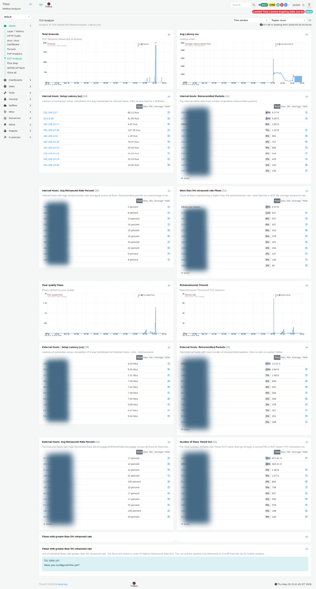

# TCP Analyzer

The TCP Analyzer dashboard provides deep visibility into TCP health metrics across your network. It identifies hosts with high retransmission rates, elevated setup latency, session timeouts, and poor-quality flows. All of which are indicators of network congestion, application issues, or degraded path quality.

:::info navigation
:point_right: Go to NBAD &rarr; TCP Analyzer
:::

*Figure: TCP Analyzer: latency, retransmissions, timeouts, poor-quality flows for both internal and external hosts*

Deep visibility into TCP health metrics. Identifies hosts with high retransmission rates, elevated setup latency, session timeouts, and poor-quality flows. All indicators of network congestion, application issues, or degraded path quality.

## Summary charts

| Chart | Description |
|---|---|
| Total Timeouts | Time-series of TCP sessions terminated through timeout without receiving a normal FIN or RST sequence. Spikes may indicate dropped connections, firewall policy mismatches, asymmetric routing, or stalled applications. |
| Avg Latency ms | Time-series tracking average TCP connection setup latency based on 3-way handshake completion time. Displays both `Average Latency` and `Avg Latency Internal` as separate series. Sustained increases can indicate congestion, routing delays, or slow backend response times. |

## Internal host modules

| Modules | Description |
|---|---|
| Internal Hosts: Setup Latency (µs) | Internal hosts ranked by TCP connection setup latency in microseconds. Selecting a host opens a drilldown view of its flow latency history. |
| Internal Hosts: Retransmitted Packets | Top internal hosts ranked by total retransmitted packet count. Persistent retransmissions may indicate lossy links, interface problems, duplex mismatches, or overloaded applications. |
| Internal Hosts: Avg Retransmit Rate Percent | Hosts ranked by average retransmission rate as a percentage of all observed flows. Helps identify problematic hosts regardless of traffic volume. A lightly used host with a high retransmission percentage may be more concerning than a busy host with a low percentage. |
| More than 5% retransmit rate Flows | Count of flows per host experiencing retransmission rates above 5%. Tracks affected flow count rather than average retransmission percentage. |

## External host Modules

| Modules| Description |
|---|---|
| External Hosts: Setup Latency (µs) | TCP connection setup latency to external destinations measured in microseconds. |
| External Hosts: Retransmitted Packets | External IP addresses ranked by total retransmitted packet count. |
| External Hosts: Avg Retransmit Rate Percent | Normalised retransmission percentage for external communication paths. Useful for identifying unstable WAN or internet-facing connectivity issues. |
| Number of flows Timed Out | Count of flows terminated by timeout rather than a clean FIN or RST sequence, grouped by external host. |

## Additional Modules

| Modules | Description |
|---|---|
| Poor Quality Flows | Time-series of flows classified as poor quality. Requires the Poor Quality Flows tracker to be enabled. A configuration prompt is displayed if the tracker is inactive. |
| Retransmission Percent | Time-series showing overall TCP retransmission percentage across all sessions, separated into internal and external traffic categories. |
| Flows with >5% retransmit rate | Detailed table of individual flows sorted by highest retransmission percentage. Includes Source IP, Destination IP, ports, and flow metadata. Packets can be exported directly to Wireshark or Unsniff for packet-level analysis. |