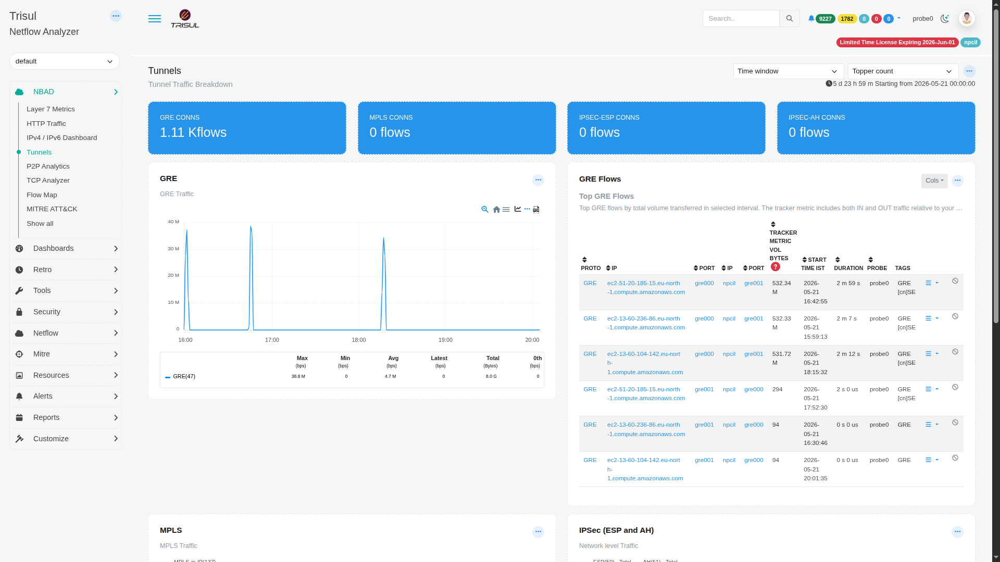

# Tunnels

The Tunnels dashboard detects and measures traffic carried inside tunneling protocols. Tunnels are commonly used for legitimate purposes (VPNs, cloud connectivity, MPLS backbones) but can also be used to encapsulate unauthorized traffic or bypass security controls.

:::info navigation
:point_right: Go to NBAD &rarr; Tunnels
:::

*Figure: Tunnels: GRE, MPLS, and IPSec connection tiles, GRE traffic chart, and top GRE flows table*

## Summary tiles

| Tile | Protocol | Description |
|---|---|---|
| GRE CONNS | Generic Routing Encapsulation (GRE) | Total number of active GRE tunnel connections observed within the selected time window. Example: `1.11 K flows`. |
| MPLS CONNS | Multiprotocol Label Switching (MPLS) | Total number of active MPLS label-switched connections. |
| IPSEC-ESP CONNS | IPSec Encapsulating Security Payload (ESP) | Total number of active IPSec-ESP encrypted tunnel connections. |
| IPSEC-AH CONNS | IPSec Authentication Header (AH) | Total number of active IPSec-AH authenticated tunnel connections. |

## Traffic modules

| Modules | Protocol | Description |
|---|---|---|
| GRE | GRE | Time-series view of GRE tunnel traffic. The metric row below the chart displays Max, Min, Avg, Latest, Total, and 0th values for the GRE counter group (Protocol 47). Traffic spikes typically indicate bursts of encapsulated WAN, cloud, or site-to-site tunnel activity. |
| MPLS | MPLS | Time-series chart showing MPLS label-switched traffic. Tracks traffic volumes carried within MPLS encapsulation across the selected analysis window. |
| IPSec (ESP and AH) | IPSec | Combined IPSec traffic panel tracking both ESP (Encapsulating Security Payload) and AH (Authentication Header) activity. Useful for monitoring VPN tunnel utilization, validating encrypted connectivity, and identifying unexpected IPSec sessions. |

## GRE traffic chart metric row

| Column | Description |
|---|---|
| Max (bps) | Peak GRE tunnel bandwidth observed during the selected time window. |
| Min (bps) | Lowest GRE bandwidth observed. A non-zero baseline may indicate continuously active tunnel traffic. |
| Avg (bps) | Average GRE bandwidth across all measurement intervals. |
| Latest (bps) | Most recent GRE bandwidth value available when the dashboard was loaded. |
| Total (Bytes) | Total volume of data transported through GRE tunnels during the selected time period. |
| 0th (bps) | Percentile baseline value used for anomaly threshold and band calculations. |

## GRE Flows table
The GRE Flows panel lists the top GRE flows by total volume transferred in the selected interval. The tracker metric includes both IN and OUT traffic relative to the monitored interface.

| Column | Description |
|---|---|
| PROTO | IP protocol associated with the tunneled flow, such as GRE. |
| IP | Source IP address of the outer tunnel endpoint, typically a cloud instance, WAN device, or tunnel gateway. |
| PORT | Source port or protocol identifier of the outer encapsulating flow, for example `gre000` or `gre001`. |
| IP | Destination IP address of the remote tunnel endpoint. |
| PORT | Destination port or protocol identifier associated with the tunnel endpoint. |
| TRACKER METRIC VOL BYTES | Total bidirectional byte volume transferred by the flow. This metric is used by the tracker to rank and sort tunnel flows. |
| START TIME IST | Timestamp indicating when the tunnel flow was first observed, displayed in local time. |
| DURATION | Total lifetime of the tunnel flow session, ranging from short-lived flows (`0 s`) to long-running sessions. |
| PROBE | Probe instance that captured and reported the tunnel flow. |
| TAGS | Automatically assigned flow tags. Examples include protocol identifiers and endpoint classifications such as `GRE [cn]SE`, indicating protocol type and country or segment information. |