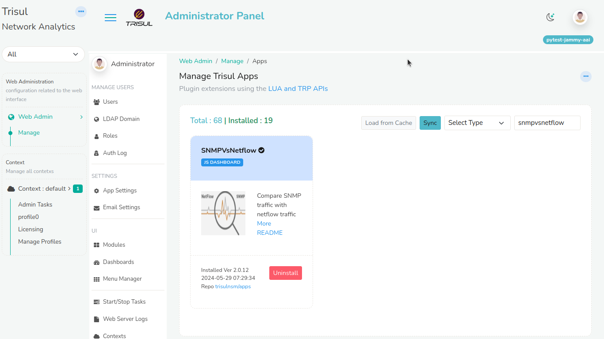
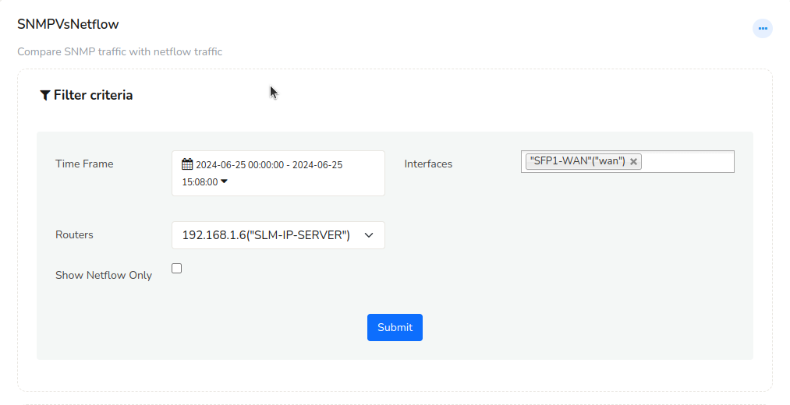
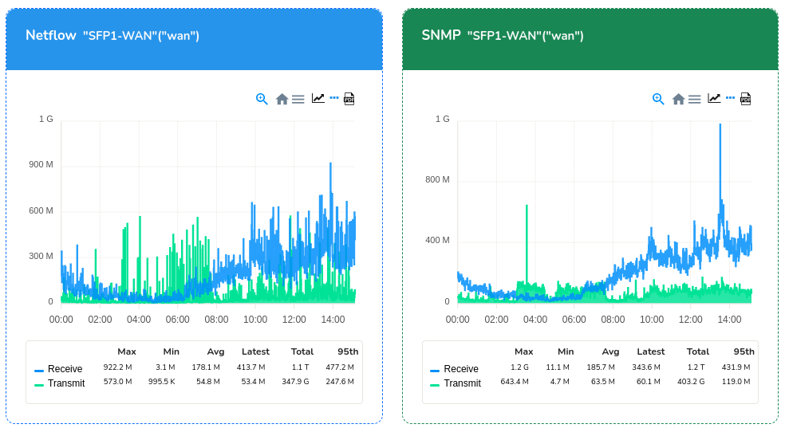

---

title: Netflow vs SNMP
sidebar_position: 10

---

# 13.10.Netflow vs SNMP

Trisul has a advanced feature that provides bandwidth mapping of the
SNMP vs Netflow Traffic from every router and interface.

## 13.10.1.Installing the SNMP vs Netflow App

To enable this feature, you must install the SNMP vs Netflow app from
Trisul Apps. To Install the app,

:::note navigation

Login as Admin. Under Web Administration select *Manage \> Apps \> SNMPvsNetflow*

:::

Select the ‘*Install*’ option to install the app.

## 13.10.2.SNMP vs Netflow Chart

If you want to have a comparison between the SNMP and Netflow records
for any router or interface,

:::note navigation

Login as User. Select *Dashboards \> Show All \> SNMPvsNetflow*
Dashboard.

:::

You will get a dialog box as follows.

You can fill in the required fields and submit them.

| Field         | Description                                                                               |
| ------------- | ----------------------------------------------------------------------------------------- |
| Time Selector | Select the desired time from the time selector box                                        |
| Routers       | Select any desired router                                                                 |
| Interfaces    | Select any interface from respective router or select multiple interfaces for that router |

Click on *Submit* option and you will see the SNMP vs Netflow chart for the
interfaces you have selected.  

You can also generate a report by clicking on the *Download* option.
