# Interface Drilldown

Describes the *Interface drilldown* tool that appears when you select
“Drilldown” against any interface in the Interfaces table of the [*Routers and Interfaces
Tool*](/docs/ug/netflow/routers_and_interfaces#interfaces-table). The options in Interface Drilldown tool looks slightly different on each interface depending on if [*Interface Tracking*](/docs/ug/netflow/interface_tracker) is enabled on the interface or not.

## Without Interface Tracker

This is the screen of your interface without tracker that shows the tabs including *Traffic, Util, Flow Hosts, Flow Apps, Conversation, Raw Flows and Matrix*. Without *interface tracker* the "*Flow Hosts*" and "*Flow Apps*" shows the totals of *Host and Apps In/Out/Total* but you will not be able to see Time Series trends of those counters.

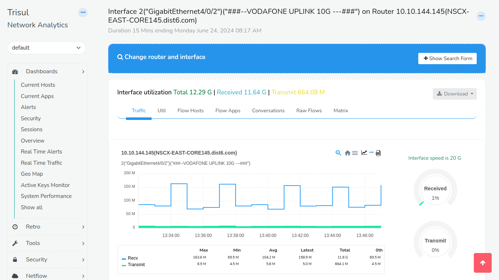

*Figure: Interface Utilization with Interface Tracker Disabled*

## With Interface Tracker

When the interface has the tracker enabled it is indicated by the Eye icon on the additional tabs such as *Hosts Track/Apps Track* as shown below.

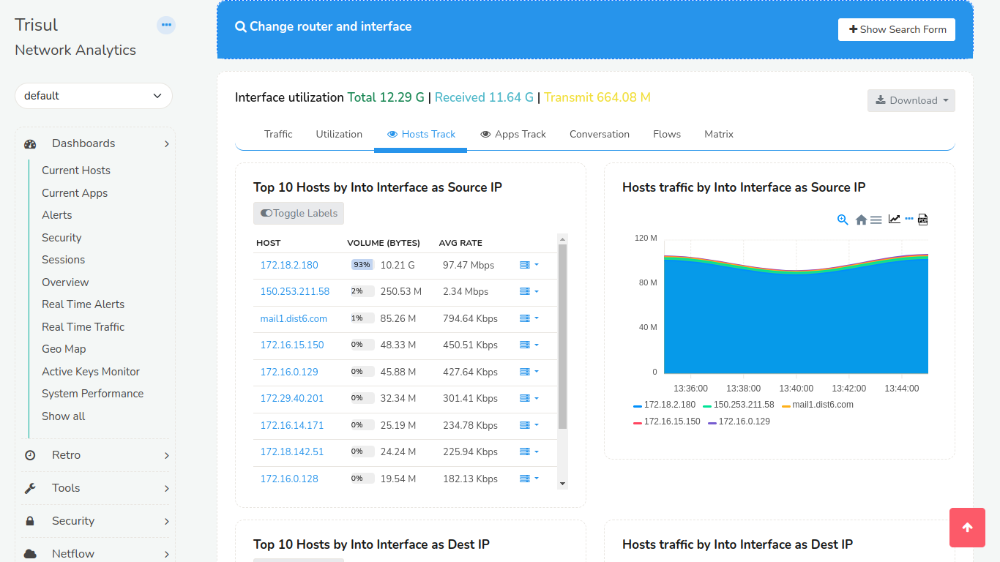 

*Figure: Interface Utilization with Interface Tracker Enabled*

## Using

:::info navigation
:point_right: Select Drilldown against any Netflow interface in the [Routers and
Interfaces Tool](/docs/ug/netflow/routers_and_interfaces)
:::

The following page that contains the traffic chart is displayed.

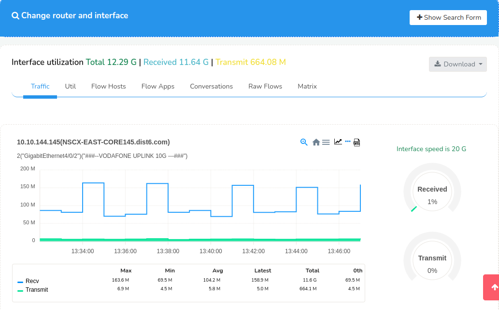

*Figure: Interface drilldown Showing the form for Time, Router, Interface
selection*

#### Search Form

Click the **Show Search Form** on the [top right](/docs/ug/ui/elements#hide-show-search-form) to open up a form where you can control the following.

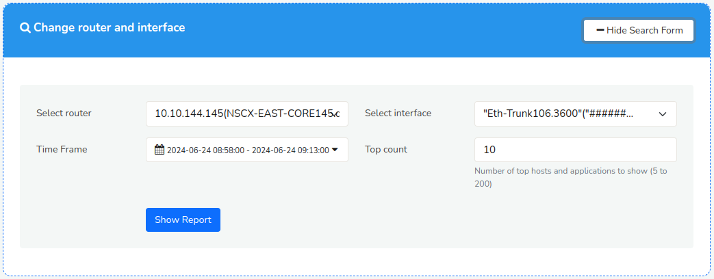

*Figure: Show Search Form to Change Router and Interface*

You can change the router, interface, time interval, and topper count.

| Field            | Description                                                                                 |
| ---------------- | ------------------------------------------------------------------------------------------- |
| Select Router    | Change the router, this loads the interface names on that router                            |
| Select Interface | Select the interface for which you want drilldown report                                    |
| Time Frame       | Change the time interval for the report                                                     |
| Top Count        | Controls how many **Top** items are shown in topper views of Hosts, Apps, Conversations etc |

Once the "Change router and interface" form is set and submitted , it takes you to the Interface utilization window.

#### Information Shown

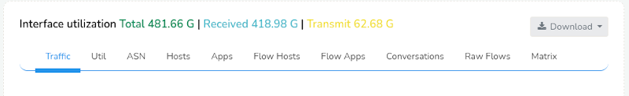

*Figure: Interface Utilization Tabs*

On top of the tabs you can see the interface utilization data that includes, 

**Volumes**  
Shows Total, Received, and Transmitted volumes on the interface

**Download**  
Allows you to download the drilldown report as PDF or XLSX worksheets

Below the title, the interface drilldown is displayed as tabs. Some of
these tabs are dynamically created. If you have created a [Crosskey
Counter Group](/docs/ag/context/crosskey_countergroups) with Flow-Interfaces as the first group, then the second group will be shown as a Tab.

| Panel | Name               | Description                                                                     |
| ----- | ------------------ | --------------------------------------------------------------------------------|
| 1     | Traffic            | Bandwidth usage of Recv and Xmit from the interface along with total volumes    |
| 2     | Util               | Utilization of the interface in transmit and receive directions                 |
| 3     | ASN                | ASNs active on this interface. Needs the ASN Tracker enabled                    |
| 4     | Hosts              | Top hosts into and out of the interface. If *Interface Tracker* is enabled you will see more accurate numbers and also a traffic chart. If *Track Hosts* is enabled you will see more details as well.|
| 5     | Apps               | Top applications into and out of the interface. More detail and chart available if *interface tracking* is enabled or if *Track Apps* is enabled                                                   |
| 6     | Flow Hosts         | Computes the hosts using this interface by querying raw flow information        |
| 7     | Flow Apps          | Computes the hosts using this interface by querying raw flow information        |
| 8     | Conversations      | Top IP source destination and destination port.                                 |
| 9     | Raw Flows          | Top Raw flows                                                                   |
| 10    | Matrix             | A chord diagram showing **interface to interface** traffic flows in transmit and receive directions. This is useful for ISPs, needs the *Track interfaces per Interface*                        |
| 11    | ASN, NBAR, QoS etc | These appear dynamically depending on whether these features are enabled or not |
| 12    | MixedBandwidth     | ISP specific use case shows the same data as ASN but groups them into cache traffic vs internet traffic                                                                                            |

Also see : [Netflow Wizard Trackers](netflow_wizard#trackers)

## Traffic Chart

Traffic chart shows the transmited and received traffic on the interface
for the selected time window. The legends on the bottom show the LATEST
values.

*Figure: Showing the transmit and receive chart of Interface*

## Util

Similar to traffic numbers, this tab shows Utilization numbers relative
to interface speed.

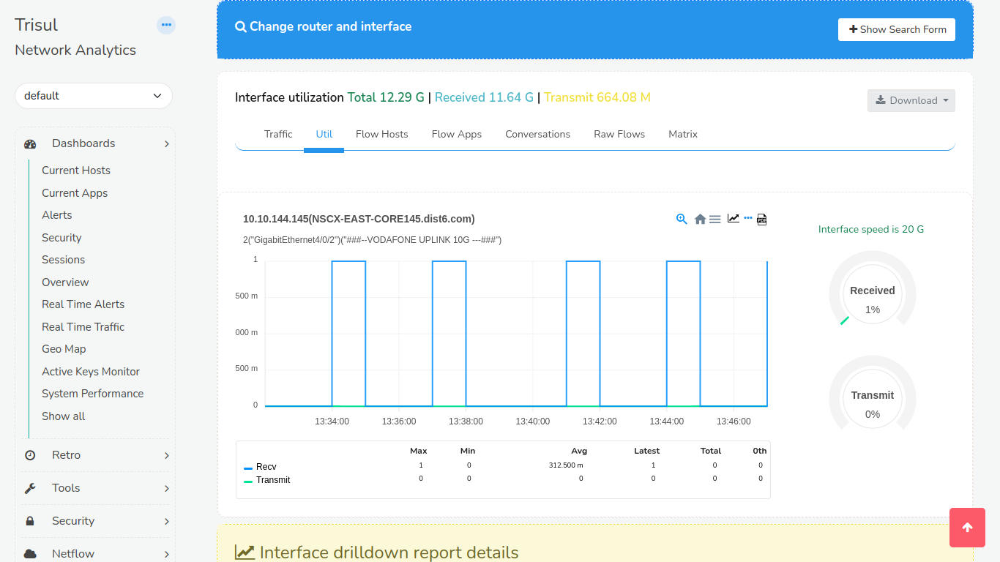

*Figure: Util Tab of Interface Utilization*

## Hosts

For IP based reporting.

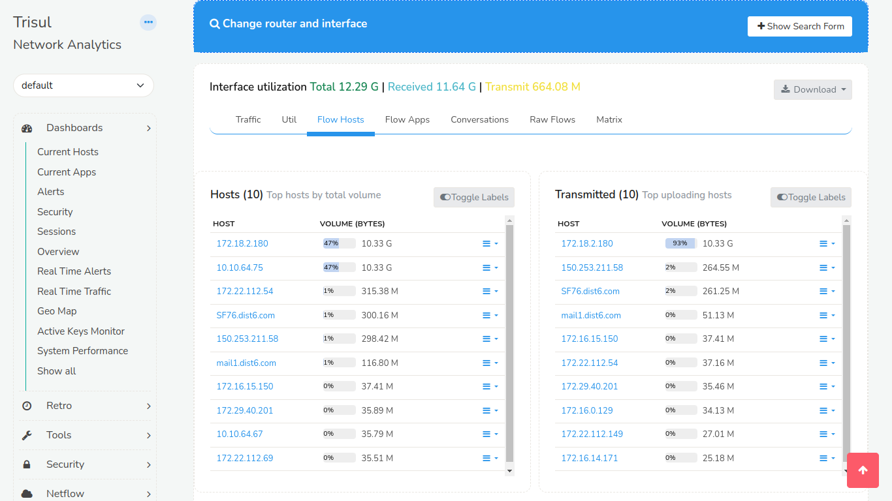

*Figure: Flow Hosts Tab of Interface Utilization*

## Hosts Track (When Interface Tracker is Enabled)

Shows Top N Hosts IP addresses sending or receiving traffic on the
interface.

### Sample Hosts Trends Chart When Interface Tracker is Enabled

This feature in trisul is a deep drilldown of top hosts by total,into
and out of an interface. This is only available after enabling
[Interface Tracker](/docs/ug/netflow/interface_tracker) .

Top hosts into interface are the hosts that are transmitting into the
interface(Ingress)  
Top hosts out of interface are the hosts that are transmitting out of
the interface(Egress)

On the right side,we have the traffic chart which helps you to detect
the hosts that are causing spikes.

*Figure: Hosts Track Tab of Interface Utilization*

## Apps

### Default Top Apps Report

Shows top applications by receive and transmit on the interface.

### Sample Apps Trends Chart

This feature in trisul is a deep drilldown of top applications by
total,into and out of an interface. This is only available after
enabling [Interface Tracker](/docs/ug/netflow/interface_tracker) .

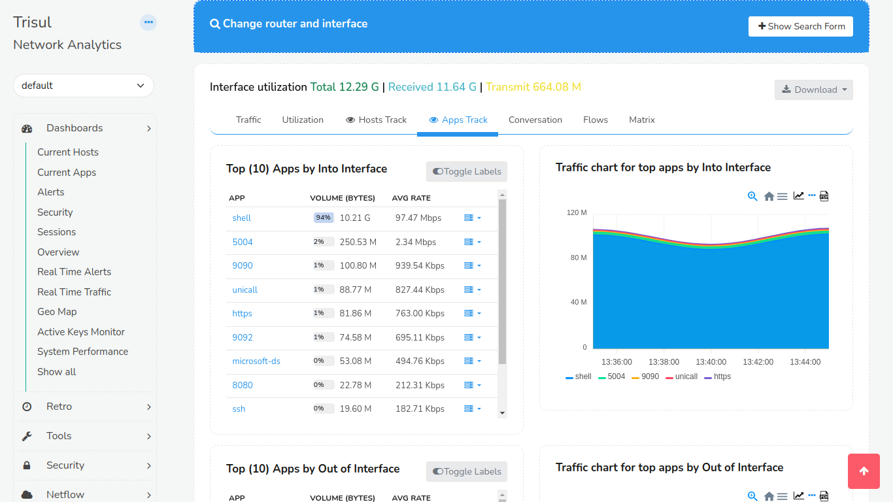

*Figure: Apps Track Tab of Interface Utilization*

## Top Conversations or Talkers

Top conversations are nothing but the talkers. The screen displays *the conversations between the source and the destination* in volume bytes.

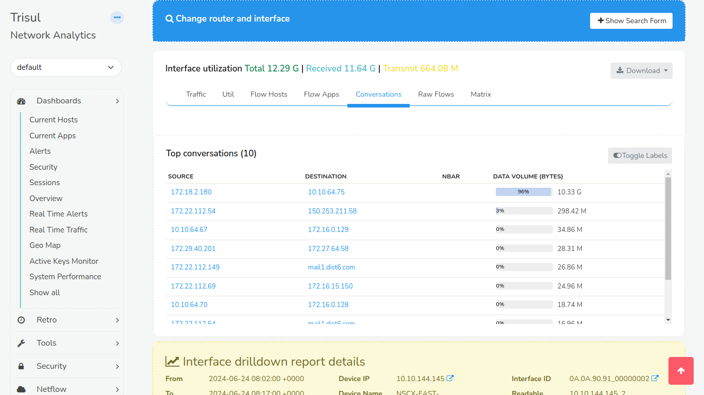

*Figure: Conversations Tab of Interface Utilization*

## Raw Flows

Raw Flows shows details against every flow sorted by volume. It contains
information like protocol,source IP, source port, destination IP,
destination port, duration of flows, etc.

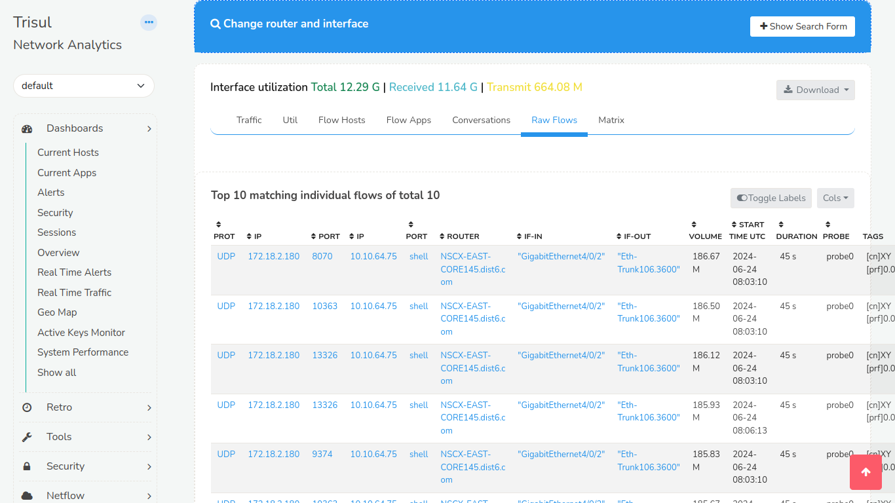

*Figure: Raw Flows Tab of Interface Utilization*

## Interface Traffic Matrix – Chord Diagram

A useful tool that represents traffic flows between interfaces. A chord
diagram looks like the picture below. The interface being drilldown is
represented a chord and the other interfaces are shown as smaller chords
sending or receiving traffic from the subject interface. This is only available after enabling [Cross Key](/docs/ag/context/crosskey_countergroups) 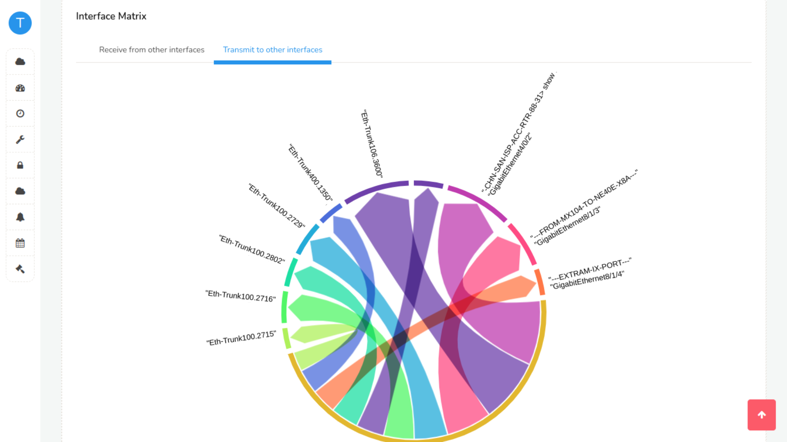

*Figure: Interface Traffic Matrix*

## ASN, NBAR, and Other Details

These are available in the interface drilldowns if the proper trackers are created ahead of time when [Cross Key](/docs/ag/context/crosskey_countergroups) is enabled for them.

*Figure: ASN Tab of Interface Utilization*

### ASN Details

If you closely observe the chart you may notice that if you sum up the
volumes in each of the ASN may be more than the interface volume. This
is because for every flow there are TWO AS Numbers. The Source and
Destination AS. Hence a 100 GB download from AS-1 will show up as AS-1 100GB Transmit and AS-2 100GB Receive.
