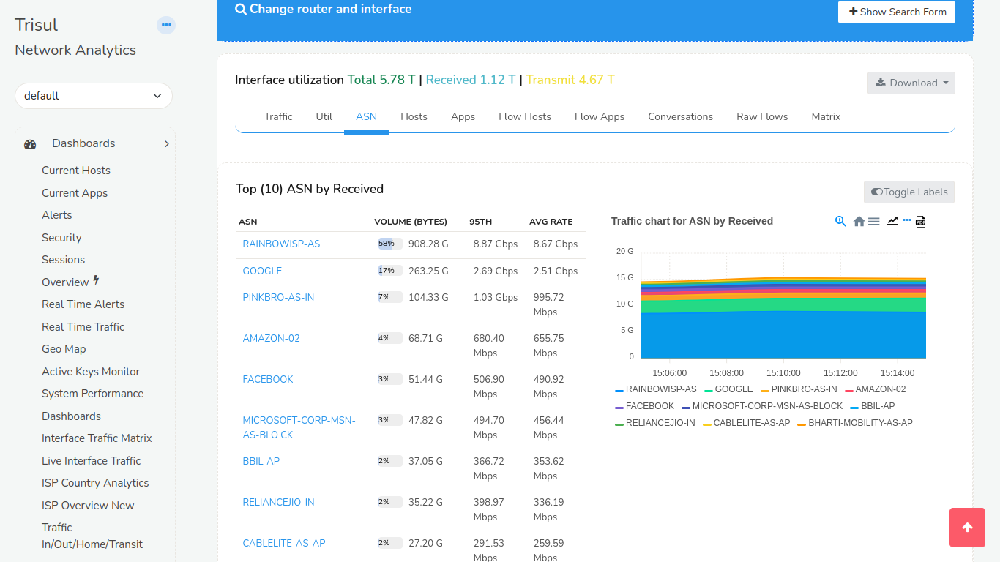

# Interface Drilldown

Describes the Interface drilldown tool that appears when you select
“Drilldown” against any interface in the [Routers and Interfaces
Tool](/docs/ug/netflow/routers_and_interfaces.html#routers_and_interfaces)

The Interface Drilldown tool looks slightly different depending on if
[Interface Tracking](interface_tracker.html) is enabled or not.

- **With Interface Tracker** — when interface has the tracker (shows up
  with eye <i class='fa fa-eye'></i> icon) enabled. You will see
  additional tabs such as Hosts Track/Apps Track.
  
  
  
  - **Without Interface Tracker** — without interface tracker you will be
    shown totals of Host and Apps In/Out/Total but you will not be able to
    see Time Series trends of these counters. 
  
    

## Using

:::note navigation

Selecting Drilldown against any Netflow interface in the [Routers and
Interfaces Tool](/docs/ug/netflow/routers_and_interfaces.html#routers_and_interfaces)

:::

The following page is displayed.

*Interface drilldown : showing the form for Time, Router, Interface
selection*

## Search Form

:::note navigation 

Click the **Show search form** to open up a form where you can control
the following.

:::

You can change the interface, time interval, topper count etc.

| Field            | Description                                                                                 |
| ---------------- | ------------------------------------------------------------------------------------------- |
| Select Router    | Change the router, this loads the interface names on that router                            |
| Select Interface | Select the interface for which you want drilldown report                                    |
| Time Frame       | Change the time interval for the report                                                     |
| Top Count        | Controls how many **Top** items are shown in topper views of Hosts, Apps, Conversations etc |

## Information Shown

The Interface utilization title line shows

**Volumes**  
Shows Total, Received, and Transmitted volumes on the interface

**Download**  
Allows you to download the drilldown report as PDF or XLSX worksheets

Below the title, the interface drilldown is displayed as tabs. Some of
these tabs are dynamically created. If you have created a [Crosskey
Counter Group](/docs/ug/cg/custom.html#cross_key_counter_groups) with
Flow-Interfaces as the first group, then the second group will be shown
as a Tab.

| Panel | Name               | Description                                                                                                                                                                                            |
| ----- | ------------------ | ------------------------------------------------------------------------------------------------------------------------------------------------------------------------------------------------------ |
| 1     | Traffic            | Bandwidth usage of Recv and Xmit from the interface along with total volumes                                                                                                                           |
| 2     | Utilization        | Utilization of the interface in transmit and receive directions                                                                                                                                        |
| 3     | ASN                | ASNs active on this interface. Needs the ASN Tracker enabled                                                                                                                                           |
| 4     | Hosts              | Top hosts into and out of the interface. If *Interface Tracker* is enabled you will see more accurate numbers and also a traffic chart. If *Track Hosts* is enabled you will see more details as well. |
| 5     | Apps               | Top applications into and out of the interface. More detail and chart available if *interface tracking* is enabled or if *Track Apps* is enabled                                                       |
| 6     | Flow Hosts         | Computes the hosts using this interface by querying raw flow information                                                                                                                               |
| 7     | Flow Apps          | Computes the hosts using this interface by querying raw flow information                                                                                                                               |
| 8     | Conversations      | Top IP source destination and destination port.                                                                                                                                                        |
| 9     | Raw Flows          | Top Raw flows                                                                                                                                                                                          |
| 10    | Matrix             | A chord diagram showing **interface to interface** traffic flows in transmit and receive directions. This is useful for ISPs, needs the *Track interfaces per Interface*                               |
| 11    | ASN, NBAR, QoS etc | These appear dynamically depending on whether these features are enabled or not                                                                                                                        |
| 12    | MixedBandwidth     | ISP specific use case shows the same data as ASN but groups them into cache traffic vs internet traffic                                                                                                |

Also see : [Netflow Wizard Trackers](netflow_wizard.html#trackers)

## Traffic Chart

Traffic chart shows the transmit and receive traffic on the interface
for the selected time window. The legends on the bottom show the LATEST
values.

## Utilization

Similar to traffic numbers, this tab shows Utilization numbers relative
to interface speed.

## Hosts

For IP based reporting.

### Basic Top Hosts Report

Shows Top N Hosts IP addresses sending or receiving traffic on the
interface.

### Sample hosts trends chart when interface tracker is enabled

This feature in trisul is a deep drilldown of top hosts by total,into
and out of an interface. This is only available after enabling
[Interface Tracker](interface_tracker.html) .

Top hosts into interface are the hosts that are transmitting into the
interface(Ingress)  
Top hosts out of interface are the hosts that are transmitting out of
the inteface(Egress)

On the right side,we have the traffic charts which helps you to detect
the hosts that are causing spikes.

## Apps

### Default Top Apps Report

Shows top applications by receive and transmit on the interface.

### Sample Apps Trends Chart

This feature in trisul is a deep drilldown of top applications by
total,into and out of an interface. This is only available after
enabling [Interface Tracker](interface_tracker.html) .

## Top Conversations or Talkers

Top conversations are nothing but the talkers. The conversations between
the source and the destination in volume bytes.

## Raw Flows

Raw Flows shows details against every flow sorted by volume. It contains
information like protocol,source IP, source port, destination IP,
destination port, duration of flows, etc.

## Interface Traffic Matrix - Chord Diagram

A useful tool that represents traffic flows between interfaces. A chord
diagram looks like the picture below. The interface being drilldown is
represented a chord and the other interfaces are shown as smaller chords
sending or receiving traffic from the subject interface. This is only available after
enabling [Cross Key](/docs/ug/cg/custom.html#cross_key_counter_groups) .

!!

## ASN, NBAR, and Other Details

These are available in the interface drilldowns if the proper trackers are created ahead of time when [Cross Key](/docs/ug/cg/custom.html#cross_key_counter_groups)is enabled for them.

### ASN details

If you closely observe the chart you may notice that if you sum up the
volumes in each of the ASN may be more than the interface volume. This
is because for every flow there are TWO AS Numbers. The Source and
Destination AS. Hence a 100 GB download from AS-1 will show up as AS-1
100GB Transmit and AS-2 100GB Receive.
