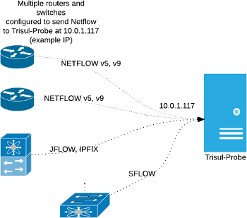
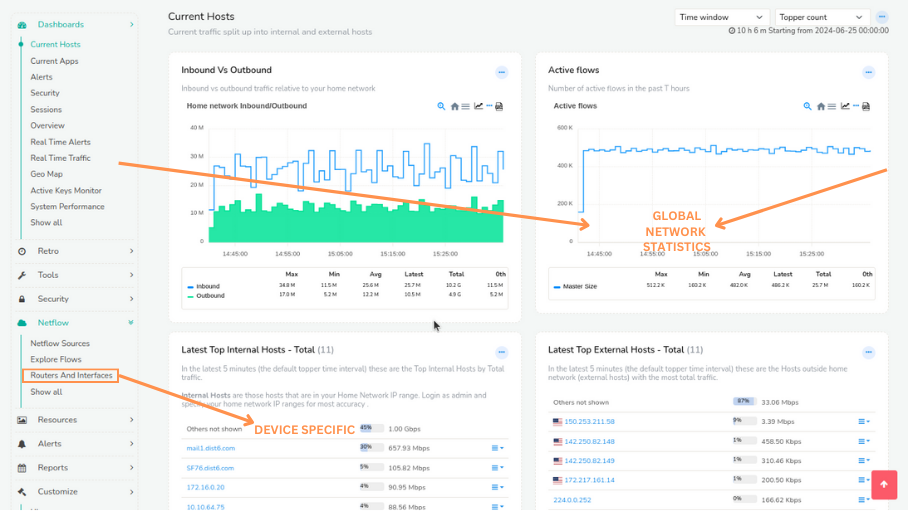

# Trisul with Netflow

This section explains how you can setup Trisul in Netflow mode. In this mode, Trisul uses Netflow and other flow telemetry to drive its analytics engine instead of raw packets. This section describes how to configure Netflow mode, to analyze from a *Device perspective*, and how to use advanced features such as “Interface Tracking”.

## Key Features of Trisul Netflow

Trisul supports Netflow v1, v5, and Netflow v9, Flexible Netflow, and all versions of SFLOW, and IPFIX. All routers and interfaces are auto discovered.

| Bandwidth and Traffic Monitoring                                                                                                                                                                                                         | Flow Analytics for incident response                                                                                                                                                                                                                 | Security and Anomaly Detection                                                                                                                                                                                                    |
| ---------------------------------------------------------------------------------------------------------------------------------------------------------------------------------------------------------------------------------------- | ---------------------------------------------------------------------------------------------------------------------------------------------------------------------------------------------------------------------------------------------------- | --------------------------------------------------------------------------------------------------------------------------------------------------------------------------------------------------------------------------------- |
| Monitor bandwidth usage   Device and interface drilldown   Over 200 Metrics,TopN,BottomN   NO ROLL UPS   Full resolution metrics   LIVE Real Time views   Powerful alerting   Long term interface drilldowns | Store ALL flows   No rollups or loss of info   Drilldown flows from interfaces   Powerful Flow Query   Graph Analytics for Flows   Enrich withFlow Taggers   Long timeframe Top-K flows   Detect Exfil and Long Sessions | Threat monitoring   Threshold Band   Detect anomalies in metrics   Identify compromised hosts   Query IP spaces   Over 20 Retro Analysis tools   Complement Packet based Trisul   TRAI ISP Compliance |

## ## Introduction to Netflow for Trisul

Netflow is a very handy mechanism to acquire network data from a very large number of network elements in a cost effective manner. For maximum visiblity, we recommend you enable Netflow all over your network and send the logs to a Trisul context.

The following diagram shows an example deployment.

Configure routers/switches to send Netflow (JFLOW,IPFIX,SFlow,etc) to Trisul-Probe

## ## Advantages of Netflow vs Packet Capture

Trisul’s default input mode is raw packet capture. But Trisul also has **comprehensive support** for Netflow v5/v9/JFlow/IPFIX/and SFlow metering.

| Advantages of netflow input    | Disadvantages                                                     |
| ------------------------------ | ----------------------------------------------------------------- |
| Easier distributed deployment  | No packet based traffic metering like DNS, HTTP, SSL analysis,etc |
| Less expensive hardware        | Limited security visibility                                       |
| Scales far better than packets | Cannot access packets for forensics or malware analysis           |

> Tip: You can use Packet based Trisul to do full NSM (Network Security Monitoring) at perimeter and Netflow to gain visibilty into lateral traffic inside your network.

## ## Global vs Device View

This may be confusing for those coming to Trisul from traditional netflow solutions. Most of the Trisul dashboards are **Global views** that represent the sum total of all the interfaces in your network. If you see metrics for *8.8.8.8* it represents the TOTAL traffic to *8.8.8.8* from all the routers in your network.

There is also comprehensive support for a **Device View**. You access that through the [Routers and Interfaces](https://trisul.org/docs/ug/netflow/routers_and_interfaces.html) tool. The *Device View* allows you to select a router then an interface on that router and then see the breakup of traffic within that.

If you log on for the first time into a Netflow instance you may get a dashboard like below. The image below shows where to find the Router and Interfaces for getting to the Device Specific view.

## ## Links

The following docs contain further instructions to setup Netflow

1. [Setup Netflow](https://trisul.org/docs/ug/netflow/netflow_setup.html) — How to switch Trisul into a Netflow mode
2. [Netflow Configuration Wizard](https://trisul.org/docs/ug/netflow/netflow_wizard.html) — Using the Netflow Config Wizard to customize, use SNMP to resolve,setup Email alerts, etc
3. [Routers and Interfaces](https://trisul.org/docs/ug/netflow/routers_and_interfaces.html) — The Device Drilldown tool that allows you to select a router, view interfaces, drilldown into an interface
4. [Using Interface Tracking](https://trisul.org/docs/ug/netflow/interface_tracker.html) — Enabling *Interface Tracking* a feature that allows long term accurate analysis of Hosts, Apps, Protocols into and out of an interface
5. [Interface Drilldown](https://trisul.org/docs/ug/netflow/drilldown.html) — Using the Interface Drilldown Screen
6. [Netflow Sources Dashboard](https://trisul.org/docs/ug/netflow/sources.html) — The netflow sources dashboard
7. [Using SNMP](https://trisul.org/docs/ug/netflow/snmp.html) — Using SNMP to complement Netflow device views
