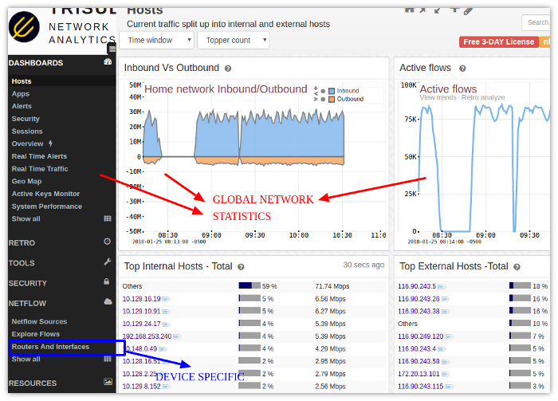

# Trisul with Netflow

This section explains how you can setup Trisul in Netflow mode. In this
mode, Trisul uses Netflow and other flow telemetry to drive its
analytics engine instead of raw packets. This section describes how to
configure Netflow mode, to analyze from a *Device perspective*, and how
to use advanced features such as “Interface Tracking”.

<button class="btn dropdown-toggle" type="button" data-toggle="dropdown">

Jump to topic 
</button>

<ul class='dropdown-menu' id='dropdown'>
<li>

Quick Links

</li>
<li>

[Setup Netflow](netflow_setup.html)

</li>
<li>

[Netflow Configuration Wizard](netflow_wizard.html)

</li>
<li>

[Routers and Interfaces](routers_and_interfaces.html)

</li>
<li>

[Using Interface Tracking](interface_tracker.html)

</li>
<li>

[Interface
Drilldown](/docs/ug/netflow/routers_and_interfaces.html#drilldown_from_the_interfaces_table)

</li>
</ul>

## Key Features of Trisul Netflow

Trisul supports Netflow v1, v5, and Netflow v9, Flexible Netflow, and
all versions of SFLOW, and IPFIX. All routers and interfaces are auto
discovered.

#### Bandwidth and Traffic Monitoring

<i class='fa fa-check'></i>  Monitor bandwidth usage  
<i class='fa fa-check'></i>  Device and interface drilldown  
<i class='fa fa-check'></i>  Over 200 Metrics,TopN,BottomN  
<i class='fa fa-check'></i>  **NO ROLL UPS**  
<i class='fa fa-check'></i>  Full resolution metrics  
<i class='fa fa-check'></i>  LIVE Real Time views  
<i class='fa fa-check'></i>  Powerful alerting  
<i class='fa fa-check'></i>  Long term interface drilldowns

#### Flow Analytics for incident response

<i class='fa fa-code-fork'></i>  Store **ALL flows**  
<i class='fa fa-code-fork'></i>  No rollups or loss of info  
<i class='fa fa-code-fork'></i>  Drilldown flows from interfaces  
<i class='fa fa-code-fork'></i>  Powerful Flow Query  
<i class='fa fa-code-fork'></i>  Graph Analytics for Flows  
<i class='fa fa-code-fork'></i>  Enrich withFlow Taggers  
<i class='fa fa-code-fork'></i>  Long timeframe Top-K flows  
<i class='fa fa-code-fork'></i>  Detect Exfil and Long Sessions

#### Security and Anomaly Detection

<i class='fa fa-bell'></i>  Threat monitoring  
<i class='fa fa-bell'></i>  Threshold Band  
<i class='fa fa-bell'></i>  Detect anomalies in metrics  
<i class='fa fa-bell'></i>  Identify compromised hosts  
<i class='fa fa-bell'></i>  Query IP spaces  
<i class='fa fa-bell'></i>  Over 20 Retro Analysis tools  
<i class='fa fa-bell'></i>  **Complement Packet based Trisul**  
<i class='fa fa-bell'></i>  TRAI ISP Compliance

## Introduction to Netflow for Trisul

Netflow is a very handy mechanism to acquire network data from a very
large number of network elements in a cost effective manner. For maximum
visiblity, we recommend you enable Netflow all over your network and
send the logs to a Trisul context.

The following diagram shows an example deployment.

Configure routers/switches to send Netflow (JFLOW,IPFIX,SFlow,etc) to
Trisul-Probe

## Advantages of Netflow vs Packet Capture

Trisul’s default input mode is raw packet capture. But Trisul also has
**comprehensive support** for Netflow v5/v9/JFlow/IPFIX/and SFlow
metering.

| advantages of netflow input | disadvantages |
|----|----|
| easier distributed deployment | no packet based traffic metering like DNS, HTTP, SSL analysis,etc |
| less expensive hardware | limited security visibility |
| scales far better than packets | cannot access packets for forensics or malware analysis |

**TIP** You can use Packet based Trisul to do full NSM (Network Security
Monitoring) at perimeter and Netflow to gain visibilty into lateral
traffic inside your network.

## Global vs Device View

This may be confusing for those coming to Trisul from traditional
netflow solutions. Most of the Trisul dashboards are **Global views**
that represent the sum total of all the interfaces in your network. If
you see metrics for *8.8.8.8* it represents the TOTAL traffic to
*8.8.8.8* from all the routers in your network.

There is also comprehensive support for a **Device View**. You access
that through the [Routers and Interfaces](routers_and_interfaces.html)
tool. The *Device View* allows you to select a router then an interface
on that router and then see the breakup of traffic within that.

If you log on for the first time into a Netflow instance you may get a
dashboard like below. The image below shows where to find the Router and
Interfaces for getting to the Device Specific view.

## Links

The following docs contain further instructions to setup Netflow

1.  [Setup Netflow](netflow_setup.html) — How to switch Trisul into a
    Netflow mode
2.  [Netflow Configuration Wizard](netflow_wizard.html) — Using the
    Netflow Config Wizard to customize, use SNMP to resolve,setup Email
    alerts, etc
3.  [Routers and Interfaces](routers_and_interfaces.html) — The Device
    Drilldown tool that allows you to select a router, view interfaces,
    drilldown into an interface
4.  [Using Interface Tracking](interface_tracker.html) — Enabling
    *Interface Tracking* a feature that allows long term accurate
    analysis of Hosts, Apps, Protocols into and out of an interface
5.  [Interface Drilldown](drilldown.html) — Using the Interface
    Drilldown Screen
6.  [Netflow Sources Dashboard](sources.html) — The netflow sources
    dashboard
7.  [Using SNMP](snmp.html) — Using SNMP to complement Netflow device
    views
