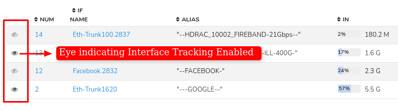

# Interface Tracking

## Overview

Interface Tracker is a *Streaming Analytics* feature of Trisul you need to
enable on a Netflow Interface level to acquire ability to create
separate monitoring for hosts, applications and protocols on each
interface.

## Purpose of Interface Tracking

When *Interface Tracking* is enabled on an interface it allows for accurate long term drilldowns of interfaces.

*Figure: Indication of Interface Tracker when Enabled*

### How it Works

>  Say you want a report of Top Hosts over time on interface ge/0/0 for 2 days.

You can create this report in three ways

1. **From Raw flows** — Filter all the flows for that interface then
   aggregate the Hosts and snapshot them into a time series.
2. **From Top-N flows** — Another option used by many competing netflow
   tools is to just consider the Top-N flows
3. **From Top-N Conversations** — A third option is to use rolled up
   top flows rolled up into conversations - ie dropping the port
   information.

None of these work satisfactorily in practice, particularly over high
traffic links, such as those seen in ISP, Large Enterprises, or Data
Centers. You only end up accouting for 10-15% of the traffic.

Since Trisul is a *Streaming analytics* platform, we introduce a feature
called **“Interface Tracking”** which when enabled,

- Four sub-streams are created from the main “interface stream”
- One each for Apps, Hosts, and Protocols
- And One “flow tracker” stream is created for flows on the interface
- These streams create their own metrics independent of Netflow

The end result is that with *Interface Tracking* enabled we get 100%
accuracy in long term drilldowns. We have deployed this on very large
data center interfaces to perfect results.

### The Cost of Interface Tracking

Interface tracking however is not free. Creating these substreams
require some minor CPU and more importantly extra disk space. A rough
calculation is about 20-30MB/per-interface/per-day. It may not seem much
but if you have 1000s of interfaces it could add up. Hence by default ,
this feature is disabled.

Second point is that the *interface tracker* is not really necessary for low
traffic interfaces. When there are less number of flows, the *raw flows*
based analytics provides sufficient accuracy.

## Enabling Interface Tracking

There are multiple ways to do this.

### Enable on Top-100 Interfaces

This is the recommended method. After running Trisul for a while it
would have discovered all of the routers and interfaces automatically.
This method creates 100 trackers for the top interfaces. This should be
suitable for most large organizations.

Login as `admin` and,

:::info navigation

:point_right: Go to Context: Default &rarr; profile0 &rarr; [Netflow Wizard](netflow_wizard)  
:::

Then in the Interfaces tab click on the "Interface tracking" drop down button and select "Enable interfaces for top 100"

Or

### Enable On Per Interface Basis

You can also choose the interfaces on a particular router and enable interface tracking on them.  
In the same Interfaces tab,  
:::info navigation

 :point_right: Click on the "Select a router to display Interfaces" dropdown button and choose a particular router which displays the number of interfaces on that router. 

 :::

 From the number of interfaces displayed, click on the check boxes of the interfaces that you want to enable interface tracking and Select “Enable Interface Tracking” from the "Interface Tracking" dropdown menu on the [Router Interfaces](routers_and_interfaces) tool

## Disable Interface Tracking

If you want to disable interface tracking, Login as `admin`

:::info navigation
:point_right: Go to Context: Default &rarr; profile0 &rarr; Netflow Wizard  
:::

Then in the *Interfaces tab* select "Disable interface tracking" from the "Interface Tracking" drop down button

