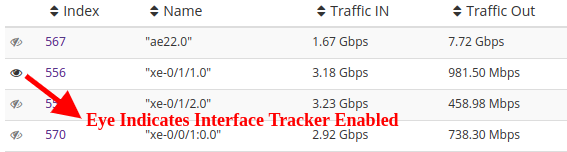

# Interface Tracking

Interface Tracker is a streaming analytics feature of Trisul you need to
enable on a Netflow Interface level to acquire ability to create
separate monitoring for hosts applications and protocols on each
interface.

## Purpose of interface tracking

To allow for accurate long term drilldowns of interfaces.

### How it works

> Say you want a report of Top Hosts over time on interface ge/0/0 for 2
> days.

You can create this report in three ways

1.  **from raw flows** — Filter all the flows for that interface then
    aggregate the Hosts snapshot them into a time series.
2.  **from Top-N flows** — Another option used by many competing netflow
    tools is to just consider the Top-N flows
3.  **from Top-N Conversations** — A third option is to use rolled up
    top flows rolled up into conversations - ie dropping the port
    information.

None of these work satisfactorily in practice, particularly over high
traffic links, such as those seen in ISP, Large Enterprises, or Data
Centers. You only end up accouting for 10-15% of the traffic.

Since Trisul is a streaming analytics platform, we introduce a feature
called **“Interface Tracking”**. When this is enabled,

- three sub-streams are created from the main “interface stream”
- one each for Apps, Hosts, and Protocols
- one “flow tracker” stream is created for flows on the interface
- these streams create their own metrics independent of Netflow

The end result is that with *Interface Tracking* enabled we get 100%
accuracy in long term drilldowns. We have deployed this on very large
data center interfaces to perfect results.

### The cost of Interface Tracking

Interface tracking however is not free. Creating these substreams
require some minor CPU and more importantly extra disk space. A rough
calculation is about 20-30MB/per-interface/per-day. It may not seem much
but if you have 1000s of interfaces it could add up. Hence by default ,
this feature is disabled.

A second point is the *interface tracker* is not very useful for low
traffic interfaces. When there are less number of flows, the *raw flows*
based analytics provides sufficient accuracy.

## Enabling interface Tracking

There are multiple ways to do this.

#### Enable on Top-100 interfaces

This is the recommended method. After running Trisul for a while it
would have discovered all of the routers and interfaces automatically.
This method creates 100 trackers for the top interfaces. This should be
suitable for most large organizations.

Select “Enable interfaces for top 100” in the “Routers table”:

\_or using the “Interfaces” tab of the [Netflow
Wizard](netflow_wizard.html#interfaces_)

Login as admin, then select Context: Default -\> profile0 -\> then
Netflow Wizard  
Then in the Interfaces tab select [Enable interfaces for top
100](routers_and_interfaces.html)

#### Enable on per interface basis

Select “Enable Interface Tracker” in the interface table menu on the
[Router Interfaces](routers_and_interfaces.html) tool

#### Disable interface tracking

If you want to disable interface tracking

Login as admin, then select Context: Default -\> profile0 -\> then
Netflow Wizard  
Then in the Interfaces tab select [Disable interface
tracking](routers_and_interfaces.html)

