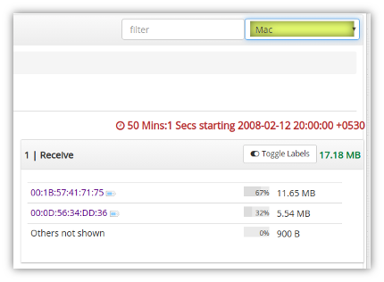
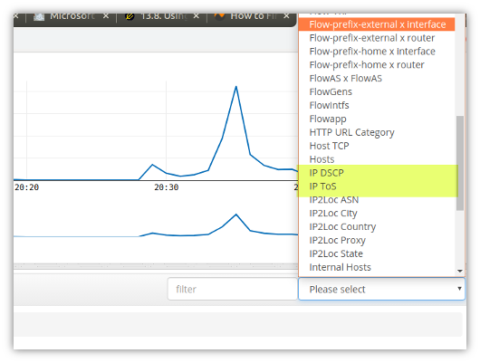

# Layer 2 and QoS

This section outlines some of the Layer 2 and QoS related features
available in Trisul Network Analytics.

## Layer 2 Metrics

Netflow is considered to be a Layer 3 IP level technologies. However, it
is possible to configure IPFIX to export MAC address information along
with IP flow records.

### MAC

In Cisco Flexible Netflow the following commands can be added to collect
source and destination MAC addresses.

```language-bash
 match datalink mac source address input
 match datalink mac destination address input
```

The chief use case for collecting L2 MAC addresses in Netflow is for

- Collecting the L2 MAC address can reliably identify a subscriber endpoint
  in an ISP edge network scenario.

The following counter groups show L2 data

| Counter Group | L2 Data                                               |
| ------------- | ----------------------------------------------------- |
| MAC           | Traffic transmit and receive per MAC address          |
| DirMAC        | Traffic flows over a L2 Link, a pair of MAC addresses |

The following picture shows where these counters can be found.

  
*Figure: Retro \> Retro Counters to view MAC Counters*

### VLAN ID

L2 VLAN ID is supported. If exported by the device , these are directly
shown under the counter group “VLAN Stats”

The following counter groups show L2 data

| Counter Group | L2 Data                         |
| ------------- | ------------------------------- |
| VLANStats     | 802.11 VLAN IDs traffic metrics |

## Tos DiffServ

Every IP Packet includes a 1-byte ToS field that has been used in
various ways to provide specialized services.

> These counters will only be activated if the target environment traffic
> deploys ToS and this information is exported in Netflow.

Trisul supports collecting the following Netflow template fields.

| ID  | Field Name          | Description                                                                                                 |
| --- | ------------------- | ----------------------------------------------------------------------------------------------------------- |
| 5   | ipClassOfService    | For IPv4: the full 8 bit value of the IP ToS field. For IPv6: the 8-bit value of the Class of Service field |
| 195 | ipDiffServCodePoint | The most significant 6 bits of the IPv4 TOS field or the IPv6 Traffic Class field                           |
| 196 | ipPrecedence        | The first 3 bits of the IPv4 TOS field or the IPv6 Traffic Class field. Value range 0-7                     |

The following counter groups show ToS data

| Counter Group | ToS Data                                   |
| ------------- | ------------------------------------------ |
| IP ToS        | The full 8-bit ToS field                   |
| IP Precedence | Meters the traffic per ipProecedence       |
| IP DSCP       | Meters the traffic per DiffServ code point |

The following image shows where the ToS counters can be found (see the
highlighted section)

  
*Figure: Retro \> Retro Counters to view IP ToS metrics*

### IP ToS

In this mode, Trisul simply meters the full 8 bit ToS field. The
customer can then map ToS raw values with their own meanings.

### IP Precedence

Trisul meters the 8 allowed values of IP Precedence. This was introduced
by RFC 791 in 1981 and is now generally deprecated , but there may be
some legacy networks still using this feature

| IP Precedence Value | Description          |
| ------------------- | -------------------- |
| 000                 | Routine              |
| 001                 | Priority             |
| 010                 | Immediate            |
| 011                 | Flash                |
| 100                 | Flash Override       |
| 101                 | Critic/Critical      |
| 110                 | Internetwork Control |
| 111                 | Network Control      |

### DiffServ

The 6-bit DSCP (DiffServ Code Point) field. Specific meaning for these
fields are flexible, Trisul users can assign textual labels to each
value, possibly mapping onto router classifications.
