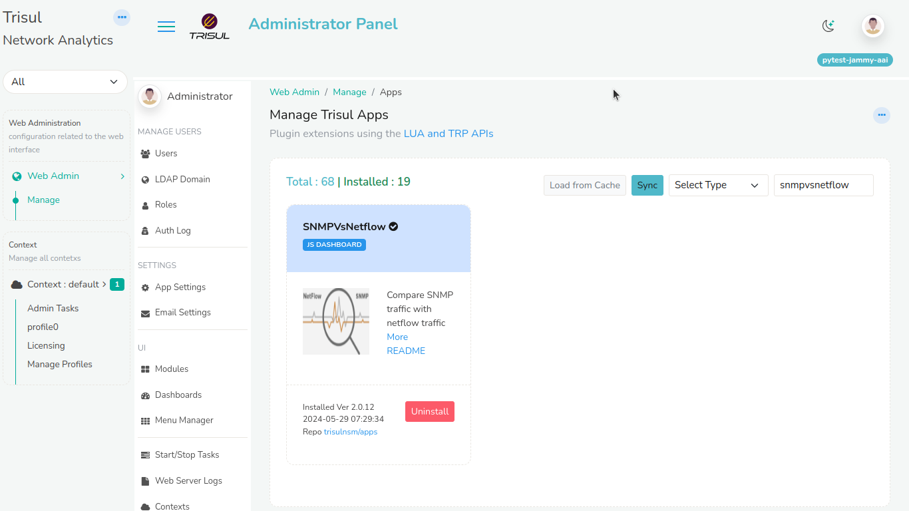

# Netflow vs SNMP

Trisul has a advanced feature that is provides bandwidth mapping of the
SNMP vs Netflow Traffic from every router and interface.

## Installing the SNMP vs Netflow App

To enable this feature, you must install the SNMP vs Netflow app from
Trisul Apps. To Install the app,

Login as Admin. Select *Manage \> Apps \> SNMPvsNetflow*

Select the ‘*Install*’ option to install the app.

## SNMP vs Netflow Chart

If you want to have a comparison between the SNMP and Netflow records
for any router or interface,

Login as User. Select *Dashboards \> Show All \> SNMPvsNetflow*
Dashboard.

You will get a dialog box as follows.

| Filed | Description |
|----|----|
| Time Selector | Select the desired time fro the time selector box |
| Routers | Select any desired router |
| Interfaces | Select any interface from respective router or select multiple interfaces for that router |

Click on *Submit* option and you will the SNMP vs Netflow chart for the
interfaces you have selected.  
You can also generate a report by clicking on the *Download* option.

