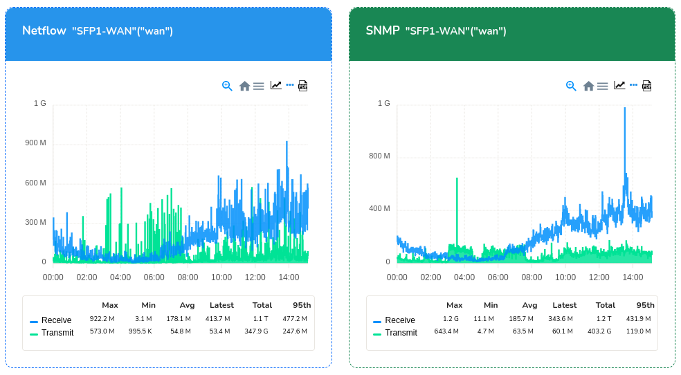

# Netflow vs SNMP

Trisul has a advanced feature that provides bandwidth mapping of the
SNMP vs Netflow Traffic from every router and interface.

## Installing the SNMP vs Netflow App

To enable this feature, you must install the SNMP vs Netflow app from
Trisul Apps. To Install the app, Login as `admin` and,

:::info navigation
:point_right: Go to Web Admin: Manage &rarr; Apps &rarr; SNMPvsNetflow
:::

Select the ‘*Install*’ option to install the app.

*Figure: SNMPvsNetFlow App in Trisul Apps*

## SNMP vs Netflow Chart

If you want to have a comparison between the SNMP and Netflow records
for any router or interface, Login as `user` and,

:::info navigation
:point_right: Go to Dashboards &rarr; Show All &rarr; SNMPvsNetflow
Dashboard.
:::

You will get a dialog box as follows.

*Figure: Filter Criteria for SNMPvsNetFlow*

You can fill in the required fields and submit them.

| Field         | Description                                                                               |
| ------------- | ----------------------------------------------------------------------------------------- |
| [Time Selector](/docs/ug/ui/elements#time-selector) | Select the desired time from the time selector box                                        |
| Routers       | Select any desired router                                                                 |
| Interfaces    | Select any interface from respective router or select multiple interfaces for that router |

Click on *Submit* option and you will see the SNMP vs Netflow chart for the interfaces you have selected.  

*Figure: NetFlow and SNMP Chart Modules*

You can also generate a report by clicking on the *Download* option.
