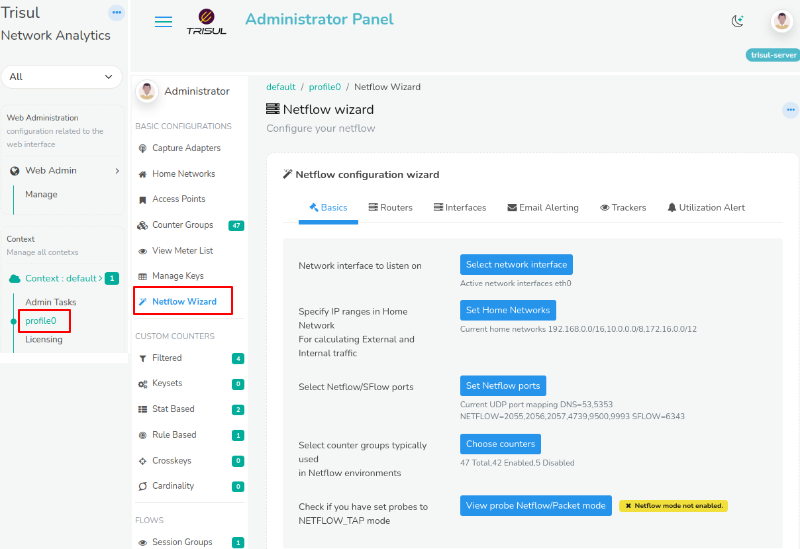
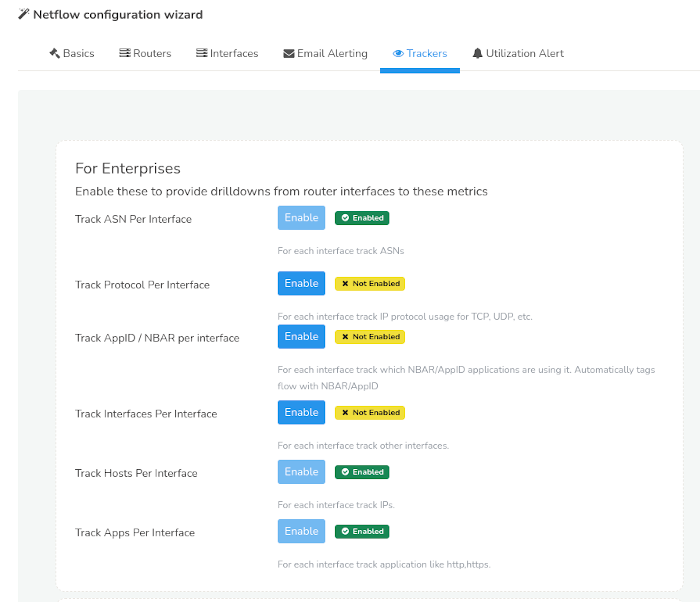

# Netflow Configuration Wizard

This configuration wizard pulls together various configuration options
into one place.

1. Used to configure most common settings for Netflow
2. Use SNMP to resolve router names, interface names, and speeds
3. Enable Interface Tracking
4. Email Alerts
5. Create Trackers
6. Create utilization alerts

## Using the Wizard

:::note navigation

Login as admin, then select Context: Default -\> profile0 -\> then
Netflow Wizard

:::

You will see a Check mark against each option that is configured
correctly

*Showing Netflow Wizard for the Default context*  

Notice the wizard has 6 Tabs.

1. **Basics** — essential setup for Netflow
2. **Configure Routers** — Helps discover router names using SNMP
   (Optional)
3. **Interfaces** — Enable or Disable “Interface Tracking” analytics
4. **Configure Email Alerting** — Alerts via Email
5. **Trackers** — Enable this to provide drilldowns from router
   interfaces to metrics
6. **Utilization Alert** — Generate alerts when any interface
   utilization crosses specific level of thresholds

## Basic configuration

Here you can configure the most common items related to Netflow.

The current setting is shown just below the form items.

| Interface to listen on              | If you are receiving Netflow on an interface other than `eth` - click on *Set Adapter* and enter the new interface name.                                                                                                                                                   |
| ----------------------------------- | -------------------------------------------------------------------------------------------------------------------------------------------------------------------------------------------------------------------------------------------------------------------------- |
| Specify Home network                | Enter IP ranges other than the default Private IP space that constitute your home network. This is used for calculating various metrics.                                                                                                                                   |
| Select Netflow/SFlow ports          | Enter the UDP ports that are mapped to Netflow. If you want to enter a new port click on *Set Netflow Ports* then enter a Port Number and select “Netflow” from the drop down list.                                                                                        |
| Select counter groups for Netflow   | In Netflow mode many packet based counter groups such as HTTP Hosts, DNS Counters, SSL/TLS certificate metrics are not available. Select *Choose Counters* then scroll to the bottom for *Advanced Options* then select *Typical enterprise Netflow counter configuration* |
| Switch Trisul Probes to NETFLOW_TAP | The Probe nodes have to be in `NETFLOW_TAP` mode. Click the button and ensure that the *Packets or Netflow* parameter is changed to NETFLOW_TAP from TAP.                                                                                                                  |

## Routers

After Trisul has been collecting Netflow for a while, it automatically
builds a map of Routers and their attached Interfaces. This page allows
you to perform the following tasks on the discovered routers.

.  
**NOTE** Skip this step if you have just started collecting Netflow. You
can come back here after Trisul has been running for a few hours in
Netflow mode.

Select routers and then :

| SNMP Settings           | Read community string for discovery                              |
| ----------------------- | ---------------------------------------------------------------- |
| Resolve Router Names    | Using SNMP sysName                                               |
| Resolve Interface Names | Using SNMP resolve all the interface names                       |
| Resolve Interface Alias | Use IF-MIB alias to assign names to discovered router interfaces |
| SNMP Port Map           | Map netstream ifindex with snmp ifindex                          |

## Interfaces

This tab allows you to enable the “Interface Tracking” features for
discovered interfaces.

.  
**NOTE**  
This step needs to have discovered Netflow entities. Skip this step if
you have just started collecting Netflow a few minutes ago. You can come
back here after Trisul has been running for a 15-20 minutes.

Select interfaces and then :

| Enable Interface Tracking for **Top 100** | Enables the Interface Tracking feature for the busiest 100 interfaces |
| ----------------------------------------- | --------------------------------------------------------------------- |
| Enable Interface Tracking                 | Enables Interface Tracking on the selected intefaces                  |
| Disable Interface Tracking                | Disables the feature                                                  |
| Create TCA                                | Create TCA for selected interfaces                                    |

| Delete TCA | Delete TCA for selected interfaces |
| ---------- | ---------------------------------- |

## Configure Email alerts

This page allows you to configure real time E-Mail alerts for various
conditions.

| Email Account settings | Outgoing SMTP email account                                                                                                                                                                                              |
| ---------------------- | ------------------------------------------------------------------------------------------------------------------------------------------------------------------------------------------------------------------------ |
| Recipients             | Email IDs of those who want to receive the alerts                                                                                                                                                                        |
| Notification Service   | Must be started and running                                                                                                                                                                                              |
| Alerts to syslog       | Select which alert types go to SYSLOG. Trisul sends out Emails only for those alerts that are sent to SYSLOG. To send an alert type to SYSLOG, click on the button and select any SYSLOG alert level in the next screen. |
| Syslog readable        | Checks if syslog files on the hub node are readable                                                                                                                                                                      |

Once you go through the items in this wizard you will have a robust
Netflow based monitoring system.

## Trackers

Trackers are streaming algorithms that convert flow or packet metrics
into sub metrics for hosts per interface, apps per interface, NBAR-APPID
per interface and so on. Internally the trackers use the “Cross Key”
counter groups for this purpose.

### For Enterprises

Enable these to provide drilldowns from router interfaces to these
metrics.These appear as Tabs in the [Router and Interface
Drilldown](drilldown.html#information_shown) pages.

| Track ASN Per Interface          | Outgoing SMTP email account                                                                                  |
| -------------------------------- | ------------------------------------------------------------------------------------------------------------ |
| Track Protocol Per Interface     | For each interface track IP protocol usage for TCP, UDP, etc.                                                |
| Track AppID / NBAR per interface | For each interface track which NBAR/AppID applications are using it. Automatically tags flow with NBAR/AppID |
| Track Interfaces Per Interface   | For each interface track other interfaces. This will enable the *Interface Matrix* in Interfaces Drilldown.  |
| Track Hosts per interface        | Host traffic per interface                                                                                   |
| Track Apps per interface         | Application traffic per interface                                                                            |

### For ISP (Internet Service Provider)

| Track ASN for Subnets               | Allows ISP to define IP subnets and assign them to customers, then track AS wise usage of those subnets. |
| ----------------------------------- | -------------------------------------------------------------------------------------------------------- |
| Track ASN for Locations             | Allows ISP to define Locations as a group of routers then track AS wise traffic for the entire location  |
| Mixed Bandwidth                     | Allows ISP to define peering vs internet traffic                                                         |
| Track Mixed Bandwidth Per Interface | For each interface track mixed bandwidth(peerig vs internet)                                             |
| Track Mixed Bandwidth for Subnets   | For each interface track mixed bandwidth(peerig vs internet)                                             |

## Utilization Alert

Generate alerts when any interface utilization crosses these thresholds

| High   | If interfaces crossed 90% it will give high level alerts   |
| ------ | ---------------------------------------------------------- |
| Medium | If interfaces crossed 80% it will give medium level alerts |
| Low    | If interfaces crossed 70% it will give low level alerts    |
