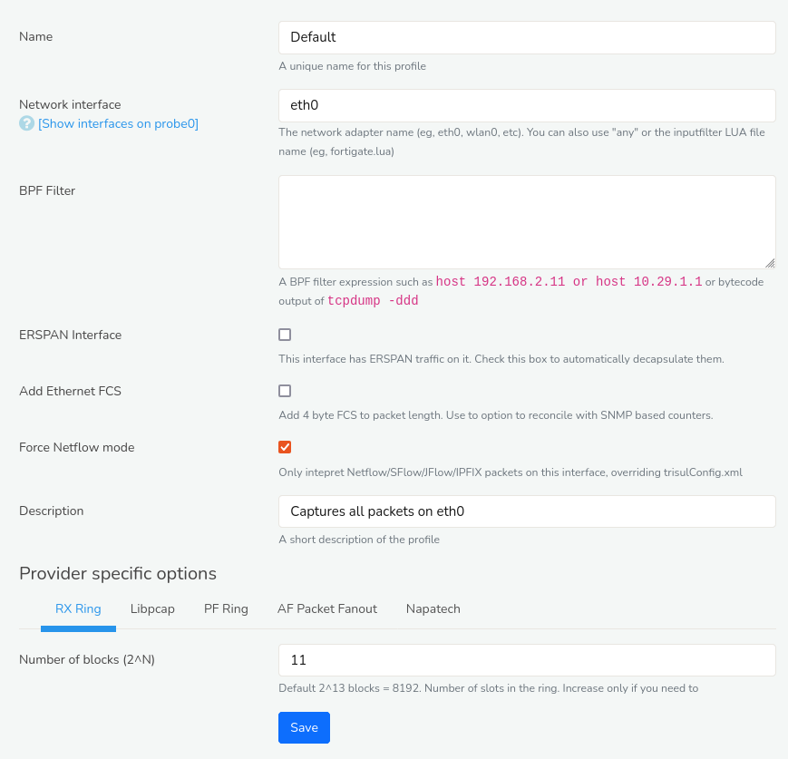

# Using Packets and Netflow Together

Trisul can also consume a mix of Netflow and raw packets on the same or
on different interfaces. The way this feature works is :

1. Packets on Netflow ports will be expanded and interpreted as
   Netflow/JFlow/IPFix/etc
2. Other packets will be treated as usual

If you want to only consume Netflow then refer to the [Howto Setup Netflow](netflow_setup)

## How to Use this Mode

To use this mixed mode - we use a different technique than that
described in the [Netflow only setup](netflow_setup)

We now enable netflow on a per-adapter mode.

For instance if you have the following scenario

1. Netflow traffic on `eth1`
2. PCAP traffic on `eth0`

and you wish to pull them into a single instance of Trisul you would do
the following.

:::info navigation
Go to Profile0 &rarr; Capture Adapters &rarr; Create Adapter
:::

*Figure: Create Adapter*

1. Create an adapter for *eth0*
2. Create an adapter for *eth1*
   1. For *eth1* (for NetFlow traffic) - Check the **Force Netflow Mode** checkbox. By enabling Force Netflow Mode on *eth1*, you're telling Trisul to interpret packets on that interface as Netflow data.
   2. For *eth0* (for PCAP traffic) - Ensure the **Force Netflow Mode** checkbox is
      unchecked. Leaving Force Netflow Mode unchecked on *eth0* allows Trisul to capture raw packets (PCAP) on that interface.
3. Enable both *eth0* and *eth1* adapters
4. Restart Trisul

> While using this mode, make sure the [TrisulMode in trisulConfig.xml](/docs/ref/trisulconfig#app) is set to TAP (the default) and not NETFLOW_TAP. Setting TrisulMode to TAP in trisulConfig.xml allows Trisul to operate in mixed mode, capturing both Netflow and PCAP traffic.

### Netflow and PCAP on the Same Interface

If you have Netflow and PCAP on the same interface (say *eth0*). You would
create two *eth0* interfaces and check the “Force Netflow Mode” on only
one of them.
