# Routers and Interfaces

The primary tool you will need to work with **Device level** views of Netflow is the ***Routers and Interfaces*** tool. This tool offers network monitoring, enabling you to select a timeframe and view a list of routers with traffic summaries. From there, you can select a router to view its associated interfaces, and then monitor interface activity or drill down further into hosts, applications, and flows on that interface. You can even pull up a [*Real Time stabber*](/docs/ug/cg/stabber) of any of the drilldowns, providing instant insights into network activity.

To access Routers and Interfaces,

:::note
Select Netflow -> Routers and Interfaces
:::

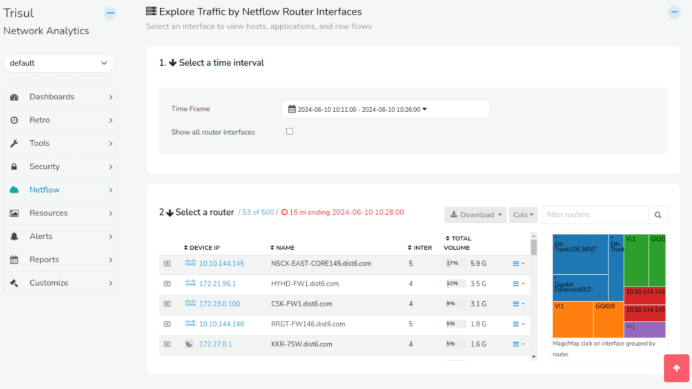

*Figure: Routers and Interfaces Tool*

## Using the Router Interface Tool

The router and Interface Tool consists of three main parts,

1. Time Selector

2. Router Table

3. Interface Table

## Time Selector

**Time Selector Configuration**

The *Time Selector* feature enables users to define a temporal scope for analysis, with a default setting of the most recent 15 minutes. Once a time window is selected, it remains fixed for all subsequent sections of the page and their associated drill-downs. Users can choose from a range of pre-defined time ranges, including:

- Last 1 hour

- Last 24 hours

- This month

- Last month and more.

Alternatively, users can specify a custom date range by selecting the *Custom Range* option, which allows for the selection of a specific period from the past.

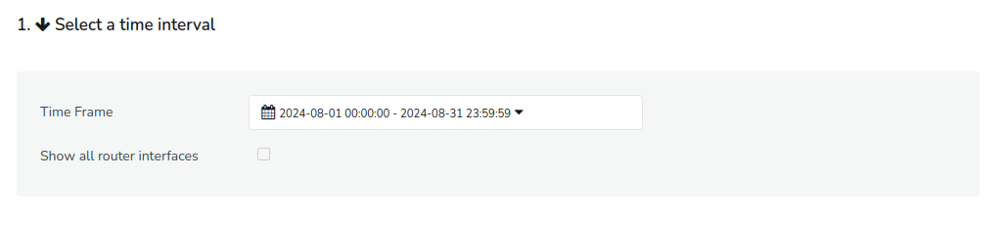

**Router Interface Display Configuration**

The *Show all router interfaces* checkbox controls the display of router interfaces in the table. When enabled, all routers and their associated interfaces are displayed in a consolidated manner. When disabled, the table only displays the router list, allowing you to select specific interfaces for each router.

## Router Table

Router Table shows the list of all routers active in the selected time window. The table shows the number of interfaces active in the selected time window. Table shows the number of interfaces active, total volume pushed through the router and other info.

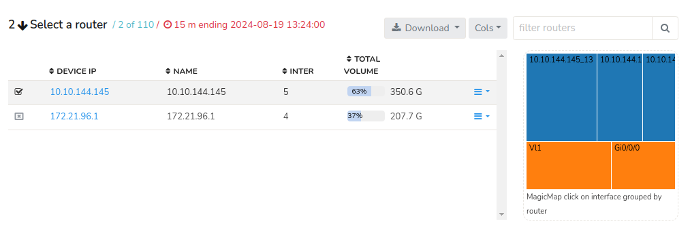

*Figure: Router Table*

**Router Table Features**

The Router Table provides several features for customizing and exporting data:

**Column Selection (Cols)**

### Download Options

The router table data can be donwloaded in easy formats.

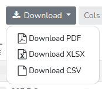

*Figure: Donwload Options in Router Table*

The *Download* button offers three export formats for the router table data:

- Portable Document Format (PDF)

- Microsoft Excel Workbook (XLSX)

- Comma Separated Values (CSV)

### Cols

The *Cols* dropdown menu allows users to customize the columns displayed in the router table.

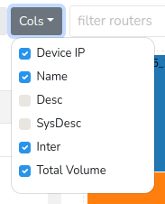

*Figure: Column Options in Router Table*

Available column options include:

- Device IP

- Name

- Description

- System Description

- Interface (Inter)

- Total Volume

Selecting specific columns enables users to tailor the table to display the information for those columns.

### **Magic Map Visualization**

The Magic Map feature provides a graphical representation of the top interfaces across all routers, enabling direct interface selection. This visualization tool offers a network-wide perspective on relative interface volumes. 

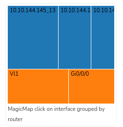

*Figure: Magic Map Visulaization*

**Key Functionality:**

- Interfaces are grouped router-wise for enhanced organization and analysis.

- Interface volumes are represented by box sizes, allowing for easy identification of high-traffic interfaces (larger boxes indicate larger data volumes).

### Filtering Routers

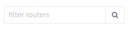

*Figure: Filter Routers bar in Router Table*

The *Filter Routers* bar, located at the upper right-hand side of the Router table, enables users to filter routers by specifying an IP address. Alternatively, clicking the *search button* without entering any criteria will display all routers on the network.

### Router List

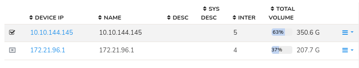

*Figure: List of routers and their details in the Router Table*

The list of routers and their details are displayed for the selected time range. The details include the following

| Column Name  | Description                                                                                         |
| ------------ | --------------------------------------------------------------------------------------------------- |
| Select       | Checkbox to enable SNMP for the corresponding router                                                |
| Device IP    | IP address assigned to the device                                                                   |
| Name         | Name of the Router                                                                                  |
| Desc         | Brief description of the router                                                                     |
| Sys Desc     | System description of the router                                                                    |
| Inter        | Number of active interfaces on the router                                                           |
| Total Volume | Total volume of the router, displayed as a percentage and in Gigabytes (G) or Terabytes (T)         |
| Context Menu | Click on the drop down button to access additional options and detailed information for each router |

#### Routers List- Context Menu

Click on the drop down button against each router to get the context menu consisting of various drill down options for each router.

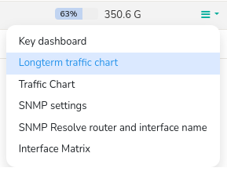

*Figure: Context Menu from Dropdown button in Routers Table*

**Key Dashboard**

With *[Key dashboard](/docs/ug/ui/key_dashboard)*, access a centralized dashboard displaying essential metrics and information for each router, providing a quick overview of its performance and status.

**Longterm traffic chart**

View a graphical representation of historical traffic data for each router, enabling analysis of trends and patterns in network usage over an extended period.

**Traffic chart**

Display a real-time or near-real-time graphical representation of traffic data for each router, allowing for immediate analysis of current network activity and potential issues.

**SNMP settings**

Configure and manage Simple Network Management Protocol (SNMP) settings for each router, enabling to edit SNMP agent parameters

**SNMP resolve router and inteface name**

Utilize SNMP to automatically resolve and display the router and interface names, simplifying network device identification and management.

**Interface matrix**

Display a matrix showcasing the relationships and connections between different interfaces on each router, facilitating network topology understanding and troubleshooting.

## Interfaces Table

The Interface Table is a dynamic display that populates with detailed information about all active interfaces on a selected router, specific to the chosen time frame. This table is invoked when a router is chosen from the Router Table.

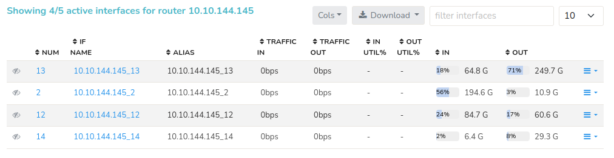

*Figure: Interfaces Table*

- Clicking on a column title enables sorting in either ascending (UP) or descending (DOWN) order, facilitating data analysis and management. 

- The Column, Download and Filter interface options are similar to the Router table components. 

- The page size indicator, located in the upper right corner of the interface table, enables users to define the number of data records displayed per page, streamlining the viewing and management of large datasets.

Upon selecting a router from the router table, the Interface Table will display comprehensive details about all interfaces active on the selected router during the specified time window. This includes the following interface details.

| Column Name  | Description                                                                                            |
| ------------ | ------------------------------------------------------------------------------------------------------ |
| Eye Icon     | Enable the Eye icon to enable interface tracking                                                       |
| Num          | Unique Interface Identifier                                                                            |
| IF Name      | Name of the interface                                                                                  |
| Alias        | Interface alias (Alternative name)                                                                     |
| Traffic In   | Incoming traffic rate (in bps)                                                                         |
| Traffic Out  | Outgoing traffic rate (in bps)                                                                         |
| In Util %    | Incoming traffic utilization percentage                                                                |
| Out Util %   | Outgoing traffic utilization percentage                                                                |
| In           | Total incoming traffic (in bytes)                                                                      |
| Out          | Total outgoing traffic (in bytes)                                                                      |
| Context Menu | Click on the drop down button to access additional options and detailed information for each interface |

### Drilldown From the Interfaces Table

Having selected a router and interface you can drilldown and access the
following by Clicking on the three lines drop down option on the right side against each interfaces.

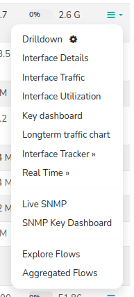

*Figure: Drilldown Options from Interface Table*

| Option                  | Opens                                 | Use this for                                                                                                                                                                                                                                           |
| ----------------------- | ------------------------------------- | ------------------------------------------------------------------------------------------------------------------------------------------------------------------------------------------------------------------------------------------------------ |
| Drilldown               | Interface drilldown                   | The most common options like What are the Top apps, hosts, conversations, and raw flows on the interface. If you have *Interface Tracking* enabled you get perfect accuracy even for long term (weeks) analysis                                        |
| Interface Details       | Interface Detail                      | To See the interface details like if-index,if-name,alias,port,ifspeed,etc in one shot                                                                                                                                                                  |
| Interface Traffic       | Real Time Interface traffic Chart     | Provides real time Interface usage from Netflow                                                                                                                                                                                                        |
| Interface Utilization   | Real Time Interface Utilization Chart | Provides real time Interface utilization from Netflow                                                                                                                                                                                                  |
| Key Dashboard           | Interface key dashboard               | To see interface metrics, assign name, jump to flows, and traffic analysis at interface level                                                                                                                                                          |
| Long term traffic chart | Long term charts                      | Default 7 day view of interface IN/OUT traffic - 1 chart per day                                                                                                                                                                                       |
| Interface Tracker       | Enable                                | Enables [Interface Tracker](interface_tracker) Enabling this on important interfaces where you wish to get long term reports of hosts and application usage. You can get the bandwidth of every host,application by total,into and out of an interface |
| Interface Tracker       | Disable                               | Disable an interface tracker. Without an interface tracker, you will get only an overview of hosts,apps by total.                                                                                                                                      |
| Real Time               | Real Time Utilization                 | Real time bandwidth chart of interface usage                                                                                                                                                                                                           |
| Real Time               | Real Time Source Dest IP              | Real time view of Source and Dest Hosts active                                                                                                                                                                                                         |
| Real Time               | Real Time Flows                       | Real Time most active flows on interface                                                                                                                                                                                                               |
| Real Time               | Real Time Recv vs Xmit                | Real Time charts showing Receive and Transmit bandwidth on that interface (from Netflow)                                                                                                                                                               |
| Live SNMP               | Charts                                | Use SNMP to show a 10-sec view of Recv and Xmit traffic on the interface                                                                                                                                                                               |
| SNMP Key Dashboard      | Key Dashboard                         | If SNMP based metrics is installed , this opens the interface metrics in the SNMP-Interface counter group.                                                                                                                                             |
| Explore Flows           | Explore Network Flows                 | Provides detailed activity of each and every flow in and out of that interface                                                                                                                                                                         |
| Aggregated Flows        | Aggregate Network Flows               | Provides all matching flows and show aggregated volumes by hosts, ports, protocols from that interface                                                                                                                                                 |
